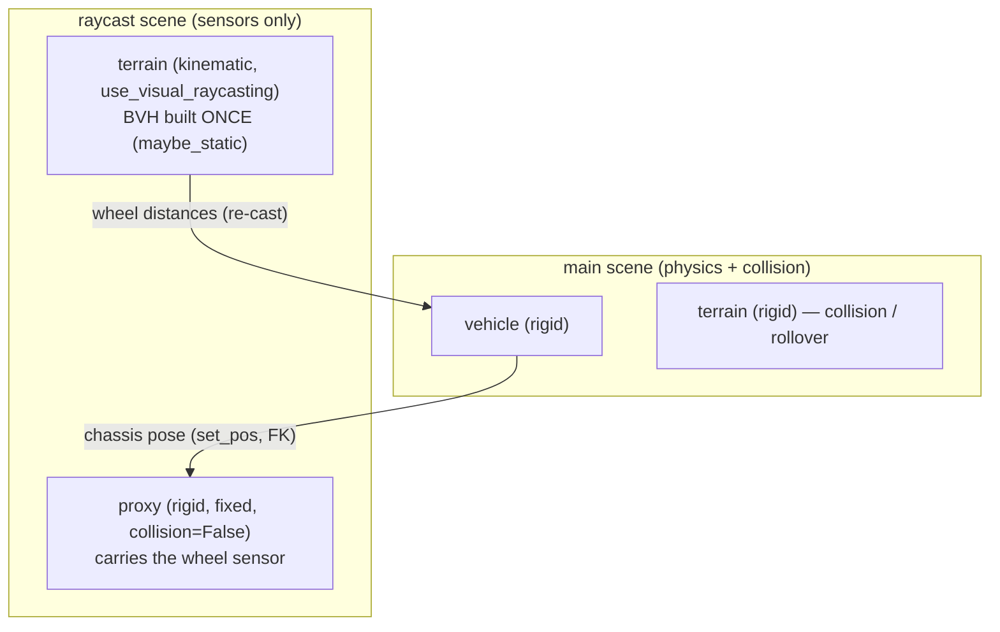

# Dual-scene wheel-raycast & the `VehicleScene` API

> **Official terminology (v1.1.0).** The subsystem is the **wheel-raycast**
> (ray-cast wheels sensing the ground); its `raycast_mode` has two modes —
> **`dual_scene`** (default: a separate, static-BVH raycast scene) and
> **`single_scene`**. "two-scene" in older notes/commits ≡ `dual_scene`.

| abbr | meaning |
|---|---|
| BVH | Bounding Volume Hierarchy (ray/collision acceleration tree) |
| FK | Forward Kinematics (link world transforms from joint/base state) |
| `maybe_static` | a raycast BVH whose solver has no physics-movable link → built once, never re-fit |
| re-cast | shooting the rays through an existing BVH (cheap, ~flat in face count) |
| rebuild | re-fitting the BVH from all faces (radix sort + bounds) — scales with face count |
| proxy | a pose-carrier entity in the raycast scene that the wheel sensor is attached to |
| L3 / `n_envs` | the parallel-scenario batching axis (one `n_envs` slot = one independent scenario) |
| `d0` | the wheel ray distances on the first settled step, in metres (one per wheel) |

`VehicleScene` is the unified, high-level entry point of the SDK. It owns the
Genesis scene(s), the registered vehicles and static bodies, and the per-step
loop, so you never call `gs.init` / `scene.build` / `scene.step` / `sensor.read`
directly. It also hosts the dual-scene wheel-raycast optimization.

**Modes.** `raycast_mode="dual_scene"` (default) is the wheel-raycast-dedicated
optimization described below; `raycast_mode="single_scene"` is the classic
one-scene path. The legacy names `"raywheel"` / `"inline"` and `"split"` /
`"single"` are accepted as aliases for `"dual_scene"` / `"single_scene"` but
retired from prose — the tables below use the official mode names.

## The problem it solves

The wheel raycaster casts rays down from each wheel to measure the ground
distance `d` that drives suspension. Genesis builds one collision-face BVH per
rigid solver and **re-fits it every step whenever any link in that solver is
physics-movable**. A driving vehicle is movable, so the BVH — which also
contains the terrain's faces — is rebuilt every step. That rebuild cost scales
with terrain face count:

> ⚠️ **The numbers in this table are RETRACTED (v1.5.1)** — they come from the
> same harness as the Performance tables below, which is disqualified twice
> over (see [Performance](#performance--figures-retracted-in-v151)). They are
> kept, unedited, so the retraction is visible. **The mechanism and the
> direction of the scaling are structural and stand; the magnitudes do not.**

| terrain faces | single-scene raycast cost (CPU) — RETRACTED |
|---|---|
| 3 k   | ~4 ms (rebuild) |
| 51 k  | ~17 ms |
| 205 k | ~44 ms |

Structurally: the **re-cast** (actually shooting the rays) is cheap and ~flat in
face count; the expensive part is the **rebuild**, which is not.

## The mechanism (`raycast_mode="dual_scene"`, the default)

Put the terrain in a **separate raycast scene** as a *kinematic* body (raycast
target, no physics) so its BVH is `maybe_static` → **built once, never re-fit**.
Keep the terrain as a *rigid* body in the **main scene** for collision/rollover.



Per `vs.step()` in dual_scene mode:

1. Mirror every chassis base pose onto its raycast-scene **proxy** — since
   v1.0.11 this is ONE batched solver write + a single FK pass for all K
   proxies (and, since v1.0.13, the dynamic-obstacle mirrors in the same
   call): `VehicleScene._sync_proxies_batched`. The per-vehicle
   `proxy.set_pos`/`set_quat` loop (2 whole-scene FK passes PER body,
   ~1 ms/body) remains only as the automatic fallback and the `reset()` path.
2. `raycast_scene.step()` — refreshes the ray origins and re-casts against the
   **static** terrain BVH. No rebuild.
3. Read the wheel distances and feed them to the main-scene physics via
   `VehiclePhysics.step(distances=...)`.
4. `main_scene.step()` advances the real vehicle physics / collision.

### Why the proxy must be rigid, fixed, collision-free

The proxy carries the wheel sensor and must move with the chassis, but it must
**not** invalidate the static terrain BVH. Three properties matter:

- **`collision=False`** → it contributes no collision faces, so it is never a
  raycast target (no self-hit) and its presence adds nothing to rebuild.
- **rigid (not kinematic)** → it lives in the rigid solver, **separate** from the
  kinematic terrain. Teleporting it via `set_pos` fires a `GEOMETRY` change on
  the *rigid* solver only; the kinematic terrain's BVH subscriber never sees it,
  so the terrain BVH stays `maybe_static`. A *kinematic* proxy shares the
  terrain's solver and its `set_pos` would flag the terrain BVH for rebuild
  every step (measured ~6x slower — no win).
- **fixed base** → no dynamics; `set_pos` simply teleports it each step.

### Why a full `scene.step()` (not just `set_pos` + `read`)

`sensor.read()` returns a **cache** filled by the last `scene.step()`; it does
**not** re-cast. So `set_pos` followed by `read()` returns the stale (previous)
distances — this is the artifact that made an early "no-step" benchmark look
fast (a *stationary* proxy's cache happened to be correct). Refreshing the cast
requires the SensorManager to run, which happens inside `scene.step()`. Because
the raycast scene is otherwise static, that step is cheap (no real physics; the
dominant cost is the unavoidable re-cast). A lower-level `cast-only` path
(`sim._sensor_manager.step()`) exists and is ~2% cheaper but uses an internal
API; the public `scene.step()` is used for robustness.

### The raycast scene is never viewed or rendered

It is **sensors-only**. It is created with `show_viewer=False` **always** —
independent of `VehicleScene`'s `show_viewer` / `viewer_options`, which configure
the **main** scene's native viewer — no camera is ever added to it, and
`VehicleScene` steps it with `update_visualizer=False`. So its `step()` does no
viewer/render work; only the SensorManager re-cast runs. (Genesis already no-ops a
viewer-less scene's visualizer update during a normal advancing step, so
`update_visualizer=False` is explicit intent / belt-and-suspenders rather than a
measurable speedup — see the 0.9.13/0.9.14 CHANGELOG.) Only the **main** scene can
have a viewer.

## Performance — figures RETRACTED in v1.5.1

`raycast_mode` changes only the *raycast* cost. The vehicle physics is shared.
That much is structural. **The measured speedups below are not trustworthy and
must not be quoted.** They are annotated rather than deleted or replaced,
because no trustworthy replacement exists yet.

> ⚠️ **Retraction (v1.5.1).** Every figure in the four tables of this section —
> `2.79x` and `5.49x` full-step on CPU, `~1x` at `n_envs=1` on GPU, `~3.40x` at
> 256 envs — is invalid for two independent reasons, either of which alone is
> disqualifying.
>
> 1. **They were measured on a broken scene.** The producing sample,
>    `samples/dual_scene_terrain.py`, spawned its car at the terrain's CORNER
>    (`gs.morphs.Terrain`'s origin is a corner, not its centre — see the API
>    section below), so the vehicle was off the mesh with three of its four
>    wheel rays missing and was in free fall by the end of the run
>    (`z_end = -84.16`). Neither the raycast load nor the contact state was that
>    of a driving vehicle. Fixed in v1.5.1.
> 2. **The harness is order-biased.** `dual_scene_terrain.py --compare` runs
>    both modes in ONE process in a fixed order (single first), so the second
>    mode is not measured under the conditions of the first. Measured with
>    `run()` called directly, 3 repeats per order, CPU, `n_envs=1`,
>    `horizontal_scale=0.25`, 51,212 faces: full-step ratio median **1.10** with
>    single-then-dual, **1.28** with dual-then-single. Order alone moves the
>    answer by that much, and it was reproduced independently. (Since v1.6.1 the
>    order-free measurement lives in
>    [`samples/bench_raycast_mode.py`](../samples/bench_raycast_mode.py);
>    `--compare` is still not a benchmark and still prints no ratio.)
>
> The mechanism behind the order effect is **not** settled and none is claimed
> here. **Correction (v1.6.1): the sentence that stood here said both parties
> measured `single_scene` running slower in SLOT 1. That was backwards — it is
> slot 2.** The measurement itself is unchanged and says so: the single/dual
> ratio median is `1.10` with single-then-dual (single in slot 1) and `1.28`
> with dual-then-single (single in slot 2), i.e. `single_scene` looks WORSE when
> it runs second. `dual_scene_terrain.py` and `samples/README.md` had it right;
> only this restatement (and the matching line in the v1.5.1 CHANGELOG entry,
> left as history) was inverted. What that does to the "the second run is
> cache-warmed" story is left open, exactly as before: the established fact is
> only that run order changes the result.
>
> **What still stands** is the structural argument, which does not depend on any
> timing: `single_scene` re-fits the collision BVH — terrain faces included —
> every step, because the vehicle in that solver is physics-movable;
> `dual_scene`'s raycast scene holds nothing movable, so its BVH is built once
> and is additionally shared across `n_envs`. Raycast cost therefore stops
> scaling with face count and with batch size under `dual_scene`. **`dual_scene`
> remains the default and remains the right mode for heavy terrain and for
> batched rollouts** — on the mechanism, not on a number.
>
> A trustworthy replacement needs per-mode **fresh processes**, alternating
> order, and repeated medians — a benchmark harness of the
> `perf_vectorization.py` kind, not an API demo sample. **That harness exists as
> of v1.6.1: [`samples/bench_raycast_mode.py`](../samples/bench_raycast_mode.py)**
> (see "What the harness measured" below). It has NOT replaced these tables and
> they stay retracted: it measures the full step on CPU only, it publishes a
> ratio only when its fail-closed rule allows, and on this machine it declined to
> publish in two of its first four runs. These tables get re-measured, not
> patched — and nothing here has been re-measured.

Measurement conditions, for the record. **Retracted tables** (all four below):
CPU / GPU as labelled, `n_envs=1` except the L3 table, 1.0 s settle before
timing (the sample's pre-v1.5.1 default, at which the car is still bouncing from
its drop), both modes timed in ONE process with `single_scene` first; the
genesis-world version is **not recorded** — they predate the 1.3.3 -> 1.4.0 bump
of v1.5.0. **Order-bias measurement** (the `1.10` vs `1.28` medians above):
genesis-world 1.4.0, CPU, `n_envs=1`, `horizontal_scale=0.25`, 51,212 terrain
faces, `run()` called directly, 3 repeats per order.

| terrain faces | raycast: single_scene — RETRACTED | raycast: dual_scene — RETRACTED | raycast ratio — RETRACTED | **full step** single_scene — RETRACTED | **full step** dual_scene — RETRACTED | **full-step ratio** — RETRACTED |
|---|---|---|---|---|---|---|
| 3 k   | ~4 ms  | ~2.5 ms | 1.7x  | ~7 ms  | ~7.7 ms | **0.94x** (dual_scene slower) |
| 13 k  | ~7 ms  | ~2.5 ms | 2.9x  | ~11 ms | ~7.5 ms | 1.47x |
| 51 k  | ~17 ms | ~2.5 ms | 4.7x  | ~20 ms | ~7.1 ms | 2.79x |
| 205 k | ~44 ms | ~2.5 ms | 17.7x | ~49 ms | ~8.9 ms | **5.49x** |

What survives the retraction, as reasoning rather than measurement:

- The **raycast cost** under `single_scene` grows with face count (rebuild);
  under `dual_scene` it does not (re-cast only). The gap therefore widens with
  face count.
- The **full-step** effect is always smaller than the raycast effect, because
  the shared vehicle physics does not change and dominates once the rebuild is
  gone.
- On **small/flat terrain `dual_scene` costs a little extra** — two scenes plus
  ~2x terrain memory — and can come out at or below break-even. **Stay on the
  default (`dual_scene`) anyway**: the deficit is small in absolute terms, and
  the default keeps working unchanged when the ground becomes a mesh or `n_envs`
  grows. `single_scene` is an optional micro-optimization for a flat-ground,
  `n_envs=1` sim you know will stay that way — not a recommendation.

### Performance on GPU (n_envs=1) — much smaller gap (figures RETRACTED)

⚠️ Same retraction as above; the table is kept for the record only.

Structurally, the CPU story does **not** carry over to GPU: the BVH rebuild
parallelizes, so `single_scene` grows far more gently with face count, while
`dual_scene`'s fixed two-scene / kernel-launch overhead is paid in full at
`n_envs=1`. Expect the two modes to be close at `n_envs=1` on GPU; do not
expect a specific ratio.

| terrain faces | single_scene (GPU) — RETRACTED | dual_scene (GPU) — RETRACTED | full-step ratio — RETRACTED |
|---|---|---|---|
| 13 k  | 21.1 ms | 21.5 ms | **0.98x** (dual_scene slower) |
| 51 k  | 25.6 ms | 23.3 ms | 1.10x |
| 205 k | 30.5 ms | 23.3 ms | 1.31x |

So on GPU the two modes are close **at `n_envs=1`**, with `dual_scene` paying its
fixed overhead against a rebuild that parallelizes well. `dual_scene` earns its
keep elsewhere — and the biggest case is L3 batching.

### Performance on GPU across L3 batch size (`n_envs`) — the real win (figures RETRACTED)

⚠️ Same retraction as above; the table is kept for the record only.

The static terrain BVH is built **once and shared across envs**, so
`dual_scene`'s per-step raycast cost is nearly **flat** in `n_envs`, while
`single_scene` re-fits per env and scales ~linearly. This is the strongest
structural case for the default, and it is the one whose *magnitude* is least
certain, since the retracted table below is the only measurement of it.

| n_envs | single_scene ms — RETRACTED | dual_scene ms — RETRACTED | ratio — RETRACTED | single_scene env-steps/s | dual_scene env-steps/s |
|---|---|---|---|---|---|
| 1   | 24.4  | 23.6 | 1.03x | 41   | 42   |
| 16  | 32.5  | 28.8 | 1.13x | 493  | 555  |
| 64  | 47.7  | 30.3 | 1.57x | 1343 | 2111 |
| 256 | 101.6 | 29.9 | **3.40x** | 2521 | **8576** |

The direction is structural: `dual_scene` throughput should scale close to
linearly in `n_envs` (the BVH is amortized), `single_scene` sublinearly (each env
adds rebuild cost). **For batched RL / MPPI / Real2Sim rollouts (high `n_envs`),
`dual_scene` (the default) is the right mode.** A flat-ground `n_envs=1` sim is
the one case where `single_scene` may come out marginally ahead — an optional
micro-optimization, not the recommended configuration, and not one this doc can
currently put a number on.

Caveat: dual_scene replicates the terrain BVH per env, so at very high `n_envs` it
hits a memory ceiling (observed near 512 envs for a 51 k-face terrain on the same
retracted run — treat the exact number as indicative only). Genesis #2914
("share static raycast BVH across envs") lifts that ceiling once merged.

dual_scene also helps independent of speed via (a) very-high-poly terrain on GPU and
(b) **accuracy** on non-convex mesh terrain (see below).

### What the harness measured (v1.6.1) — still no publishable figure

[`samples/bench_raycast_mode.py`](../samples/bench_raycast_mode.py) is the
order-free replacement the retraction above asked for: a fresh process per
measurement, an alternating slot order, a paired ratio
`r_k = ms(single_scene, k) / ms(dual_scene, k)` inside each repeat, and a
**fail-closed** rule that prints a ratio only if (i) each slot-order group's
median lies inside the other group's `[min, max]` and (ii) `1.0` lies outside
the pooled `[min, max]`. It is a heuristic disclosure rule, not a statistical
test, and it is allowed to answer "not measurable here".

Conditions, identical for all four runs below: genesis-world **1.4.0**, CPU
(WSL2), SDK 1.6.1, 640 x 640 m flat plate at `horizontal_scale=4.0` (**51,212
faces**, the same face count as the sample's 40 m / hs 0.25 plate), `dt=0.025` /
`substeps=10`, `n_envs=1`, 3 s brake settle, then a timed constant-throttle
window at throttle 0.6 / steer 0.0 — an ACCELERATION, so the vehicle state
changes across it (at the 20 s default the window covers **v = 0.33 .. 18.86
m/s**). One discarded warm-up worker. Both modes drive the same distance
(x_end 208.148712 m dual vs 208.148788 m single at the defaults).

| run | settings | pooled `r_k` median [min .. max] n | verdict |
|---|---|---|---|
| 1 | defaults (6 repeats, 20 s window) | 1.169 [0.979 .. 1.251] n=6 | **NO RATIO** — failed (i) (median(B)=1.138 outside A=[1.151 .. 1.235]) and (ii) (1.0 inside) |
| 2 | defaults, same session | 1.208 [1.034 .. 1.409] n=6 | published `single/dual = median 1.208 [1.034 .. 1.409] n=6` |
| 3 | `--repeats 4 --drive-s 8` | 1.193 [1.118 .. 1.302] n=4 | published `single/dual = median 1.193 [1.118 .. 1.302] n=4` |
| 4 | `--repeats 4 --drive-s 4` | 1.171 [1.006 .. 1.217] n=4 | **NO RATIO** — failed (i): median(A)=1.205 vs B=[1.006 .. 1.149], the groups separated |

Absolute per-step cost at the defaults, for orientation only — not a ratio:
dual_scene median 9.062 [8.414 .. 10.994] and 9.025 [8.748 .. 10.034] ms/step
(runs 1 and 2, n=6 each); single_scene 10.710 [10.503 .. 11.026] and 10.669
[10.350 .. 12.442].

**Two of four runs declined to publish, so this doc publishes nothing.** The
flip is a result about this machine's noise, not about the modes: plan-review
simulated the rule against the measured run-to-run spread of 5 fresh dual_scene
processes (9.438, 8.620, 8.597, 10.065, 7.799 ms/step — a range of 26% of the
median) and found P(publish) = 17.1% at a true 1.13x with 6 repeats, meaning two
honest runs disagree about publishability roughly 28% of the time even with a
perfect rule. Run it on your own machine and quote what it prints, with its
interval, its n and its conditions block; do not quote a median from a run that
printed NO RATIO.

Two limits of the harness bear on how far these numbers go. It times the **full
step** — raycast + the 5-step wheel pipeline + `scene.step` — because
`single_scene`'s BVH refit happens inside the engine step and there is no
symmetric hook to time the raycast alone; a raycast-only effect is diluted here,
and `r_k` near 1.0 does not mean the two raycasters cost the same. And it is
**CPU-only**: `--gpu` runs the same code path but every default and number in it
was measured on CPU, so the retracted GPU tables above cannot be re-measured
here and stay retracted.

## API

```python
from genesis_vehicle import VehicleScene, car_4w_rwd_ackermann
import genesis as gs

VehicleScene.init_backend("cpu")   # physics backend (default cpu; "gpu" only for large-n_envs L3)
vs = VehicleScene(raycast_mode="dual_scene", dt=0.025, substeps=10)  # dual_scene is the default

# Static body: rigid in main (collision) + kinematic in raycast (static BVH).
# Provide collision_morph for a coarse/convex collider while raycasting a
# detailed surface (recommended for high-poly / non-convex meshes — a rigid
# mesh is auto-convexified for collision, so a rigid-mesh raycast would hit the
# convex bulge, not the true surface; the kinematic raycast stays exact).
#
# gs.morphs.Terrain's ORIGIN IS A CORNER, not its centre: an
# n_subterrains=(1,1), subterrain_size=(Lx,Ly) terrain spans x,y in [0,Lx]x[0,Ly].
# Centre it under the origin, or spawn the vehicle over the mesh - a vehicle at
# (0,0) on an uncentred terrain sits on the corner with most of its rays missing.
Lx = Ly = 40.0
vs.add_static(morph=gs.morphs.Terrain(n_subterrains=(1, 1),
                                      subterrain_size=(Lx, Ly),
                                      pos=(-Lx / 2, -Ly / 2, 0.0)))

car = vs.add_vehicle(URDF, car_4w_rwd_ackermann, pos=(0, 0, 1.0))
vs.build()

for t in range(N):
    car.set_inputs(throttle=0.6, steer=0.0)
    vs.step()
    pos = car.get_pos()
```

`raycast_mode="single_scene"` uses one scene with the classic per-vehicle wheel
raycaster and reproduces the prior SDK behavior. It is an optional
micro-optimization for a flat ground at `n_envs=1` that you know will stay that
way — the SDK publishes no speedup figure for it (see the retraction above, and
"What the harness measured (v1.6.1)" for why the order-free harness has not
produced one either), and `dual_scene` is the default.

> **Single-scene rays see the vehicle itself.** The one scene's collision BVH
> contains the chassis box, so the high-cast ray origin
> (`raycast.RAY_UP_OFFSET`) is capped at the vehicle's own collision ceiling —
> 0.28 m on the reference car, whose wheel attachment sits at `z=0.30` and whose
> chassis box starts at `z=0.60`. Without the cap (v1.1.16 through v1.4.1) every
> ray hit the roof and the vehicle launched. The cap costs over-compression
> headroom on a hard landing, which `dual_scene` — raycasting a scene with no
> vehicle collision geometry in it — does not pay. See
> [`physics-contracts.md` §7.8](physics-contracts.md#78-high-cast-rays-and-over-compression-v1116).
>
> Since v1.6.0 the cap is measured against **every** wheel ray, so a
> `wheel_contact="swept_envelope"` vehicle is supported in `single_scene` too:
> an outer fan sample can sit under a low overhang the wheel centre clears, and
> capping on the centre alone would leave that ray starting inside the body.
> Verified end to end — `single_scene` with M=9 settles at the same ride height
> as the point contact on flat ground, wheel distances agreeing to `1e-4`.
> ([`physics-contracts.md` §7.11](physics-contracts.md))

> **`gs.morphs.Terrain` places its origin at a CORNER.** With
> `n_subterrains=(1, 1)` and `subterrain_size=(Lx, Ly)` the mesh spans
> `x in [0, Lx]`, `y in [0, Ly]`, so a vehicle spawned at `(0, 0)` straddles the
> corner and most of its wheel rays miss into empty space — the suspension gets
> no normal force and the vehicle falls off the world. Pass
> `pos=(-Lx/2, -Ly/2, 0)` to centre the plate under the origin, or spawn the
> vehicle over the mesh instead. This cost this repo a broken sample across
> several releases (see CHANGELOG 1.5.1); after the fix the reference car reads
> `d0 = [0.411, 0.411, 0.412, 0.412]` and settles at `z = 0.112`.

Runnable demo: `python -m genesis_vehicle.samples.dual_scene_terrain --compare`.
It is an **API and pose-equivalence demo**, not a benchmark: it shows how the
two `raycast_mode` values are wired and checks that they agree
(`single_scene` matches `dual_scene` to three decimals on the wheel distances,
`z_end` and `x_end`; `|dx| = 0.000`). Since v1.5.1 it prints each mode's ms/step (the
absolute cost on your machine, which is useful) but **no ratio and no speedup
verdict** — see the retraction above for why a single-process A/B from this
sample cannot produce one.

Runnable benchmark: `python -m genesis_vehicle.samples.bench_raycast_mode`
(v1.6.1) — one fresh process per measurement, alternating slot order, paired
ratios, and a fail-closed rule that prints NO ratio when this machine's noise
cannot carry one. `--json out.json` records every worker payload, gate result
and aggregate. See "What the harness measured (v1.6.1)" above for what it
answered here, and `run(terrain_size=...)` in `dual_scene_terrain.py` for the
plate it drives.

## Scope & follow-ups

Supported:

- **One or more vehicles (L2)** — each gets its own proxy + sensor in the
  raycast scene and they still collide in the main scene (verified: dual_scene
  matches single_scene pose-for-pose with two cars).
- **L3 (`n_envs >= 1`) batching** — one proxy per env; the static terrain BVH is
  shared across envs.
- **Static terrain/mesh raycast targets** — `add_static` (always a wheel-raycast
  target; use `wheel_raycast_morph` for a detailed raycast surface vs a coarse
  `collision_morph`).
- **Dynamic raycast targets** — `add_dynamic(morph, physics=…, wheel_raycast=True)`
  adds a moving body the wheels must *sense* (ramp, curb, moving platform). A
  dynamic body is collide-only by default (`wheel_raycast=False`); set
  `wheel_raycast=True` only for a surface the wheels drive onto, and prefer a
  primitive Box/Sphere/Cylinder collider (a non-primitive mesh logs a warning,
  since its mirror BVH re-fits every step). In dual_scene mode it gets a rigid
  mirror in the raycast scene's *rigid* solver — a separate BVH context from the
  kinematic terrain — re-synced each step, so only that small body's BVH re-fits
  while the heavy terrain stays static. Verified: the wheel distance tracks the
  body (and matches single_scene) as it is moved via `handle.set_pose(...)`.

Follow-up:

- **Server unification**: DONE as of 1.0.12 — both OSC server modes default to
  `dual_scene` (statics get kinematic mirrors, dynamic obstacles get
  `wheel_raycast` mirrors via `env_builder`); `--road-raycast-only` composes on
  top by additionally dropping the main-scene road collider
  (`add_raycast_surface`). The legacy one-scene behavior remains as the
  L2-mode `--single-scene` flag — see `server.md` §3.

The upstream-correct fix (no second scene) is Genesis splitting the rigid
collision/raycast BVH into static + dynamic subsets so the static terrain is not
re-fit while the vehicle moves — see Genesis issue **#2878** (open).
