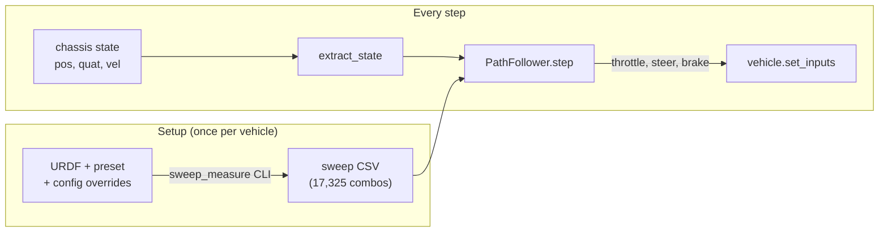
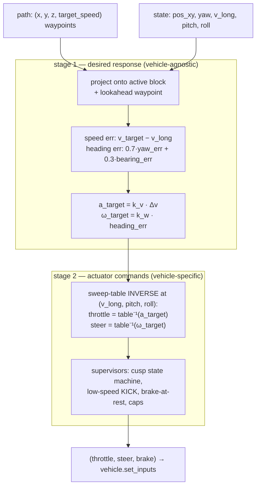

# Path following — `genesis_vehicle.control`

| abbr | meaning |
|---|---|
| S/T | Steer / Throttle command |
| sweep table | measured (v, throttle, steer, pitch, roll) → (a, ω_z) grid of ONE vehicle |
| cusp | sign flip of `target_speed` along the path = gear change (stop, then reverse) |
| block | maximal run of waypoints with one speed sign (the unit the follower drives) |
| ω_z | chassis yaw rate (rad/s) |
| P control | proportional feedback (`u = K · error`) |

Give a path — a list of `(x, y, z, target_speed)` waypoints — and get
per-step `(throttle, steer, brake)` for any URDF + preset vehicle. The
controller inverts a per-vehicle measured *sweep table* instead of assuming
a dynamics model, so the same code drives a skid-steer tank and an
Ackermann car.



## Quick start

```python
from genesis_vehicle import PathFollower
from genesis_vehicle.control import extract_state

# (x, y, z, target_speed): z ignored; speed sign = direction
# (+forward / -backward); a sign flip = cusp (auto stop-and-reverse).
path = [
    (30.0,   0.0, 0.0, +2.0),
    (10.0,  -8.0, 0.0, +2.0),
    (-10.0, -8.0, 0.0, +2.0),
    (-30.0,  0.0, 0.0, +2.0),
]

follower = PathFollower(path, "my_vehicle_sweep.csv")

for step in range(n_steps):
    st = extract_state(vehicle)          # Genesis entity or Vehicle wrapper
    thr, steer, brake = follower.step(
        st["pos_xy"], st["yaw"], st["v_long"], st["pitch"], st["roll"])
    if follower.last_mode == "DONE":
        break
    vehicle.set_inputs(throttle=thr, brake=brake, steer=steer)
    vs.step()
```

Outside Genesis (UE / Unity / replay), build the state dict with
`extract_state_from_arrays(pos_xyz, quat_wxyz, vel_xyz)` — the controller
itself is numpy-only and simulator-agnostic.

Runnable end-to-end demo (bundled tank + reference sweep, PASS = final
error < 3 m):

```bash
python -m genesis_vehicle.samples.path_follow_demo [--viewer]
```

## 1. Measuring the sweep table (once per vehicle)

```bash
python -m genesis_vehicle.control.sweep_measure \
    --urdf my_vehicle.urdf \
    --preset tank_10w_skid_belt \
    --config my_overrides.py \
    --output my_vehicle_sweep.csv --gpu
```

- `--preset`: any SDK preset name (`tank_10w_skid_belt`,
  `car_4w_rwd_ackermann`, ...).
- `--config` (optional): Python file defining `apply_config(cfg)` (before
  `build`) and/or `apply_runtime_config(physics)` (after) — the same
  overrides you use when driving.
- `--gpu`: recommended when CUDA is available — the measurement is a
  ~500-env L3 batch, past the CPU/GPU crossover (see
  [`backends.md`](backends.md)). Measured full grid: **GPU ~3.6 min vs
  CPU ~20 min**.
- `--quick`: 81-combo smoke grid to check wiring (not usable for control).
- `--dt` / `--substeps` (default **0.025 × 10** — the presets'
  `recommended_dt`, internal 2.5 ms): **measure at the dt you will drive
  at.** Discrete per-step effects (brake, stability hooks) are baked into
  the measured response, so dt/substeps are part of the table's validity
  contract alongside the (URDF, preset, config) triple.

Each grid combination runs in its own env: gravity is set per env in one
batched call to emulate a (pitch, roll) slope on flat ground, the chassis
is launched at `v_init` with wheels pre-spun (per-wheel resolved radius),
inputs are held, and the response is averaged over 2 s. **`a_measured` is
taken in the body-longitudinal frame** (world velocity projected through
yaw) — the same definition `extract_state` feeds the follower, so the
table is produced and consumed in one frame. (v1.1.12, from the
deliverables_v3 revision: a world-x measurement under-reads by cos(yaw)
once steer ≠ 0 rotates the vehicle during the window — up to ~12 m/s² off
at high speed + full steer. The scene is also built once and reused across
chunks via reset, with the last chunk padded so nothing re-JITs.)

| column | meaning | grid (default) |
|---|---|---|
| `v_init` | initial longitudinal speed (m/s) | −4 … +4, 11 levels |
| `throttle` / `steer` | held input | −1 … +1, 5 levels each |
| `pitch` / `roll` | emulated slope (deg) | ±35 / ±30 |
| `a_measured` | mean longitudinal acceleration (m/s²) | output |
| `omega_z_measured` | mean yaw rate (rad/s) | output |

**Re-measure whenever the URDF, the preset, the config overrides, or
dt/substeps change** — the table is only valid for that exact quadruple.

> **Override-ordering trap (VehicleScene).** Apply cfg overrides
> (`apply_config(cfg)`) **BEFORE `vs.build()`** — with the default batched
> solver, cfg mutations after build are silently ignored unless you call
> `vs.mark_config_dirty()`. Post-build (runtime) overrides go on the
> RESOLVED config via `vehicle.resolved` (works in both solver modes;
> `vehicle.physics` is `None` under the batched solver, so guarding on it
> silently skips your overrides). The bundled demo shows the correct
> sequence.

## 2. How the follower works

### The concept: a two-stage controller around a measured response map

The sweep table is the vehicle's measured **forward map**: "at state
(v, pitch, roll), command (throttle | steer) produces response
(a | ω_z)". The controller never models the vehicle analytically — each
step it does two things:

1. **Decide WHAT physical response it wants** (plain geometry + P control,
   vehicle-agnostic): from the current state and the path it computes a
   speed error and a heading error, and turns them into a desired
   acceleration `a_target` and a desired yaw rate `ω_target` — physical
   quantities, no actuator knowledge.
2. **Read the measured map BACKWARD** (all vehicle specifics live here):
   find the throttle whose measured acceleration at the current
   (v, pitch, roll) equals `a_target`, and the steer whose measured yaw
   rate equals `ω_target`. Unachievable targets saturate to the actuator
   limit.

So "current state in → (S, T, B) out to match the path" is exactly right,
with the state used TWICE: once to compute the errors (pos, yaw, v_long),
and once as the operating point of the inverse lookup (v_long, pitch,
roll). Swapping the vehicle only swaps the table; the controller code is
untouched.



### The mechanics, step by step

The path is split into **direction blocks** (runs of same-sign
`target_speed`). Within a block, per step:

1. project the position onto the block's segments (search window
   `lookahead + 2 m`, ≤ 5 segments advance per step);
2. take the waypoint `lookahead` (default 3.5 m) ahead, capped at the
   block end;
3. `v_target` = that waypoint's speed; when a cusp is inside the lookahead
   window, taper `|v_target| ≤ k_approach · d_cusp + 0.3` so the vehicle
   arrives slow;
4. `heading_err = 0.7·yaw_err + 0.3·position_err` (backward blocks store
   chassis yaw flipped by π — the chassis faces away from travel);
5. P control: `a_target = k_v·(v_target − v_long)`,
   `ω_target = k_w·heading_err`;
6. sweep inversion: `throttle = table⁻¹(v, a_target, pitch, roll)`,
   `steer = table⁻¹(v, ω_target, pitch, roll)` (4-D multilinear
   interpolation + bisection; out-of-grid states clamp to the boundary);
7. low-speed KICK: if the along-direction speed is below 40 % of
   `|v_target|`, saturate throttle toward the target direction;
8. near-zero throttle at near-zero speed ⇒ `brake = 1`.

At a block boundary the cusp state machine takes over: brake until
`|v_long| < v_stop`, then continue into the next block with the flipped
direction. `last_mode` exposes the state: `INIT` / `DRV+1` / `DRV-1` /
`STOP` / `BRAKE_TRANS` / `DONE`.

Projection and lookahead **never cross the active block's boundary** — the
pre-SDK deliverable let the lookahead leak across the cusp, which applied
backward-driving geometry while still moving forward and only behaved on
collinear forward/backward paths (see CHANGELOG 1.1.11 for the two bugs
fixed during adoption).

### Tuning knobs (constructor kwargs)

| kwarg | default | effect |
|---|---|---|
| `lookahead` | 3.5 m | pursuit distance; larger = smoother, cuts corners more |
| `arrival_goal` | 1.5 m | DONE radius around the final waypoint (final block only) |
| `cusp_goal` | 1.0 m | distance to a cusp that starts the stop-and-reverse |
| `k_v` / `k_w` | 2.0 / 1.5 | speed / heading P gains |
| `k_approach` | 1.0 /s | cusp deceleration taper slope |
| `v_stop` | 0.05 m/s | "stopped" threshold for the gear change |
| `steer_cap` | 0.5 | steer command cap |

Cusp overshoot depends on the vehicle's brake authority at low speed (the
bundled tank with its `T_BRAKE_MAX` override stops essentially on the
spot). If a vehicle rolls past the cusp, raise `v_stop` (accept the flip
at a slow roll), increase `k_approach` tapering, or give it a stronger
low-speed brake.

## 3. Path requirements

- ≥ 2 waypoints; adjacent spacing 0.3–1 m recommended (densify long
  straights — see the demo's `build_path`).
- Waypoint yaw is derived from the next waypoint; nothing to specify.
- Backward driving = negative `target_speed`; `0` marks an explicit stop
  point and inherits the running direction (does not split a block).
- DONE = within `arrival_goal` of the FINAL waypoint while driving the
  final block; don't route the final block within `arrival_goal` of its
  own end point early, or it will finish there.
- Skid-steer is the tuned reference; for Ackermann re-measure the sweep so
  the backward steer sign is baked in from the actual drivetrain.

## See also

- [`samples/path_follow_demo.py`](../samples/path_follow_demo.py) — bundled
  end-to-end demo (tank + reference sweep + wall detour).
- [`backends.md`](backends.md) — why `--gpu` for the measurement.
- [`api-reference.md`](api-reference.md) §11 — `control` API surface.
