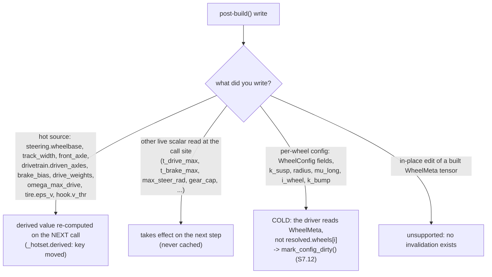

# Physics contracts

The SDK's promises about ambiguous physical conventions. These contracts are
enforced by `genesis_vehicle.dynamics` (pure-Python, unit-tested in
`tests/test_dynamics.py`) and consumed by `core.py`.

| abbr | meaning |
|---|---|
| `N` | suspension normal force (N) |
| `kappa` | longitudinal slip ratio |
| `rest_d` | suspension rest length; `compression = max(rest_d - distance, 0)` |
| `no_hit_value` | Genesis `Raycaster` option: the distance a ray reports when it hit nothing (defaults to `max_range`) |
| `max_range` | the raycaster's maximum ray length (m); `raycaster_max_range`, default 20.0 |
| RAW / CORRECTED distance | straight off `sensor.read().distances` / after `read_distances` subtracts the high-cast offset |
| `n_envs` / L3 | the parallel-scenario batching axis |
| `dual_scene` / `single_scene` | the two `raycast_mode` values: separate static-BVH raycast scene / one shared scene |
| BVH | Bounding Volume Hierarchy (the acceleration structure rays are cast against) |
| AABB | Axis-Aligned Bounding Box |
| VJS | `WheelJointInternalSync` — the legacy wheel-visual writer that drives solver joints |
| PD | proportional-derivative controller (the VJS `control_dofs_position` path) |
| RL | reinforcement learning (the partial-reset rollout pattern) |
| ISO 8855 | the vehicle-axis standard this SDK follows: `+X` forward, `+Y` left, `+Z` up |
| M | `contact_samples` — rays per wheel in a swept-envelope fan; 1 is the point contact |
| `s_j` / `c_j` | sample `j`'s longitudinal offset from the wheel centre / its swept-circle height penalty `r - sqrt(r^2 - s_j^2)` |
| `d_eff` | the one distance per wheel a fan reduces to, `min_j(d_j + c_j)` |
| `r` / `h` | wheel radius / obstacle (step) height, metres |

## 7.1 Brake torque is a positive command magnitude

`brake` (user input) is always in `[0, 1]`. Internally, the SDK converts it
to a signed torque opposing wheel rotation:

```
T_brake_eff = T_brake * tanh(omega / smoothing_scale)
domega      = (T_drive - T_brake_eff - R * F_long) / I_wheel
```

- For `omega > 0`, `T_brake_eff > 0`, so `-T_brake_eff` decelerates the wheel.
- For `omega < 0` (reverse spin), `T_brake_eff < 0`, so `-T_brake_eff > 0`
  again decelerates.
- For `omega ≈ 0`, `T_brake_eff ≈ 0` — the smooth brake cannot pin the
  wheel. Pair with `StaticFrictionLock` for hard hold-at-rest behaviour.

Implementation: `genesis_vehicle.dynamics.brake_torque_signed`.

## 7.2 Normal force is non-negative; air-mask wheels contribute nothing

Per-wheel suspension force uses the asymmetric damper (different coefficient
on compression vs extension) and is clamped non-negative — the ground cannot
pull a wheel down:

```
c_damp = c_compression if c_dot > 0 else c_extension
N_raw  = K_susp * compression + c_damp * c_dot
N      = max(N_raw, 0)
N      = 0 if the ray missed the ground (air_mask)
```

When `N = 0`, the per-wheel `F_long`, `F_lat` are also zero (no contact),
though `T_drive` and `T_brake` still update `omega` (the wheel spins freely
in the air).

Implementation: `genesis_vehicle.dynamics.suspension_normal_force`.

## 7.3 `WheelConfig.i_wheel` truth policy

```
1. WheelConfig.i_wheel set by the user            -> AUTHORITATIVE (used as-is)
2. URDF inertia (via parse_urdf, projected on the spin axis) -> default
3. Genesis-runtime metadata (projected on +Y)     -> fallback estimate
4. DEFAULT_I_WHEEL                                -> last-resort fallback
```

`i_wheel` is the moment about the **spin axis**, `a^T (R I R^T) a` — not the
largest principal moment. Since v1.2.8 both estimating paths project onto that
axis (`<inertial rpy>` honoured). Before then they took `max(ixx, iyy, izz)`,
which is the spin moment only for a disc-like wheel (length < √3·radius); a
wide, small-diameter road wheel got roughly **2× its true spin inertia** and
accelerated half as fast as its URDF describes.

For ray-wheel dynamics, the wheel spin inertia is often different from the
URDF hinge inertia (e.g. URDF wheel hinge is visual-only while real
ray-wheel inertia comes from a coarser estimate). In Real2Sim / parameter
fitting, **always set `WheelConfig.i_wheel` explicitly** to take this out of
the estimation pipeline.

## 7.4 Steering sign convention (ISO 8855)

`+steer` is right turn under all strategies (`Ackermann`,
`PartialAckermann`, `SkidSteer`). Unit-tested:

- **Ackermann right turn**: both front wheels turn positive; the right wheel
  (the inner wheel for a right turn) has the larger angle.
- **SkidSteer right turn**: the left side commands more torque than the
  right side (`left_cmd > right_cmd` via
  `left_cmd = throttle + steer_gain * steer`).

The legacy `+steer = LEFT` convention is **not** carried forward; skid-steer here is
`+steer = right` (ISO 8855), so any code ported from a `+steer = LEFT`
convention must flip the steer sign.

### URDF authoring recommendation — steer joint axis = `(0, 0, -1)`

For new URDFs, declare steer joint axes as `(0, 0, -1)` so the joint angle
follows the same sign convention as the user-facing `+steer = right`:

```xml
<joint name="front_left_steer_joint" type="revolute">
  ...
  <axis xyz="0 0 -1"/>   <!-- ISO 8855: +angle = CW from above = RIGHT turn -->
  ...
</joint>
```

Vehicle frame z is up, so +joint_angle around `(0, 0, -1)` is CW viewed
from above = right turn — matches `+steer`. Using `(0, 0, 1)` instead makes
+joint_angle = CCW = left turn, which is **opposite-handed** to the SDK's
user-facing convention.

`WheelJointInternalSync` does compensate either way (`visual_cmd = -phys * sign`), so
existing URDFs with `(0, 0, 1)` still render correctly. The recommendation
is only for NEW URDFs: declaring `(0, 0, -1)` keeps URDF joint values and
user-facing steer values in the same sign domain, which makes URDF-side
inspection / debugging less surprising.

Examples surveyed:
- the reference car URDF — `(0, 0, -1)` ✓ (matches recommendation)
- the 6-wheel truck URDF — `(0, 0, -1)` ✓ (fixed in v0.5.4)
- one externally authored URDF — `(0, 0, 1)` (SDK handles via WheelJointInternalSync sign flip)

## 7.5 Coupling order

`CouplingStrategy.apply(omega)` runs after the per-wheel omega integration
in the current step and before the next step. Drive torque distribution in
the same step uses **pre-coupling** omegas (one-step lag), matching the
reference implementation. Strategies must not assume they run inside the
per-wheel loop.

## 7.6 First-step protection

The wheel raycaster is not populated until the first `scene.step()`. To
avoid a NaN cascade, `VehiclePhysics.step()` skips force application on the
first call when all distances are zero, sets `_prev_init = True`, and runs
normally from the second step onward.

### An env that has not completed a step renders at the REST pose (v1.5.2)

`_stepped_once` is **per env** — an `(n_envs,)` bool tensor, cleared per index
by `reset(env_ids=...)`. Every closed-form visual path
(`VehiclePhysics.wheel_visual_transforms`,
`MultiVehicleKindPhysics.wheel_visual_transforms`) masks a row whose flag is
False back to the rest pose, and `wheels_grounded` reports all-False for it.

The contract is that such an env renders at REST, not in an air pose, and the
distinction is deliberate:

- `_stepped_once == False` means **"no distance data"**, not "the ray missed".
  An air pose would assert a MISS that was never measured. Rest is the only
  pose that asserts nothing.
- `reset` already zeroes `wheel_spin_angle` and `last_steer_per_wheel`, so the
  wheel ORIENTATION is already the rest orientation. Giving it an air POSITION
  would produce a hybrid — rest yaw and spin, extended suspension — that
  corresponds to no state the vehicle was ever in.

Before v1.5.2 the flag was a single Python `bool`, so a partial reset left it
`True` and those envs' freshly-zeroed `last_distances` were fed to
`_susp_visual_offset` as a CORRECTED `0.0` — a legitimate contact at exactly
`RAY_UP_OFFSET`, i.e. **maximum compression**. The reset wheels rendered
jammed into the chassis and `wheels_grounded` (had it existed) would have
called them grounded.

Known gap: `MultiVehicleKindPhysics.wheel_visual_reads` /
`wheel_visual_transforms_host` — the split device-read / host-compute pair —
still gate batch-wide and carry no per-row mask, so for one frame after a
partial reset they render those wheels fully compressed (measured device
`0.3000` vs host `0.4000`). It self-corrects on the next step.

**Reach, corrected in v1.6.2.** This gap used to be described as reachable only
from "user-written RL and host render harnesses" — because the two reset paths
that could trigger it were both below the public surface. That is no longer
true. v1.6.2 made `VehicleScene.reset()` actually reset the batched driver (it
reset nothing there through 1.6.1) and added
`MultiVehiclePhysics.reset(vehicle_ids=...)`, so **a top-level SDK API now
reaches it**: a partial reset followed by a host-capture render frame. The
shipped OSC server is still exempt — both its `reset` command handlers re-pose
with `set_pos` / `set_quat` and never call `physics.reset()` or
`VehicleScene.reset()` (`server/l3_runtime.py:550-553`,
`server/physics_server.py:862-880`, verified at v1.6.2). Closing the gap costs a
sixth device-to-host download plus a signature change on the host helper, for a
one-frame artefact; it stays separately ticketed.

## 7.7 Longitudinal friction-force overshoot clamp (v0.6.0)

The tire-friction analogue of §7.1. Explicit-Euler integration of the
slip-dependent friction torque `T_fric = R·F_long` is stiff near rolling
(its relaxation rate `R²·C_kappa/(I·|v_long|) → ∞` as `v_long → 0`); below
the stability limit the wheel oscillates across the rolling point
(forward force → reverse slip → backward force → …), seen as wheel
"trembling" and a stuck `kappa ≈ −1` drag on undriven wheels at launch.

`VehiclePhysics.step()` caps `F_long` so the friction torque cannot carry
the wheel **past the rolling speed** `omega_target = v_long/R` in one step:

```
omega_nofric = omega + DT·(T_drive - T_brake_eff)/I_wheel
F_long_limit = (omega_nofric - omega_target)·I_wheel / (DT·R)
omega_nofric > omega_target → F_long ∈ [0, F_long_limit]
omega_nofric < omega_target → F_long ∈ [F_long_limit, 0]
```

The clamp binds **only near rolling** (small `omega_nofric − omega_target`),
so it removes the oscillation while leaving the high-slip saturated regime —
driven-wheel launch slip — untouched (`quickstart` launch is preserved). The
**clamped** `F_long` is what is applied to both the wheel-ω update and the
chassis force, so a custom `TireModel` or parameter-fit sees a force that may
be reduced from its raw output near rolling. Implementation: inline in
`core.py` step (D); cf. `brake_torque_signed` (§7.1).

## 7.8 High-cast rays and over-compression (v1.1.16)

Wheel rays start `RAY_UP_OFFSET` (default 1.0 m) ABOVE the wheel
attachment point and the read layer (`read_distances`) subtracts the
offset from hits, so every consumer still sees attachment-relative
distances. In `single_scene` the offset is capped per vehicle (v1.5.0, see
below); `read_distances` takes the offset off the sensor, so it always
subtracts back exactly what the pattern added. Contract points:

- A ray MISS keeps its sentinel value; the offset is NOT subtracted from
  misses. **The sentinel is the sensor's own `no_hit_value`** (a Genesis
  `Raycaster` option, which `model_post_init` fills with `max_range` when left
  unset), read through `raycast.ray_miss_value` — it is NOT a fixed number, and
  the correction that follows is:

  > **Correction (v1.5.2).** This bullet used to read "keeps its sentinel value
  > (>= 19.9)". That was **wrong** for every raycaster not built at the default
  > `raycaster_max_range=20.0`: `19.9` is that default less a margin, so at
  > `max_range=10.0` a miss (10.0) fell UNDER the threshold, was taken for a
  > hit, and `read_distances` returned 9.0 — the high-cast offset subtracted
  > from a distance that measured nothing. Three separate copies of the
  > threshold (`raycast.py`, `core._susp_visual_offset`,
  > `visual._susp_visual_target`) encoded the same false claim.

- The MISS test is an **equality**, `d_raw == miss`, evaluated on the **RAW**
  distance before the offset is taken off, plus a `d_raw != 0.0` term. Both
  halves are load-bearing:
  - Equality is exact because Genesis writes the sentinel verbatim and its own
    test is likewise an equality (`distances != no_hit_value`); a value with no
    float32 representation (19.9, 0.1) still round-trips.
  - RAW, because with `no_hit_value = 0.0` a genuine hit at exactly the offset
    corrects to `0.0` and would collide with the sentinel.
  - `d_raw != 0.0` rejects the UNPOPULATED buffer (Genesis allocates it as
    zeros and only fills it inside `scene.step()`), which is otherwise
    indistinguishable from four rays hitting ground exactly `up_offset` above
    the attachment points. It is only meaningful on RAW values.

  The two predicates are public: `is_ray_hit(d_raw, miss)` for raw distances
  and `is_ray_hit_corrected(d, miss)` (`d != miss`, no zero term) for corrected
  ones — everything in `last_distances`. Carry the mask
  `read_distances(..., return_hit=True)` produces rather than re-deriving one
  downstream.

- **A CORRECTED distance of `0.0` is a HIT, not air**: ground exactly
  `RAY_UP_OFFSET` below the ray origin, i.e. exactly at the wheel attachment
  point — full compression. `is_ray_hit_corrected` deliberately omits the
  `!= 0.0` term for this reason. Both visual mirrors carried the term until
  v1.5.2 and rendered that contact as fully-extended air; three tests encoded
  the same mistake for several releases because the contract above never said
  what a corrected `0.0` meant.

- **`no_hit_value` below `max_range` is UNSUPPORTED and raises.** A sentinel
  inside the measurable range is indistinguishable from a very close hit, and
  the pipeline reads `compression = max(rest_d - distance, 0)` — with
  `no_hit_value = 0.0` that is maximum compression and the vehicle launches. A
  non-finite or non-positive sentinel raises too (`nan < max_range` is False,
  so `nan` used to pass the range test and then made the equality never fire).
  `raycast.check_miss_supported` enforces both, and is called wherever the
  sentinel is OBTAINED — the stamp (`set_sensor_miss_value`), the read
  (`ray_miss_value`, which `VehiclePhysics.__init__` goes through) and the
  `dual_scene` injection (`VehiclePhysics.set_ray_miss_value`) — not only where
  the SDK happens to stamp it. A hand-built `gs.sensors.Raycaster` passed
  straight to `VehiclePhysics` is never stamped, so a stamp-only guard would
  have covered nothing but the SDK's own path.
- A hit may therefore report a **negative** distance: the ground is above
  the attachment point (the chassis has sunk past its wheels). That is a
  VALID reading — compression maxes out and `N` pushes the vehicle back
  up. Do not "sanitize" negative distances back to air.
- Why: with origins AT the attachment points, a hard landing could sink
  the origins below the ground; the rays then missed, the air mask killed
  `N`, and the vehicle rested on its chassis collision box forever (a
  stable buried equilibrium — the v1.1.16 field report).
- **The RAW read is `(n_envs, n_wheels)` — EXCEPT with a swept-envelope fan,
  where it is rank 3.** Genesis returns `(n_wheels,)` at `n_envs == 1` and
  `(n_envs, n_wheels)` otherwise; with `wheel_contact="swept_envelope"` (§7.11)
  it returns `(n_wheels, M)` and `(n_envs, n_wheels, M)`, **M last**.

  > **Correction (v1.6.0).** This doc and `docs/index.md` used to describe the
  > raw read as `(n_envs, N_WHEELS)` with no qualification. That is now
  > incomplete: it is the M=1 case. What holds unconditionally is the
  > post-`read_distances` shape below — state that, not the raw one.

  `read_distances` normalises BOTH the `n_envs == 1` squeeze and the M axis, so
  **every downstream consumer sees `(n_envs, n_wheels)` in every mode**:
  `last_distances`, the pipeline, `wheels_grounded`, `distances_list()` and both
  visual mirrors. Use `read_distances`; do not index the raw buffer.

- **`single_scene` CAN self-hit, and the offset is capped so it does not**
  (v1.5.0). A vehicle is never a *visual* raycast target
  (`use_visual_raycasting` defaults to False), which is why `dual_scene` —
  whose raycast scene holds no vehicle collision geometry at all — is safe at
  the full offset. But a raycaster also casts against the rigid solver's
  COLLISION BVH, and in `single_scene` that BVH contains the vehicle's own
  chassis box: from v1.1.16 to v1.5.0 the elevated origin sat above the
  reference car's roof and every ray self-hit, reporting -0.80 m and launching
  the vehicle. `raycast.single_scene_up_offset` now caps the offset at the
  vehicle's own collision ceiling (`urdf.self_collision_ceiling`, from the
  URDF's rest-pose collision AABBs) — 0.28 m for the reference car. A ray with
  nothing of its own above it keeps the full 1.0 m.
- The capped offset buys proportionally less over-compression headroom, so a
  `single_scene` vehicle recovers from a deep bottom-out less readily than a
  `dual_scene` one. `dual_scene` is the default for this reason among others.
- Keep overhead raycast terrain (tunnel ceilings) more than the vehicle's
  effective offset above the wheel attachment points.

Related: `WheelJointInternalSync` is intended to be cosmetic but is not
perfectly physics-neutral (the control path's PD applies real joint
forces; the set path teleports wheel mass). Its suspension targets are
stroke-clamped and slew-rate-limited (`_SUSP_VIS_MAX_RATE`), bounding
the measured disturbance to < 1 cm extra compression on hard landings
(was 2-3 cm unclamped — enough to flip a marginal landing into the
buried state before the high-cast fix removed that failure mode).

Since v1.1.17 `VehicleScene` no longer uses VJS by default: rendered
scenes with `n_envs == 1` draw wheels via `InstancedWheelRenderer` —
closed-form poses streamed into instanced render nodes (Genesis's
external render-node channel — the debug-draw machinery — NOT the rigid
solver), verified physics-identical to headless to 1e-6 m at a slight
pose-streaming cost (~2–3 ms/step at 30 vehicles, CPU)
(`wheel_render_mode="internal_sync"` restores the old behavior; multi-env
and raw-`VehiclePhysics` use still fall back to VJS).

Since v1.1.25 the native viewer additionally commits the wheel buffers, the
`follow_entity` camera and the rigid node poses in ONE render-lock hold
(`visual.patch_viewer_atomic_update`, applied automatically at `build()`).
Before that, the async draw thread could pair state from adjacent steps and
a followed vehicle appeared to "tremble" fore/aft at speed — a pure draw
artifact; physics was never affected (see CHANGELOG 1.1.25).


## 7.9 URDF contracts for ray-wheels (auto-corrected since v1.1.22)

Ray-wheel physics makes three demands on a vehicle URDF. Every
SDK-authored vehicle satisfies them; an arbitrary URDF (e.g. one exported
for a normal rigid-body sim) usually does not, so
`VehicleScene.add_vehicle` ALWAYS runs `genesis_vehicle.urdf_prep` on
it (not a knob — the prepared file feeds the entity, the parse AND the
ray pattern, which must agree), writing a corrected temp copy next to the
original — the original file is never modified, and a URDF that already
complies is used as-is (no copy).

| contract | why | auto-correction |
|---|---|---|
| **Wheels must not collide** | ground contact IS the raycast + suspension force model; a colliding wheel is a SECOND support that fights it (vehicle jitters in place, or rides on its colliders while the suspension pushes several times its weight) | wheel colliders are removed. A collider that is the wheel's ONLY geometry is first promoted to a `<visual>`, so the wheel still RENDERS — the instanced wheel renderer draws visual geoms, and physics never touches them |
| **The suspension attach point IS the wheel centre** | the ray is cast down from `WheelConfig.position` (= the prismatic joint origin) and `rest_d = radius + rest_stroke` measures from there | a chain that hangs the wheel off a carrier (`body --susp--> carrier --spin(z=+h)--> wheel`) puts the attach `h` below the wheel centre — the hull then settles `h` too high with the wheels visibly floating (measured on a 14-wheel tracked-vehicle model: h = 0.433 m). The spin-joint offset is folded into the suspension origin, leaving every link's rest pose unchanged |
| **Moving links need a valid inertial** | links with no `<inertial>` have zero mass AND inertia; Genesis warns ("mass and inertia of moving bodies must be larger than mjMINVAL"), falls back to its legacy URDF parser, and the articulated chain goes degenerate — the hull stops responding to force properly | a small inertial is injected where one is missing |

The OSC server builds its own morph, so it prepares the URDF itself and
hands the SAME prepared path to `build_cfg()` and `add_vehicle()` (fixed in
v1.1.24 — before that the server passed the original path and its vehicles
floated). If you supply `morph=...` to `add_vehicle` yourself, prepare the
file first and build the morph from the prepared path; `add_vehicle` warns
when the two disagree.

**These three are not equally severe, and the SDK reports them differently.**
Contracts 1 and 2 are *convention gaps*, not URDF defects: a wheel collider
is mandatory in a normal rigid-body sim, and a prismatic joint's origin may
sit anywhere along its own axis (a gauge freedom — the child chain
compensates, so the kinematics are identical). Such a file is perfectly
valid; it just does not match what the ray-wheel model reads out of it. Both
corrections are therefore reported as an informational line. A link with no
`<inertial>`, by contrast, is a **genuine defect in any engine**, and the fix
injects a placeholder mass the author never chose — so it raises a
`logging.WARNING` naming the offending links. Fix that one at the source.

Wheel RENDERING is independent of all of this: the instanced renderer
harvests the wheel link's visual geoms (falling back to its colliders, and
finally to a cylinder synthesized from `radius`) and draws them at the
closed-form ray-wheel pose. The wheel link's own solver pose is never used
— its visuals are hidden and its body only contributes mass.

## 7.10 `wheels_grounded` is a read-layer diagnostic, not the air mask (v1.5.2)

`Vehicle.wheels_grounded` / `VehiclePhysics.wheels_grounded` /
`MultiVehiclePhysics.grounded_list()` answer **"did this wheel's ray find
ground on the last step?"** — a question about the SENSOR. They are

```
last_hit & _stepped_once.unsqueeze(1)
```

where `last_hit` is the mask the read layer produced alongside
`last_distances` (§7.8) and the per-env gate is §7.6's. The gate is not
decoration: on the injected `dual_scene` path only corrected distances exist,
and the corrected predicate cannot recognise the pre-first-step zero buffer by
itself.

**The physics air mask is a different quantity.** The pipeline decides air from
`compression <= 0` (§7.2) and never looks at the sentinel. The two agree
everywhere except inside the suspension's rest gap: a ray can hit ground that
is still farther away than `rest_d`, so `wheels_grounded` is True while the
wheel carries no normal force and contributes nothing. Use `wheels_grounded` to
answer "is the vehicle over terrain at all" (fall detection, spawn validation,
RL termination); use `last_N > 0` or `last_compression > 0` if what you mean is
"is this wheel loaded".

`all_wheels_grounded` is `wheels_grounded.all(dim=1)` — `(n_envs,)`, True where
EVERY wheel of that env found ground. It is the supported answer to "is this
vehicle actually on the terrain?", replacing the ad-hoc
`distances.max() < 19.9` that samples and user code were writing (and which
§7.8 shows was wrong at any non-default `max_range`).

## 7.11 Swept-envelope wheel contact is OPT-IN and can only RAISE the ground (v1.6.0)

`VehicleScene.add_vehicle(wheel_contact=...)` selects the wheel-ground contact
model. **`"point"` is the default and is the single-ray behaviour of every
earlier release, bit-for-bit** (`torch.equal` on a 200-step reference rollout,
v1.6.0 CHANGELOG). Nothing below applies unless a caller opts in.

**The defect `"swept_envelope"` addresses.** A single zero-radius downward ray
reads ground height as a STEP FUNCTION. A wheel at road level on one step and
0.13 m into a kerb on the next takes the whole obstacle height as compression in
one `dt`; the damper sees a rate no tire can produce and dominates the spring
(measured on the reference car at a 0.130 m lip at 3.3 m/s: `dcompression =
0.130` in one 0.025 s step, raw rate `5.200 m/s`, peak `N` `85,120 N`).

**The model.** M rays per wheel, uniformly spaced along **body +X** over
`[-r*fan_span, +r*fan_span]` using EACH wheel's own radius, each penalised by
the height its tire surface stands off the wheel's lowest point:

```
s_j   = (2j/(M-1) - 1) * r * fan_span        j = 0 .. M-1
c_j   = r - sqrt(r^2 - s_j^2)                c(|s| = r) = r exactly
d_eff = min_j (d_j + c_j)                    a MISSING sample goes to +inf
```

A wheel of radius `r` therefore begins to climb a step of height `h` about
`sqrt(2*r*h)` before it — where a real tire touches it.

Contract points:

- **`c_0 = 0` exactly, so `d_eff <= d_center` always.** The envelope can only
  RAISE the ground it reports, never lower it; a sinking regression is
  structurally impossible rather than merely untested. Verified over 2000
  randomised profiles including 1784 mixed hit/miss cases: zero violations.
- **M must be 1 or ODD.** An even fan has no centre sample, loses the guarantee
  above, and reads even FLAT ground biased (`r=0.35`: `-0.020017 m` at M=4,
  `-0.350000 m` at M=2, against exactly `0.000000` for any odd M). Even counts
  raise.
- **M=3 at the default `fan_span=1.0` IS the point contact.** Its two off-centre
  samples sit at `|s| = r`, where `c = r`, so for any obstacle shorter than the
  wheel radius they can never win the minimum (measured: identical peak `N`).
  That is correct behaviour, not a bug — M=3 is legal and useful at
  `fan_span < 1` (at `0.6` the same three rays see the lip). The default M is 9
  because it is the smallest count that does useful work at the default span.
- **M is a DISCRETISATION count, not an accuracy dial.** The peak force does not
  converge monotonically in M — it oscillates as which sample wins the minimum
  changes (ratio vs the point contact on the harness above: M=9 → 1.703,
  M=15 → 1.906, M=31 → 2.039, M=101 → 1.959, i.e. M=101 BELOW M=31).
  Convergence needs M around 101; across M ∈ [9, 31] the peak still swings by
  roughly ±20%. Pick M for cost, read the result as "no longer a step function",
  and **do not compare two runs at different M**. "Low phase spread" and
  "accurate" are separate claims; conflating them is how a bogus acceptance bar
  got written during this work.
- **The approximation errs late, never early.** M samples of the continuous
  envelope can miss a contact, never invent one — the discretisation is
  conservative in the safe direction. The model's real limitation is that the
  rays are **vertical** and therefore blind to terrain SLOPE, not the size of
  `c_j`. An intermediate `s_j` winning the minimum with a smaller penalty than
  the outermost sample is the model working.
- **The M axis never escapes `read_distances`** (§7.8). The per-wheel hit mask is
  the OR over the fan, and `d_eff` is clamped just under the miss sentinel so
  "the mask says hit" and "the value is not the sentinel" cannot disagree.
- **`single_scene`'s self-collision ceiling is measured against EVERY fan ray**,
  not the wheel centre, and takes the minimum gap (`raycast.fan_ray_positions`).
  An outer fan origin can sit under a low overhang the wheel centre clears, and
  a centre-only cap would leave that one ray starting inside the body — the
  v1.1.16 "the ray hits its own roof, reads maximum compression, the vehicle
  launches" failure, reproduced one sample at a time. For the reference car both
  caps give the same answer (its chassis AABB covers every fan origin), so the
  tests use a synthetic variant with a low sill outboard of the front wheels:
  centre-only `0.28 m`, M=9 fan `0.12 m`, and the centre-only value would put
  the outer ray origins at `z=0.58`, inside the sill at `z=0.44`.
- **One kind, one M.** Every vehicle of a `MultiVehicleKindPhysics` kind must
  share one fan size; `multi_vehicle.check_fan_uniformity` enforces it once at
  construction. Mixed sizes would either fail deep inside the stacked read or,
  when the wheel counts line up, silently mix two contact models in one batch.
- **`DifferentiablePlant` does not model the envelope.** It snapshots
  `distances` and holds them frozen over the horizon, so a `swept_envelope`
  vehicle's kerb crossing is still PREDICTED as a point contact. The simulated
  vehicle gets the envelope; the controller's internal model does not. See
  `docs/path-following.md`.

Nothing else in the pipeline changes shape or behaviour: the cost is M raycasts
per wheel per step where there was 1, plus one `min` reduction.

## 7.12 A config rebuild CARRIES the vehicle's runtime state (v1.6.2)

`VehicleScene.mark_config_dirty()` followed by `step()` is the documented way to
make a post-`build()` cfg change take effect. It re-groups the vehicles into
kinds and **replaces the batched `MultiVehiclePhysics`** — `VehicleScene.step`
→ `_ensure_grouped()` → `_build_mvp()`. The contract below is what that
replacement promises.

| abbr | meaning |
|---|---|
| MVP | `MultiVehiclePhysics` — the batched multi-vehicle driver a `VehicleScene(solver="batched")` owns |
| K | vehicles of one kind in one scene (the L2 batch axis) |
| NK | flat batch rows, `n_envs * K`, env-major / vehicle-minor (`env * K + slot`) |
| SFL | `StaticFrictionLock` — the hold-at-rest stability hook |
| `comp_rate` | suspension compression RATE, `(compression - prev_compression)/dt`, the damper's input |
| `rest_d` | suspension rest length (§7.2) |
| PD | proportional-derivative controller (the `visual_susp_mode="control"` joint path) |

**Through 1.6.1 there was no carry.** A rebuild constructed a fresh driver and
dropped everything the old one held. Measured on the reference car
(CPU/WSL2, genesis-world 1.4.0, `dt` 0.02, `dual_scene`,
`car_4w_rwd_ackermann(stability="control")`, 60 steps at throttle 0.5 / steer
0.1, then `mark_config_dirty()` + one step): wheel `omega`
`[-17.4207, -16.7303, -17.3659, -14.2479]` → `[-8.5504, -8.1484, -6.2335,
-5.8315]`, a 51–60 % loss in one step, and the spin accumulator jumped by up to
2.08 rad. With the carry the same run continues to
`[-17.3417, -16.6906, -14.8659, -16.6363]` and the spin delta is `|omega|*dt`.

### What a rebuild preserves

The enforcing path is `VehicleScene._build_mvp` → `MultiVehiclePhysics.import_state`
→ `MultiVehicleKindPhysics.import_slot` → `VehiclePhysics.load_runtime_state`.
The old driver is snapshotted per vehicle BEFORE the new one is constructed, and
the snapshot is written back after it, matched by **flat vehicle slot** —
`add_vehicle` is build-time only, so old slot *i* is new slot *i* and only the
kind/row placement can move.

- Integrator state: `omega`, `prev_compression`, `_prev_init`, `_stepped_once`
  (per env since v1.5.2, §7.6), `wheel_spin_angle`, `last_steer_per_wheel`.
- Ray state: `last_distances`, `last_hit`.
- Read-layer diagnostics carried in the same loop (one clone each, so a reader
  between the rebuild and the next step does not see zeros): `last_compression`,
  `last_N`, `last_F_long`, `last_F_lat`, `last_T_drive`, `last_T_brake`,
  `last_kappa`, `last_alpha`. The authoritative list is
  `core.RUNTIME_STATE_ATTRS` / `RUNTIME_STATE_ROW_ATTRS` / `RUNTIME_STATE_SCALARS`.
- The wheel REST pose (`core.REST_POSE_ATTRS`). This one is carried rather than
  recomputed because a rebuild re-captures it from a vehicle whose suspension
  has SAGGED: measured `_rest_wheel_pos_local` z `0.3000` → `0.14989`
  (Δ 0.150 m, a permanent visual reference error) plus a tilt on the rest
  quaternion. It is restored to `0.3000` with an identity quaternion. A snapshot
  whose source capture had FAILED holds `None` and is skipped, so it cannot
  overwrite the new instance's good capture.
- Visual accumulators, per vehicle: the per-entity `WheelJointInternalSync`
  spin angle and its slew origin, and this vehicle's column of the batched
  `KindVisualBatch` spin accumulator.

**The config is still fully re-resolved** — that is the point of the call.
`resolved`, `wheel_meta`, the hook slotting, `dt`, `base_idx_list`, the
suspension clamps and the ray-miss sentinel are all rebuilt from the current
cfg. Carrying state and re-resolving config are not in tension: re-resolving the
same config was measured bit-identical, which is why the tests compare with
`torch.equal` and not a tolerance.

### What a rebuild REFUSES

Both of these raise `ValueError` from the **config precheck**
(`VehicleScene._precheck_wheel_counts`), which runs off the grouped cfgs before
any replacement driver is constructed. That ordering is load-bearing:
constructing an MVP is not side-effect free even when the result is discarded —
`WheelJointInternalSync.__init__` writes `set_dofs_kp` / `set_dofs_kv` onto the
LIVE entity's suspension dofs (`visual.py:227-228`) — so on the refusal path
there is no such side effect at all.

- **A wheel-count change.** The raycast sensor's ray count is fixed at
  `build()` and is not rebuilt here, so a vehicle whose `cfg.wheels` shrank
  produces a driver that dies on its very next step
  (`RuntimeError: The size of tensor a (3) must match the size of tensor b (4)`).
- **A wheel-order / identity change.** Every per-wheel tensor is carried by
  COLUMN INDEX, so a reordered list would land `omega`, `prev_compression`,
  `wheel_spin_angle`, `last_steer_per_wheel`, the ray state and the rest pose on
  the wrong physical wheel — and the sensor's ray ORDER is fixed at `build()`
  anyway.

Two qualifications, because the guard does not do quite what "identity change"
suggests. It compares wheel **names**, so a pure RENAME with the order unchanged
also raises — fail-closed and intended, since a name is the only identity the
SDK has here. And it is **skipped entirely** when a name is missing on
EITHER side — any `wheel_names` entry in the carried snapshot, or any
`cfg.wheels[i].name` in the new config: an unnamed wheel list carries no
identity to compare, so a reorder of unnamed wheels is NOT blocked. Do not read this as "a reorder is always
blocked". `VehicleScene._check_rebuild_shapes` repeats both checks against the
BUILT kind's `wheel_meta` / `resolved.wheels` as a backstop; the error message
names which of the two fired.

### A FAILED rebuild

`VehicleScene.step` rolls `_grouped_version` back to its previous value and
**re-raises**. The dirty flag is therefore not consumed by a failure: the next
`step()` retries and reports the same error, instead of a broken configuration
being reported once and then silently accepted while the old driver keeps
running under a config the user believes took effect. The new driver is built
into a local and published to `self._mvp` only after validation, the state
import and the renderer rebind all succeed, so a failed rebuild leaves the
PREVIOUS driver installed and stepping.

**Residual side effect, not fixed in v1.6.2.** A failure that happens AFTER the
new driver was constructed — the authoritative shape check, `import_state`, or
the renderer rebind — leaves the new cfg's `set_dofs_kp` / `set_dofs_kv` values
written onto the live entity's suspension dofs (`visual.py:227-228`) while the
OLD driver continues to run. The physics driver is consistent; the visual
suspension joint's PD gains are the new cfg's. The precheck keeps every
user-reachable structural change out of this window, but a `resolve()` that
raised, for instance, does not.

### `DifferentiablePlant` / `PathFollower`

The plant's `_StateSource` caches the proto, the kind, the entities, the row
indices, `resolved`, `wheel_meta` and `dt`. Through 1.6.1 those all belonged to
the discarded driver after a rebuild — the plant kept predicting off a driver
that is never stepped again, and `docs/path-following.md` recommends exactly the
flow that triggers it.

- It **re-binds at the ENTRY** of `predict`, `jacobian` and `solve`, before
  their `_snapshot()`. Staleness is one int compare against
  `MultiVehiclePhysics.build_id` on the normal path.
- It is **not** re-bound from inside a solve. `_sync_hooks` only ASSERTS that
  `build_id` did not move and raises `RuntimeError` if it did: re-binding
  mid-Newton would mix an old snapshot with new indices and produce one
  silently wrong inverse. Consequently, **calling `mark_config_dirty()` from
  another thread (or from a hook) while a controller is solving is outside the
  contract** — you get that RuntimeError, not a defined result.
- A **structural** change (wheel count, K, `n_envs`, member count) raises
  `RuntimeError` naming `mark_config_dirty`: the unroll's tensors and the warm
  start are sized for the old shape. Build a new plant (and a new
  `PathFollower` / `FleetFollower` around it).
- On a re-bind the prediction hook copies are re-taken from the new driver, so
  a rebuild that changed the stability-hook set is followed.

### Partial reset and the visual writers

`MultiVehiclePhysics.reset(vehicle_ids=...)` (new in v1.6.2) is per-VEHICLE; it
expands each vehicle to its own kind's `env * K + slot` rows.
`MultiVehicleKindPhysics.reset(rows=...)` is the row-level primitive.

- **Per vehicle**: the physics state of those rows, and the spin accumulators of
  **both** visual writers — the per-entity `WheelJointInternalSync` and the
  batched `KindVisualBatch` column. Through 1.6.2-pre the visual resets ran with
  no index at all, so resetting one row wiped every vehicle of the kind
  (measured at K=2 / `n_envs`=2: vehicle 0's batch angle
  `[0.4316, 0.3281, -2.7312, 2.6947]` → all zeros while only vehicle 1 was
  asked for).
- **Kind-wide, and deliberately left alone on a partial reset**: the batched
  writer's suspension SLEW ORIGIN (`KindVisualBatch._susp_set_prev` /
  `_susp_ctrl_prev`). "No origin" is the whole tensor being `None`, not a row
  value, so clearing it for one vehicle is not expressible — and dropping it
  would snap the suspension visual target of every OTHER vehicle of the kind,
  which under `visual_susp_mode="control"` is a real joint PD transient, not a
  cosmetic jump.

So: **a reset vehicle SLEWS its suspension visual on the batched path and SNAPS
on the per-entity fallback path** (where the slew origin belongs to that vehicle
alone and is dropped). A full reset snaps on either. Chassis POSE is never
touched by any reset — place vehicles with `Vehicle.set_pos` / `set_quat`.

### NOT preserved

- **Instance attribute patches on the driver.** The OSC server monkey-patches
  `vs.physics.step` on the instance (`server/physics_server.py:709-732`,
  `server/l3_runtime.py:417-440`); a rebuild installs a new object and the patch
  is gone. Unreachable today — the shipped server never calls
  `mark_config_dirty()` — but any user code that patches the driver instance
  must re-apply after a rebuild.
- **A post-build `set_aero_drag` on a HAND-WRITTEN `ChassisConfig(mass=None)`.**
  `resolve()` copies the chassis in that one branch, so the runtime setter wrote
  to an object the rebuild discards. Every bundled preset fills `mass`, so the
  branch does not fire on the supported path (measured).

### Changing suspension constants across a rebuild

- `k_susp`, `c_compression`, `c_extension` are **unconditionally clean**. The
  carried `prev_compression` feeds a purely kinematic rate
  (`comp_rate = (compression - prev_compression)/dt`), which does not depend on
  the old coefficients; the new ones simply multiply it.
- `radius` and `rest_stroke` shift `rest_d`, and `compression` is measured
  against `rest_d`. Carrying `prev_compression` across that shift produces ONE
  step of spurious `comp_rate ≈ Δrest_d/dt`. It is **bounded** by
  `wheel_meta.comp_rate_clamp` (30.0 in the car and tank presets and in `DEFAULT_COMP_RATE_CLAMP`) and
  self-corrects on the next step, when `prev_compression` is back in the new
  geometry. Recomputing from the raw distance instead would trade this for a
  worse defect (the rate would be measured against no history at all).
- **No test covers a constant change across a rebuild.** The suite exercises the
  carry itself and the structural refusals; the analysis above is reasoning from
  the formula, not a measurement.

### Known gap — `StaticFrictionLock` anchors survive every reset

`SFL`'s contact anchors (`_d_long`, `_d_lat`, `_was_active`,
`strategies/stability.py:204-206`) are allocated on the hook instance and are
therefore **kind-wide**: one tensor shared by all K vehicles of the kind. No
reset path touches them — not `VehiclePhysics.reset`, not
`MultiVehicleKindPhysics.reset(rows=)`, not
`MultiVehiclePhysics.reset(vehicle_ids=)`. A reset-then-reposition-then-brake
sequence can therefore reuse a stale anchor for a moment, pulling the vehicle
toward where it used to be held. Separately ticketed; the fix needs the hooks to
carry row-indexed reset, which is a wider change than v1.6.2's scope.

### Premise: `_kind_key` is immutable after build

`VehicleScene._rebind_wheel_renderer` matches render units to kinds
**positionally**, which is sound only because kind ORDER is derived from the
immutable vehicle list on both sides: `_ensure_grouped` buckets by
`veh._kind_key` (set once, in `add_vehicle`, which is build-time only) in
first-seen vehicle order, and `MultiVehiclePhysics` groups by cfg identity in
that same order. `InstancedWheelRenderer.rebind` validates K and the wheel count
per unit and raises without touching any unit if either moved — but K and *n*
alone would not notice two same-shaped kinds swapping places. If a future API
ever lets `_kind_key` change after build, the unit must carry a kind identity
instead.

Without the rebind the renderer stays bound to the DISCARDED kind, which is
never stepped again, and **the rendered wheels stop turning permanently** while
the physics keeps running (measured headless with one offscreen camera: the old
proto's spin frozen at `[0.3005, 0.3005, 0.5585, 0.5585]` while the live kind
reached `[0.3867, 0.3864, 0.6415, 0.6420]`).

## 7.13 What a post-`build()` config write reaches (v1.6.4)

Since v1.6.4 several quantities the step path needs are computed at BUILD time
instead of on every call (`_hotset.prime_derived`, from
`VehiclePhysics.__init__`). This section is the contract that hoist has to keep:
**which writes still take effect, on which call, and which need a rebuild.**

| abbr | meaning |
|---|---|
| hot source | a config field the step path must keep reading LIVE; a post-`build()` write to it takes effect on the next call |
| derived value | a value computed from hot sources + `wheel_meta` + device/dtype, cached until one of them moves (`_hotset.derived`) |
| cold config | config the driver reads ONCE at build; changing it needs `VehicleScene.mark_config_dirty()` (§7.12) |
| SFL | `StaticFrictionLock` |
| `v_thr` / `eps_v` | SFL's activation speed threshold (m/s) / `CoulombIsotropic`'s slip-magnitude floor |



### The hot set is declared, not implied

`_hotset.HOT_DEPENDENTS` maps `(role, source attribute) -> (derived slot, ...)`:

| role | source | derived slot(s) |
|---|---|---|
| `steering` | `wheelbase`, `track_width`, `front_axle` | `_geom` |
| `drivetrain` | `driven_axles` | `_driven`, `_drive_share` |
| `drivetrain` | `brake_bias` | `_brake_bias` |
| `drivetrain` | `drive_weights` | `_drive_weights` |
| `drivetrain` | `omega_max_drive` | `_omega_cap` |
| `tire` | `eps_v` | `_eps2` (`CoulombIsotropic` only — `PacejkaAnisotropic` reads `eps_v` live at the call site and squares nothing, so it has no derived slot) |
| `hook` (any `stability_hooks` entry) | `v_thr` | `_v_thr_sq` (`StaticFrictionLock`; a hook without the source simply has no slot) |

The table is DESCRIPTIVE of the call sites — it does not itself invalidate
anything. The enforcement is `_hotset.derived`, which re-runs the compute
whenever the key it was given moves, and the gates are
`tests/test_build_time_hoists.py` and `tests/test_tire_coulomb_eps.py`: each
derives the value first, THEN writes the source, then asserts the next call
moved. That order matters — a "snapshot at construction" implementation passes
any test that writes the source before the first call, and fails these.

Guaranteed, and by what:

- **A write to a hot source lands on the next call.** Guard: the source is in
  `derived(...)`'s `key`, compared by VALUE.
- **An in-place edit of a LIST source lands too** (`brake_bias[0] = 0.9`,
  `driven_axles[0] = 1`): list sources enter the key as tuples
  (`drivetrain._axles_key` / `_bias_key`), so a mutation is a different key.
- **A new `wheel_meta` object is never answered with the old one's value**:
  `ref` is compared by `is` and held weakly. It deliberately never reaches
  `==`, because `WheelMeta` is a dataclass and `==` on two different metas
  raises "Boolean value of Tensor … is ambiguous".
- **A copy never inherits a cache**: the cache is keyed by `id(owner)` in
  `_hotset._CACHES`, so `copy.copy` / `copy.deepcopy` (the plant's prediction
  hooks) start empty.

NOT guaranteed, stated plainly:

- **An in-place mutation of a built `WheelMeta` tensor is not seen by
  anything.** That is unchanged from every earlier release — the pipeline reads
  `wm.*`, never `resolved.wheels[i].*` — and no invalidation hook exists for
  it. Re-resolve through `mark_config_dirty()` (§7.12).
- **A `wheel_meta` or an owner that cannot be weakly referenced is not cached at
  all.** `wheel_meta` is a documented duck type
  (`strategies.steering._WheelMetaProto`), and a `SimpleNamespace`, a
  `namedtuple` and a `__slots__` class all satisfy it while refusing
  `weakref.ref`. Such callers get the pre-v1.6.4 behaviour — derive on every
  call — not a stale value.
- **Derived slots are not attributes.** They live in `_hotset._CACHES`, off the
  owner — so a config stays picklable, and so the generic attribute sweeps that
  walk a strategy's `__dict__` cannot see them (`control/plant._sync_hooks`
  here; the structural fusion predicate in the diagnostic workstream).
  Read one with `_hotset.derived_value(owner, slot)`; there is nothing to
  `getattr`.

### Deriving early never changes WHETHER a config is accepted

`prime_derived` catches and debug-logs any role that raises while pre-computing.
A bad config (an `Ackermann` whose `front_axle` matches no wheel, a
`brake_bias` of the wrong length) therefore still raises its `ConfigError` from
the step path, with the same message, exactly as before v1.6.4 — the hoist
moved WHEN a value is computed, not whether a build succeeds.

### `has_bump_stop` is a whole-batch branch, and it differs under NaN

`WheelMeta.has_bump_stop` is a build-time python bool so §7.2's bump-stop term
can be skipped without a per-step device→host sync. Since v1.6.4 it is
`bool((k_bump > 0.0).any())`, an OR over every element, where it was
`float(k_bump.max()) > 0.0`. Consequences, exactly:

- It is a branch for the WHOLE batch, not a per-row flag: one wheel with a bump
  stop makes every row take the branch. That is exact, because
  `dynamics.bump_stop_force` returns 0 wherever `k_bump == 0`.
- The two forms agree on every ordinary value **including `-0.0` and `±inf`**,
  but NOT under NaN. `torch.max` propagates NaN, so the old form evaluated
  `nan > 0.0` as False and disabled the bump stop for the whole vehicle as soon
  as ONE wheel carried a NaN rate — even with real bump stops on the others.
  The OR is True there. A NaN rate is a broken config, and silently disabling
  every wheel's bump stop is the worse answer. Pinned in
  `tests/test_bump_stop.py`.

### Per-wheel broadcasts go through a rank test

`_pipeline.pw` / `pw3` replace 16 `unsqueeze(0)` broadcasts of `WheelMeta`
fields in `_pipeline.compute_wheel_step` and `core.py`. They return
`t.unsqueeze(0)` at rank 1 and `t` unchanged at rank 2 (`pw`) / rank 3 (`pw3`).
Every `WheelMeta` field is rank 1 today, so this is value-identical; the rank
test exists so that a later per-row field cannot silently become `(1, B, n)`
and broadcast the wrong axis. **13 sites are NOT yet converted** — 4 in
`strategies/stability.py`, 8 in `tire_models/pacejka.py`, 1 in
`tire_models/coulomb.py` — so do not read the helpers as a completed
invariant: `WheelMeta` fields are per-wheel-only until every site uses them.
