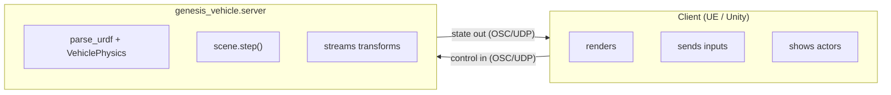

# Physics Server (`genesis_vehicle.server`)

An OSC/UDP server that runs the `genesis_vehicle` physics pipeline as a
standalone process and streams vehicle state to an external client (Unreal
Engine, Unity, a custom viewer, …). The client owns rendering and control
input; Genesis owns the physics truth.

> **Do you even need the server?** If your client is Python, you almost
> certainly don't — `import genesis_vehicle` and drive `VehiclePhysics` /
> `MultiVehiclePhysics` directly (simpler, faster, no UDP hop). The server
> exists for **language-agnostic, out-of-process clients** (C++ / C# /
> Blueprint). See [`batching.md`](batching.md) for the in-process APIs.

---

## 1. Purpose



The server is **client-agnostic**: any process that speaks the OSC schema
in §4 can drive it. The bundled `genesis_unreal_plugin/` is one such
client (Unreal). UE-specific bits are confined to the wire format (cm /
left-handed coordinate conversion in `osc_manager.py`); the physics core
has no engine dependency.

---

## 2. Running

```bash
# per-entity (L2) mode — the default: interacting / heterogeneous vehicles, one world
python -m genesis_vehicle.server

# multi-env (L3) mode: many IDENTICAL, NON-interacting vehicles
python -m genesis_vehicle.server --multi-env

# both modes default to the CPU backend; --gpu opts into GPU
# (only pays off at hundreds of envs in --multi-env mode)
python -m genesis_vehicle.server --multi-env --gpu

# common flags
python -m genesis_vehicle.server --headless          # no Genesis viewer window
python -m genesis_vehicle.server --recv_port 7001 --send_port 7002 --send_port_obs 7004
# dt: the client-sent dt wins; the server fallback default is 0.025 (40 Hz,
# v1.0.17). To force 40 Hz regardless of what the client sends:
python -m genesis_vehicle.server --override_dt 0.025
# Rationale: verified physics-identical to 0.02 at substeps=2 on bumpy terrain
# (cruise/z-oscillation/yaw within noise), while the per-step budget grows
# 20 → 25 ms (+25 %) and total CPU drops ~20 % (40 loops/s instead of 50).
python -m genesis_vehicle.server --override_dt 0.01  # 100 Hz physics (finer)
python -m genesis_vehicle.server --no-floor --vis_mode visual -v

# pacing: cap the catch-up steps per loop (default max(5, 0.1/dt)).
# The cap does NOT speed anything up — it selects the degradation mode when a
# step exceeds the dt budget: 5 bursts up to 5 steps trying to recover
# real-time (jerky pacing), 1 runs one step per loop → steady, burst-free
# slow motion (pairs with the TimeDilation the server sends). Irrelevant once
# a step fits the budget.
python -m genesis_vehicle.server --max-catchup-steps 1
```

**Diagnostics** printed by both modes:
- startup `[MODE] === PER-ENTITY === / === MULTI-ENV (L3 batched) ===` banner
  (so perf reports are unambiguous about which path ran);
- startup `[PROFILE]` — one-shot per-step section breakdown
  (`raycast/proxy | SDK compute | genesis solver | 기타`), measured over 5
  warmup steps after 2 unprofiled JIT-warm steps;
- runtime `[STATS] [per-entity|L3 n_envs=N] Loop Avg | Physics Avg
  (X steps/loop, Y ms/step)` every 50 loops. `Physics Avg` is the SUM of the
  loop's catch-up steps — read the per-step value from the parenthesis;
  `steps/loop` pinned at the cap (default 5.0) means the server cannot hold
  real-time (permanent slow-motion), ~1.0 means it can.

**Dependencies** (server only — NOT required by the SDK core):
`pythonosc`, `psutil`, `trimesh` (obstacle-mesh preprocessing). Install
into the same venv as `genesis-world` + `torch`.

**Platform**: Windows and Linux. Windows-only bits (PyInstaller
`ctypes.CDLL` patch, `HIGH_PRIORITY_CLASS`) are platform-guarded.

---

## 3. Mode selection

The two server modes are the SDK's L2 / L3 batching axes (see
[`batching.md`](batching.md)); "per-entity" is the historical name of the
L2 mode, kept for the CLI and logs.

| Sample goal | Mode | Batching axis | Backend | Vehicles interact? | Solver |
|---|---|---|---|---|---|
| Interacting traffic, heterogeneous, see collisions | **default (per-entity)** | **L2** (K vehicles × 1 env) | CPU | ✅ (one world) | batched per vehicle *kind* — identical targets share ONE pipeline (1.0.8) |
| Many identical cars spread out, no mutual collision, max count | **`--multi-env`** | **L3** (1 vehicle × n_envs) | CPU (`--gpu` at hundreds of envs) | ❌ (parallel envs) | 1 × `VehiclePhysics(n_envs=N)` |
| Interacting traffic × N parallel scenarios (RL / MPPI) | *(not in server)* | **L2 × L3** | CPU (GPU at large K×N) | ✅ within env | `MultiVehiclePhysics(n_envs=N)` — drive from Python, see [`samples/l2l3_minimal.py`](../samples/l2l3_minimal.py) |

**Why is CPU the default in BOTH modes?** GPU kernel-launch overhead is a
fixed per-step cost that needs a lot of parallel work to amortize. At
`n_envs=1` (per-entity) CPU wins outright (measured: 10 vehicles → CPU
47 ms vs GPU 160 ms per step). Even batched (`--multi-env`), the GPU step
is a flat ≈ 19 ms/step (30/50/100 vehicles alike) while the CPU step is
8.4 ms at 30 tanks — so CPU stays ahead until roughly hundreds of envs,
where the GPU's flat cost finally undercuts the CPU's growing one. Pass
`--gpu` for fleets of that scale. The deciding factor is per-step compute
weight, not vehicle count — for a collision-heavy real map, check the
server's startup `실측된 1스텝 평균` log line and compare. See
[`batching.md`](batching.md) for the full L1/L2/L3 story.

`--multi-env` requirements: all targets share ONE URDF; each target maps
to its own env (`target_id` sorted → env index); dynamic obstacles are
per-env copies (state reported from env 0); `target_forces` and
impulse/torque relative commands are not supported (logged at runtime).

**Raycast scene**: since v1.0.12 BOTH modes default to the SDK's
`dual_scene` raycast (matching `VehicleScene`'s own default) — statics get
a kinematic mirror in a separate raycast scene (static BVH, wheels ride
the exact mesh surface), and dynamic obstacles get a per-step-synced
mirror so wheels can still drive onto moving ramps/platforms.
`--road-raycast-only` composes on top: it additionally drops the
main-scene road collider (no CoACD / chassis-vs-road narrow-phase). The
pre-v1.0.12 per-entity behavior — one scene, rays hit the rigid colliders
themselves — remains available as `--single-scene` (per-entity only;
incompatible with `--road-raycast-only`, ignored by `--multi-env`).

---

## 4. OSC schema reference

### 4.1 Ports & transport

| Role | Default | Direction |
|---|---|---|
| `recv_port` | 7001 | client → server (all inbound, one unified receiver) |
| `send_port` (`send_port_cpp`) | 7002 | server → client (state, pacing) |
| `send_port_obs` | 7004 | server → client (observation tensors) |

Transport is plain OSC over UDP. The subject name (default `Genesis`)
prefixes some addresses (`/{subject}/…`).

### 4.2 Coordinate convention

Genesis is **right-handed, meters**, quaternion `(w, x, y, z)`. UE is
**left-handed, centimeters**, quaternion `(x, y, z, w)`. Outbound state is
converted in `osc_manager.send_target_states_bulk`:

```
ue_pos  = ( x·100,  −y·100,  z·100 )         # m → cm, Y flipped
ue_quat = ( −qx, qy, −qz, qw )               # (w,x,y,z) → (Qx,Qy,Qz,Qw), mirrored
```

Inbound init poses are expected **already in Genesis coordinates** (the UE
bridge converts on its side before sending).

### 4.3 Handshake (startup)

| Step | Address | Args | Dir |
|---|---|---|---|
| 1 | `/Genesis/RequestInit` | — | server → client (polled ~1 Hz until init arrives) |
| 2 | `/Genesis/Init/Physics` | `gravityZ:f, dt:f, friction:f` | client → server |
| 3 | `/Genesis/Vehicle/Init` | `urdfPath:s, mappingJSON:s` | client → server (vehicle only) |
| 4 | `/Init/Target` (or `/{subject}/…`) | `[id:i,] type:i, Px,Py,Pz, Qx,Qy,Qz,Qw, Sx,Sy,Sz, mass:f, friction:f, restitution:f` (14 or 15 args) | client → server |
| 5 | `/Init/Obstacle` | obstacle descriptor (type, pose, scale, mesh path, collision tag) | client → server |
| 6 | `/Init/Done` | — | client → server (ends `wait_for_initialization`) |
| 7 | `/Genesis/Init/Pacing` | `dt:f` | server → client (confirms physics period) |

After build, the server also emits topology once:
`/Genesis/Vehicle/JointList`, `/Genesis/Vehicle/LinkList`,
`/Genesis/Vehicle/WheelNamesList` (arrays of strings).

### 4.4 Runtime — client → server

| Address | Payload | Meaning |
|---|---|---|
| `/Genesis/Vehicle/Control` | `frameId:i, [id:i, steer:f, throttle:f, brake:f, aux1:f, aux2:f] × K` | per-vehicle inputs (6 fields/vehicle). `steer/throttle/brake` in `[-1,1]`/`[0,1]` |
| `/Genesis/Control` | command string (`stop`, `reset`) | lifecycle |
| `/Genesis/Vehicle/TargetControl/Transform` | `id:i, Px,Py,Pz, Qx,Qy,Qz,Qw` | teleport (pos+quat) |
| `…/TargetControl/Position` · `…/Rotation` | per-component teleport |
| `…/TargetControl/AddLocalOffset` · `AddWorldOffset` | `id:i, dx,dy,dz` | relative move |
| `…/TargetControl/AddLocalRotation` · `AddWorldRotation` | `id:i, qw,qx,qy,qz` | relative rotate |
| `…/TargetControl/AddWorldForce` · `AddWorldImpulse` · `AddWorldTorque` | `id:i, x,y,z` | per-vehicle external wrench (per-entity mode only) |
| `/Genesis/Obstacle/Transform` | `id:i, Px,Py,Pz, Qx,Qy,Qz,Qw` | drive a dynamic obstacle from the client |

### 4.5 Runtime — server → client

| Address | Payload | Meaning |
|---|---|---|
| `/Genesis/Vehicle/TargetBulk` | per vehicle: `id:i, Px,Py,Pz, Qx,Qy,Qz,Qw, numWheels:i, (wPx,wPy,wPz, wQx,wQy,wQz,wQw, spinAngle:f) × numWheels`; trailing `-1` sentinel | all vehicle + wheel transforms, one packet/step |

> **Wheel pose source (v0.7.7+):** the server fills the per-wheel `wPx..wQw`
> from `VehiclePhysics.wheel_visual_transforms("world")` — a closed-form pose
> that already includes steer + suspension + spin and works regardless of
> VisualJointSync (the server runs headless, so VisualJointSync is off). The trailing
> `spinAngle` is therefore sent as `0` (spin is baked into the wheel quat — the
> client uses the quat directly and must NOT re-apply spin). Earlier versions
> read `entity.get_link(wheel)`, which returned a frozen rest pose with
> VisualJointSync off (no suspension travel / no steer). See
> [`api-reference.md`](api-reference.md#76-wheel-visual-pose-for-external-renderers-wheel_visual_transforms-v077).
| `/Genesis/Dynamic/StateBulk` | chunked `id, Px,Py,Pz, Qx,Qy,Qz,Qw` | dynamic obstacle transforms |
| `/Genesis/Init/TimeDilation` | `ratio:f` | tells the client to slow playback when the loop can't hit real-time (`ratio = dt / loop_avg`) |
| `/Genesis/Step/Ack` | `frameId:i` | lockstep acknowledgement |
| `/Genesis/State/Observation` (port 7004) | float array | optional RL observation tensor |

### 4.6 Vehicle mapping JSON (`/Genesis/Vehicle/Init` arg 2)

Serialized from UE's `FGenesisVehicleMapping`. Recognized keys (camelCase
and PascalCase both accepted):

| Key | Type | Meaning |
|---|---|---|
| `driveType` | int | 0 Ackermann, 1 Truck, 2 SkidSteer, 3 Manual — selects a preset for 4w/6w/10w |
| `drivingJoints` / `steeringJoints` | `[{jointName}]` | which joints propel / steer (Manual path) |
| `drivetrainStrategy` | int | 0 AWD, 1 RWD, 2 FWD, 3 PerSide |
| `couplingStrategy` | int | 0 Independent, 1 SameSideBelt |
| `maxTorque` / `maxBrake` | float | drive / brake torque (N·m) |
| `steerScale` *(= `maxSteerRad`)* | float | max steer angle (rad) at \|steer\|=1. **UE serializes `SteerScale`; the server also accepts `maxSteerRad`.** Should stay within the URDF steer joint `<limit>` |
| `brakeBiasFrontRatio` | float | front brake fraction (rest to rear) |
| `wheelOverrides` | `[{wheelName, radius, mass, stiffness, muLong, pbX, …}]` | per-wheel physical / Pacejka overrides (fuzzy name match) |

> **Steering note:** `steerScale` is the **center (bicycle) angle**; with
> Ackermann the inner wheel turns *more*. If a client expects "max angle =
> exact wheel angle," account for the Ackermann inner/outer spread. Keep
> `steerScale` ≤ the URDF steer joint limit or the physics angle will
> exceed what the visual joint can show.

---

## 5. Limitations

- **`--multi-env`**: same-URDF only; no inter-vehicle collision (separate
  envs); dynamic obstacles per-env (env-0 state sent); no per-vehicle
  forces/impulses; no lockstep.
- **L2 × L3 through the server** is not wired (by design) — drive
  `MultiVehiclePhysics(n_envs=N)` from Python instead.
- **UDP datagram size**: ~16 KB at 100 vehicles. Fine on localhost; over a
  real network this can exceed MTU and fragment (one lost fragment drops
  the whole packet). Split per-vehicle if you hit this.

---

## 6. Relationship to `genesis_unreal_plugin/`

The canonical, version-controlled implementation lives **here, in the
SDK** (`genesis_vehicle/server/`). The repository-external
`genesis_unreal_plugin/` folder is a thin launcher that delegates to this
package (run `python -m genesis_vehicle.server` or its shim). Earlier the
plugin kept its own full copy of the server, which led to a silently
dropped performance patch on a hand-off overwrite — do not reintroduce a
fork there; edit the SDK copy.
