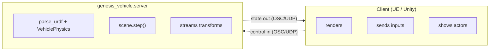
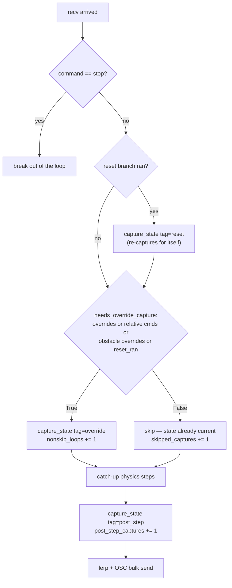
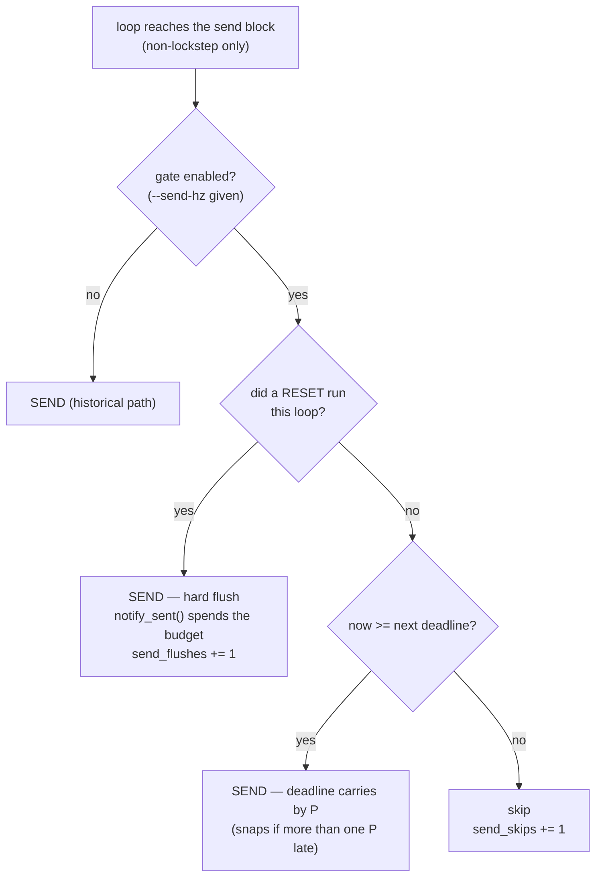

# Physics Server (`genesis_vehicle.server`)

An OSC/UDP server that runs the `genesis_vehicle` physics pipeline as a
standalone process and streams vehicle state to an external client (Unreal
Engine, Unity, a custom viewer, …). The client owns rendering and control
input; Genesis owns the physics truth.

> **Do you even need the server?** If your client is Python, you almost
> certainly don't — `import genesis_vehicle` and drive `VehiclePhysics` /
> `MultiVehiclePhysics` directly (simpler, faster, no UDP hop). The server
> exists for **language-agnostic, out-of-process clients** (C++ / C# /
> Blueprint). See [`batching.md`](batching.md) for the in-process APIs.

---

## 1. Purpose


```mermaid
flowchart LR
    subgraph Client["Client (UE / Unity)"]
        C1["renders"]
        C2["sends inputs"]
        C3["shows actors"]
    end
    subgraph Server["genesis_vehicle.server"]
        S1["parse_urdf + VehiclePhysics"]
        S2["scene.step()"]
        S3["streams transforms"]
    end
    Client -->|"control in (OSC/UDP)"| Server
    Server -->|"state out (OSC/UDP)"| Client
```

The server is **client-agnostic**: any process that speaks the OSC schema
in §4 can drive it. The bundled `genesis_unreal_plugin/` is one such
client (Unreal). UE-specific bits are confined to the wire format (cm /
left-handed coordinate conversion in `osc_manager.py`); the physics core
has no engine dependency.

---

## 2. Running

```bash
# L2 mode (per-entity) — the default: interacting / heterogeneous vehicles, one world
python -m genesis_vehicle.server

# multi-env (L3) mode: many IDENTICAL, NON-interacting vehicles
python -m genesis_vehicle.server --multi-env

# both modes default to the CPU backend; --gpu opts into GPU
# (pays off in --multi-env mode at ~300+ envs — measured crossover, see 2.1)
python -m genesis_vehicle.server --multi-env --gpu

# common flags
python -m genesis_vehicle.server --headless          # no Genesis viewer window
python -m genesis_vehicle.server --recv_port 7001 --send_port 7002 --send_port_obs 7004
# dt: the client-sent dt wins; the server fallback default is 0.025 (40 Hz,
# v1.0.17). To force 40 Hz regardless of what the client sends:
python -m genesis_vehicle.server --override_dt 0.025
# Rationale: verified physics-identical to 0.02 on bumpy terrain
# (cruise/z-oscillation/yaw within noise; measured at the pre-v1.1.25 default
# substeps=2), while the per-step budget grows 20 → 25 ms (+25 %) and total
# CPU drops ~20 % (40 loops/s instead of 50).
python -m genesis_vehicle.server --override_dt 0.01  # 100 Hz physics (finer)
python -m genesis_vehicle.server --no-floor --vis_mode visual -v

# internal substeps (v1.1.25; default 4, both modes): internal step = dt/substeps.
# It refines the CHASSIS rigid-body/contact integration, NOT the ray-wheel
# suspension, and it CHANGES THE TRAJECTORY - it is not a free perf knob.
# Read 2.3 before touching it.
python -m genesis_vehicle.server --substeps 1        # coarser chassis contact integration
python -m genesis_vehicle.server --substeps 10       # extra-fine internal step

# viewer follow camera (v1.1.25): track one target with the viewer's own
# follow_entity (jitter-free, smoothed; world-fixed offset) instead of the
# one-shot bird's-eye framing. 'side' views from -Y (wheel watching),
# 'chase' from behind (-X). Ignored when --headless.
python -m genesis_vehicle.server --follow-cam side --follow-target 0

# pacing: ADAPTIVE catch-up is the default (v1.0.20). The server monitors
# steps/loop: sustained overload (window avg ≥ 1.5) drops the cap to 1 —
# steady, burst-free slow motion; once step-loops run comfortably under the
# dt budget again (a full window of consecutive < 0.9×dt loops) it returns
# to cap=max(5, 0.1/dt) so backlog catch-up / real-time recovery resumes
# (plus a 100-loop startup grace so the build/JIT transient can't trigger it).
# Switches log as [Pacing] [AdaptiveCatchup]; every [STATS] line shows the
# current mode as [cap=N:burst|smooth|fixed:N].
# Pass N to PIN the cap and disable the adaptive pacer:
python -m genesis_vehicle.server --max-catchup-steps 1   # always-smooth (old fixed behavior)

# serving (L2 only, v1.6.6): the post-override capture_state is SKIPPED when
# no override / relative command / obstacle override arrived and no reset ran.
# Per-window counters print as a separate [SERVE] line. Full story in 2.5.
python -m genesis_vehicle.server --legacy-override-capture  # rollback: always capture
python -m genesis_vehicle.server --serve-timers             # + cap_override_us (GROSS cost, not a saving)

# state-send downsampling (L2 only, v1.6.7): physics keeps running at dt, only
# the SimTime+TargetBulk send to the client is gated, on a wall clock. Default
# OFF (one send per loop). A reset is always flushed; a teleport is not and is
# delayed by up to 1/H + one loop interval (<= 75 ms at H=20, dt=25 ms). The
# cost is LAG, not stutter, and no speed figure is published. Full story in 2.6.
python -m genesis_vehicle.server --send-hz 20               # 20 Hz state send, dt untouched

# reporting window (L2 AND L3, v1.6.8): wall-clock length of one
# [STATS]/[SERVE] window. Default 1.0 s; <= 0 is rejected on the CLI at
# argparse, and clamped back to 1.0 with a WARN for a hand-built args
# namespace (§2.5). Raise it for a heavy config so each window still holds
# enough loops to weight by (§2.5).
python -m genesis_vehicle.server --stats-interval 2.0

# pacing diagnostics: dump the trigger context on every adaptive switch
# (window steps/loop history, loop_dur avg/p95, dt budget, est speed ratio).
# Off by default; the server benchmark (§2.1) always enables it.
python -m genesis_vehicle.server --pacing-profile
```

**Diagnostics** printed by both modes:
- startup `[MODE] === L2 (per-entity) === / === L3 (multi-env) ===` banner
  (so perf reports are unambiguous about which path ran);
- startup `[PROFILE]` — one-shot per-step section breakdown
  (`raycast/proxy | SDK compute | genesis solver | 기타`), measured over 5
  warmup steps after 2 unprofiled JIT-warm steps;
- runtime `[STATS] [L2|L3 n_envs=N] Loop Avg | Physics Avg
  (X steps/loop, Y ms/step)` once per **`--stats-interval` seconds of wall
  clock** (default 1.0; through v1.6.7 it was a fixed 50 LOOPS, which on a
  server with headroom closed in ~0.1 ms — §2.5). `Physics Avg` is the SUM of
  the loop's catch-up steps — read the per-step value from the parenthesis;
  `steps/loop` pinned at the cap (default 5.0) means the server cannot hold
  real-time (permanent slow-motion), ~1.0 means it can. **On a server with
  HEADROOM, `Loop Avg` and `steps/loop` are close to meaningless whatever the
  window length** — thousands of ~2 µs busy-wait loops are averaged against a
  few dozen real ones, and the `.2f` / `.1f` print rounds the result to
  `0.00` / `0.0`. Read them on a SATURATED server (`steps/loop ≈ 1.0`,
  `Loop Avg ≈ dt`); otherwise use the `[SERVE]` sums and the duty cycle `D`
  (§2.5), which do not depend on the loop population. **`Physics Avg` /
  `ms/step` cover `vs.step()` and nothing else** — state capture, interpolation
  and the OSC send are inside the loop but outside that timer, so they show up
  only in `Loop Avg`. Compare `Loop Avg`, not `ms/step`, against the real-time
  budget; the exact boundaries are in §2.4.
- runtime `[SERVE] [L2] recv_loops=… nonskip_loops=… skipped_captures=…
  post_step_captures=… post_step_captures_ref=… sends=… send_skips=…
  send_flushes=… loops=… steps=… zero_step_loops=… serve_ms=… phys_ms_sum=…
  window_ms=…` on its OWN line at the same window boundary as `[STATS]` —
  v1.6.6, extended with the four send-gate counters in v1.6.7 and the five
  window-shape keys in v1.6.8. **Since v1.6.8 L3 prints one too**, as a bare
  `[SERVE] [L3]` carrying only the six keys L3 can produce (`loops`, `steps`,
  `zero_step_loops`, `serve_ms`, `phys_ms_sum`, `window_ms`); the L2-only
  counters are ABSENT from it, not zero. See §2.5 for the tables and the
  duty cycle `D`, and §2.6 for `--send-hz`;
- startup `[Pacing] [Send-Rate] physics(engine dt) … | pacing … | state send …`
  — printed in BOTH arms (v1.6.7), so the log always says whether the send gate
  is on, off, or DEMOTED (a demoted run gets its own label, not the default
  one).

## 2.1 Official server benchmark

`genesis_vehicle.server.benchmark` (v1.0.20) drives the REAL server
end-to-end over the OSC wire with a built-in mock UE client — the official
per-mode speed test:

```bash
python -m genesis_vehicle.server.benchmark                  # full matrix:
#   {L2, L3} × {simple(plane), complex(88 convex hulls)} × {1,10,30,100,200,400 tanks}
python -m genesis_vehicle.server.benchmark --modes L3 --tanks 10,30
python -m genesis_vehicle.server.benchmark --terrain complex --gpu   # L3 GPU opt-in
python -m genesis_vehicle.server.benchmark --urdf /path/to/tank.urdf
python -m genesis_vehicle.server.benchmark --stats 5 --stats-interval 2.0  # longer windows
```

Per configuration it launches the server subprocess (`--headless
--road-raycast-only`, CPU default, dt = 0.025), performs the full OSC
handshake (`/Genesis/Init/Physics` → `/Genesis/Vehicle/Init` (SkidSteer
mapping → `tank_skid_belt`) → K `/Init/Target`s → 88 `/Init/Obstacle`s
(complex) → `/Init/Done`), streams `/Genesis/Vehicle/Control` driving inputs
at ~30 Hz (`--input-hz`, default 30.0 — the rate every table below was
measured at), pools the server's per-window figures (the first window dropped
as warm-up; the weights come from the `[SERVE]` keys, not from the rounded
`[STATS]` print — see below), then sends `stop` (`MockUEClient.stop`, `server/benchmark.py:190`). The summary
table reports ms/step, steps/loop, Loop Avg, the **pacing mode** (final
adaptive-catchup state, with switch count — the benchmark always runs the
server with `--pacing-profile`) and a real-time verdict (steps/loop ≤ 1.05 AND
Loop Avg ≤ 25 ms). Since v1.6.6 it also reports **`serving`** (Loop Avg −
Physics Avg), the OBSERVED **`kinds`** count and the per-arm sample size **`n`**
— see §2.5 for those three and for `--kinds` / `--input-hz` /
`--legacy-override-capture` / `--serve-timers`. The reference tables below
predate those columns; the quantities they DO report are unaffected (`--kinds`
defaults to 1, which is the historical single shared kind bit-for-bit, and
`--input-hz` defaults to the historical rate). Every adaptive-catchup
trigger context is echoed per config as a `[pacing]` line (window steps/loop
history, loop_dur avg/p95, budget, est speed). The tank URDF defaults to
the SDK's bundled `samples/urdf/tank_ray.urdf` (`--urdf` to override).

**Two things about the numbers changed in v1.6.8, and the reference tables
below predate both.** (i) A `[STATS]`/`[SERVE]` window is now
`--stats-interval` seconds of wall clock (default 1.0) instead of 50 loops, so
each config takes about `--stats × --stats-interval` seconds of simulation and
holds a VARIABLE number of loops. (ii) The five headline columns are therefore
**pooled over each window's own loop count** — `Σ(x × loops) / Σloops` — where
they used to be an unweighted mean of the per-window means, which was correct
only because every window held exactly 50 loops. `ms/step` is the exception:
unlike the other five columns, this one weights by `steps`, not `loops`. The
summary table carries a **`weighting`** column (`loops`, or `unweighted` when
the `[SERVE]` keys are missing/unaligned) and the footer prints
`!! MIXED ESTIMATORS` instead of the pooled caption if any row fell back.
**Figures measured before v1.6.8 — including the tables below — are not
directly comparable with a run from v1.6.8 on**; they are kept, not retracted,
because they were not wrong for the regime and window they were measured in
(saturated, 50-loop windows).

For a HEAVY config, raise the interval: the per-window sample count is one loop
per loop duration, so a K=400 config at ~200 ms/loop puts only ~5 loops in a
1 s window. The progress line and the `[serve]` summary print
`loops=Σ (min..max)`, and a run with `loops_min < 20` is flagged
`!!low-sample`. Both arms of a comparison must use the SAME interval.

Official reference results (v1.0.20, CPU, dt = 0.025, rco on, WSL2 laptop —
re-run on your hardware for absolute numbers):

| mode | terrain | tanks | ms/step | steps/loop | Loop Avg | pacing | realtime |
|---|---|---|---|---|---|---|---|
| L2 | simple | 1 | 10.9 | 0.4 | 5.9 | burst | O |
| L2 | simple | 10 | 12.7 | 0.5 | 9.0 | burst | O |
| L2 | simple | 30 | 15.7 | 0.6 | 14.5 | burst | O |
| L2 | simple | 100 | 31.1 | 1.0 | 57.8 | smooth (1sw) | X |
| L2 | complex(88) | 1 | 10.5 | 0.4 | 5.8 | burst | O |
| L2 | complex(88) | 10 | 13.0 | 0.5 | 9.2 | burst | O |
| L2 | complex(88) | 30 | 16.7 | 0.7 | 16.2 | burst | O |
| L2 | complex(88) | 100 | 35.8 | 1.0 | 64.1 | smooth (1sw) | X |
| L3 | simple | 1 | 10.3 | 0.4 | 5.9 | burst | O |
| L3 | simple | 10 | 11.4 | 0.5 | 8.3 | burst | O |
| L3 | simple | 30 | 12.1 | 0.5 | 10.6 | burst | O |
| L3 | simple | 100 | 17.4 | 1.0 | 40.5 | smooth (1sw) | X |
| L3 | complex(88) | 1 | 11.0 | 0.4 | 6.0 | burst | O |
| L3 | complex(88) | 10 | 12.2 | 0.5 | 8.7 | burst | O |
| L3 | complex(88) | 30 | 13.5 | 0.5 | 11.6 | burst | O |
| L3 | complex(88) | 100 | 24.5 | 1.0 | 51.4 | smooth (1sw) | X |

GPU backend (`--gpu` — accepted by BOTH server modes; since v1.1.6 the
benchmark forwards it to L2 as well, which is how the L2 anti-scaling below
was measured), same matrix:

| mode | terrain | tanks | ms/step | steps/loop | Loop Avg | pacing | realtime |
|---|---|---|---|---|---|---|---|
| L3-GPU | simple | 1 | 13.8 | 0.4 | 8.2 | burst | O |
| L3-GPU | simple | 10 | 15.8 | 0.6 | 14.4 | burst | O |
| L3-GPU | simple | 30 | 14.5 | 0.8 | 19.2 | burst | O |
| L3-GPU | simple | 100 | 15.6 | 1.9 | 57.5 | smooth (1sw) | X |
| L3-GPU | complex(88) | 1 | 19.6 | 2.2 | 60.0 | smooth (1sw) | X |
| L3-GPU | complex(88) | 10 | 18.4 | 1.6 | 40.3 | smooth (1sw) | X |
| L3-GPU | complex(88) | 30 | 19.3 | 2.4 | 67.0 | smooth (1sw) | X |
| L3-GPU | complex(88) | 100 | 21.5 | 2.5 | 91.1 | smooth (1sw) | X |

GPU reading: the physics step barely grows with n_envs (13.8 → 15.6 ms from
1 → 100 tanks — launch-bound, exactly as designed) and reaches CPU parity /
crossover around 100 tanks. The GPU loses on the **serving** side — measured
in steady state (100-simple, smooth cap=1 windows only; the table averages
above mix in pre-switch burst windows, inflating Loop Avg):

| backend | physics ms/step | serving ms/loop | Loop |
|---|---|---|---|
| CPU | 16.2 | 20.3 | 36.5 |
| GPU | 18.2 | 28.5 | 46.7 |

The gap is NOT data volume (tens of KB/loop — µs over PCIe). Every
hypothesis was implemented and measured (v1.1.1–v1.1.3):

1. *"per-read sync count"* — capture now downloads everything with ONE
   on-device concat + `.cpu()` (`_to_host_batched`): Loop unchanged.
2. *"capture-side GPU compute"* — the closed-form wheel poses are now
   computed **on the CPU** from one raw-state download
   (`wheel_visual_transforms_host`; "GPU mode = physics-only on GPU,
   serving math on CPU"): Loop unchanged.
3. *"post-step sync tail"* — the L3 loop's `synchronize()` moved inside the
   physics timing (a measurement fix: ~2 ms of GPU execution tail was being
   booked as serving).

Final steady-state decomposition (100-simple, smooth cap=1 windows): CPU
physics 16.2 / serving ~20.3; GPU physics **21.7** / serving ~25.6. So the
dominant term is **GPU physics itself** (launch-bound — still +5.5 ms over
CPU physics at n_envs=100); the residual serving delta (~5 ms) is per-step
HtoD input uploads + capture getter kernels, within run noise (±3 ms). The
serving-on-CPU architecture is now in place, so at the hundreds-of-envs
scale where GPU physics starts winning, serving will not be the bottleneck.
On complex terrain the extra solver kernel launches additionally cost
~+5 ms/step even at 1 tank.

**GPU crossover (measured, v1.1.6 — simple terrain, ms/step):**

| tanks | L2 CPU | L2 GPU | L3 CPU | L3 GPU |
|---|---|---|---|---|
| 30 | 15.7 | 109.5 | 12.1 | 14.5 |
| 100 | 31.1 | **684.0** | 17.4 | 15.6 |
| 200 | 73.2 | (impractical) | 27.4 | 31.5 |
| 400 | — | — | 46.2 | **27.8** |

- **L3 crosses over between 200 and 400 envs**: CPU grows ~linearly
  (17 → 27 → 46 ms) while GPU stays launch-bound-flat (~16–31 ms), so at
  400 envs GPU wins 1.66×. The long-standing "hundreds of envs" guidance
  now has a measured location (~250–300).
- **L2 has NO practical GPU crossover — it anti-scales**: 30 tanks 7×
  slower than CPU, 100 tanks 22× slower (684 ms/step; the GPU build alone
  took >14 minutes). Growing K grows ONE env's system — every per-vehicle
  sensor read and solver stage pays GPU launch/sync latency with no
  env-axis batch width to amortize it. Need interaction at scale → stay on
  CPU; need hundreds of vehicles without interaction → L3 (+`--gpu`
  beyond ~300).

Verdict: **CPU remains the server recommendation for L2 at every size and
for L3 up to ~200–300 envs**; the GPU backend pays off for L3 at ~300+
envs (and for RL/MPPI-style batching driven directly through the SDK).

Reading (CPU): both modes are real-time up to 30 tanks on simple AND complex
terrain. At 100 tanks the adaptive pacer detects the sustained overload and
switches to smooth (steps/loop pinned at 1.0, burst-free slow motion) — L2's
limit is the physics itself (31–36 ms/step, 2 300 links in one env), while
L3's physics still fits the budget (17–25 ms/step) and the loop overrun is
serving overhead (capture + OSC encode for 100 targets), the next
optimization target for 100-vehicle fleets.

## 2.2 Collision-stress benchmark (ring convergence)

The official benchmark spawns tanks on a 15 m grid, so they never touch —
it measures the contact-free cost. `genesis_vehicle.server.benchmark_collision`
(v1.1.1) measures the other regime: K tanks on a circle (radius auto-scaled
from K, `--radius` to override), each facing the center, driven at identical
constant throttle until they all pile up in the middle. L2 only (vehicles
must interact), plane terrain, CPU:

```bash
python -m genesis_vehicle.server.benchmark_collision              # 10, 30 tanks
python -m genesis_vehicle.server.benchmark_collision --tanks 30 --duration 40
python -m genesis_vehicle.server.benchmark_collision --radius 25 --throttle 1.0
```

Unlike `benchmark.py` it also LISTENS on the send port: chassis positions
and yaw are read back from `/Genesis/Vehicle/TargetBulk`, and steering is a
small P-controller aiming every tank at the origin — after the first impact
the tanks stay pressed together (sustained K-way contact) instead of
ricocheting out of the ring. It reports both "speed drops": the physical
one (mean tank speed v_peak → v_end; the collision instant is the first
drop below 50 % of peak) and the simulation one (mean ms/step before vs
after the pile-up, plus the post/pre slowdown factor), with a 0.5 s
timeline of mean ring radius / mean speed / ms/step per config.

Reference results (v1.1.1, CPU, dt = 0.025, throttle 0.8, same WSL2 laptop
as §2.1):

| tanks | R (m) | v_peak → v_end (m/s) | collision t | ms/step pre → post | slowdown |
|---|---|---|---|---|---|
| 10 | 20.0 | 6.29 → 0.02 | 9.5 s | 12.9 → 13.8 | 1.07× |
| 30 | 38.2 | 8.51 → 1.15 | 12.0 s | 14.0 → 19.5 | 1.39× |

Reading: the pile-up is real but affordable. At 30 tanks the sustained
30-way contact scrum costs ~+39 % per step vs the approach phase (peaking
at ~24 ms/step in the densest jam) — still inside the 25 ms real-time
budget that the contact-free grid holds at 15.7 ms/step (§2.1).

**Dependencies** (server only — NOT required by the SDK core):
`pythonosc`, `psutil`, `trimesh` (obstacle-mesh preprocessing). Install
into the same venv as `genesis-world` + `torch`.

**Platform**: Windows and Linux. Windows-only bits (PyInstaller
`ctypes.CDLL` patch, `HIGH_PRIORITY_CLASS`) are platform-guarded.

---

## 2.3 What `--substeps` actually changes (correction, v1.6.3)

| abbr | meaning |
|---|---|
| dt | one server/physics step duration (s) — `--override_dt`, client-sent otherwise |
| substep | one genesis internal integration step; internal step = `dt / substeps` |
| wrench | the force + torque pair the SDK applies to the chassis link each step |

**The old justification was wrong.** Through v1.6.2 the `--substeps` help text
and this document said "a stiff suspension spring needs a small internal step
or it rings" and told you to lower it "only to reproduce coarse-step
instability". That is false for the ray-wheel path. The SDK's suspension spring
and damper never pass through genesis substep integration at all:
`_pipeline.compute_wheel_step` computes the wrench once per `vs.step()`, it is
applied once through `_gs_compat.apply_links_wrench`, and genesis holds it
CONSTANT for every substep — `clear_external_force()` sits OUTSIDE the substep
loop (`genesis/engine/simulator.py:349-363`, installed genesis-world 1.4.0).
So the SDK spring/damper always integrate at `dt`, whatever `--substeps` says.

What `substeps` does refine is the **chassis rigid-body / contact integration**
inside genesis: chassis-vs-world contacts, the constraint solve, and above all
**contact transients** — the peak normal force of a drop or a kerb strike.

Measured (CPU/WSL2, genesis-world 1.4.0, one `car_4w_rwd_ackermann`, plane,
`dt` 0.02, 600 open-loop steps; scratchpad harness `m_substeps_fidelity.py`,
re-run independently by a reviewer — not shipped in the repo):

| substeps | settled ride height z (m) | peak contact normal force, 0.5 m drop (N) |
|---|---|---|
| 1 | 0.11145 | 39,094 |
| 2 | 0.11143 | 53,481 |
| 4 | 0.111422 | 60,561 |
| 8 | 0.111422 | 63,302 |

Ride height spans 0.03 mm across the whole range and z peak-to-peak is 1.4e-4
at every setting — the suspension is unmoved, exactly as the mechanism above
predicts. The drop force is not: it grows 1.6× from substeps 1 to 8.

**Lowering `substeps` is NOT trajectory-neutral, so do not treat it as a free
performance knob.** Same harness, 12 s of driving: substeps 2 ends at
`(30.267, -19.900)`, substeps 4 at `(30.365, -19.707)` — **0.217 m apart, yaw
0.26° apart**, and convergence is NOT monotone (8 is further from 2 than 4 is).
Any recorded scenario, regression baseline or replay is only valid at the
`substeps` it was captured with.

There was also no measurable speed to buy here at `n_envs=1`: one fresh process
per measurement, forward and reverse order, 300 timed steps after 60 warm-up
(CPU/WSL2, genesis-world 1.4.0, dual_scene, plane, same car, `dt` 0.02) gave
median `vs.step()` of 10.08/10.49 ms (substeps 1), 10.43/11.25 (2),
10.92/12.62 (4), 11.44/11.82 (8) — the between-setting differences sit inside
the run-to-run spread of a single setting, so this machine cannot resolve them.
The v1.6.2 help text's "cost is usually negligible at n_envs=1" was never
backed by a measurement and has been dropped rather than restated.

### `dt` and `substeps` are fixed at build — there is no runtime path (v1.6.5)

`--override_dt` (and the `dt` UE sends in the init handshake) reaches the
simulation only by being passed to `VehicleScene(dt=...)` **before**
`build()`. After that, nothing can change it: the engine snapshots
`dt`/`substeps` in `Simulator.__init__` on both genesis 1.3.3 and 1.4.0, and
`Simulator.dt` is read-only. Assigning `sim_options.dt` post-build is inert —
see [`physics-contracts.md`](physics-contracts.md) §7.14 for the measurement.

Through v1.6.4 the L2 path did exactly that assignment and then printed
`[OK] [Determinism] … 설정되었습니다`; the claim was false on 1.3.3 and the
assignment raised `AttributeError` on 1.4.0, killing the L2 server on the
first client connection. It now prints the engine's `effective_dt` /
`substeps` and says they are fixed at build. The L2 startup write was not the
only one: the `/Reset` handler assigned `vs.sim_options.gravity` and
`vs.sim_options.dt` too, so it was a SECOND `AttributeError` site on 1.4.0 —
unreachable in practice only because the startup write killed the process
first. Its `dt` restore is deleted and its gravity restore now goes through
`VehicleScene.set_gravity`.

L3's near-identical line never performed a write and was already accurate — but
note the fix is **L2-only** in the other direction too: `l3_runtime.py` prints
the `dt` it was HANDED (`sim_dt = ue_dt`) and no substeps, where L2 now prints
what the engine reports. True today, since the L3 scene is built with exactly
that `dt`; an asymmetry to tidy, tracked in the v1.6.5 CHANGELOG §8.

Gravity is the one exception: `VehicleScene.set_gravity()` IS live post-build,
and the `/Reset` handler uses it to restore the initial value. Note that
`/Genesis/Config/Physics`, which UE may use to push `gravity`/`dt`/`friction`
at runtime, is received and stored but **never consumed** — a separate ticket.

---

## 2.4 What the `[STATS]` line measures — and what it leaves out

The `[STATS]` line is **not** a full per-step cost. Only `vs.step()` is inside
the timer; everything else the server does per loop is outside it.

| quantity | includes | excludes |
|---|---|---|
| `Physics Avg` | the SUM over this loop's catch-up steps of `vs.step()` only — raycast + SDK wheel math + genesis solve | state capture, interpolation, OSC send, the OSC receive/parse at the top of the loop, the follow-cam update |
| `ms/step` | `Physics Avg / steps-per-loop` — same scope, per step | same as above |
| `Loop Avg` | the WHOLE loop body: receive/parse, every catch-up step, every `capture_state`, interpolation, both OSC bulk sends, the pacer | nothing inside the loop |

Boundaries, so you can check them in the source:

| path | timer opens | timer closes | outside but in-loop |
|---|---|---|---|
| L2 (`server/physics_server.py`) | `:1413` `physics_start` | `:1415` `physics_end` (`+=` at `:1417`) | post-override `capture_state` `:1359` (gated since v1.6.6, §2.5), post-step `capture_state` `:1427`, GPU sync `:1493`, `lerp_state` `:1523`, OSC sends `:1530` / `:1532` (gated arm) and `:1542` / `:1548`; loop span `:1106` → `:1652`, with `_t_end` (the end of `loop_dur` AND the window trigger) at `:1553` |
| L3 (`server/l3_runtime.py`) | `:688` `physics_start` | `:703` (`torch.cuda.synchronize()` at `:702` is INSIDE) | `st.capture` `:705`, `lerp_state` `:725`, OSC sends `:729` / `:731`; loop span `:509` → `:800`, `_t_end` at `:733` |

**These L2 line numbers were WRONG before v1.6.6 and are corrected above.** The
table cited the loop span as `:814 → :1188` and the post-step `capture_state` as
`:1095`; at v1.6.5 the file already had `:830 → :1247` and `:1119` (everything
but the loop start was off by a uniform 24 lines, the loop start by 16), so the
citations were stale before this release moved them again. **Both rows were
re-derived against the v1.6.8 tree** (the v1.6.6–v1.6.8 server work moved the
L2 loop down by ~200 lines and the L3 loop by ~7). Re-derive them with
`grep -n` rather than trusting them after any edit to either file — that
instruction is the only durable part of this table.

Two consequences worth knowing:

- **State capture is the big excluded cost, and it grows with the fleet.**
  None of it is inside the reported `ms/step`, so a server that reports a
  comfortable `ms/step` can still miss real-time.

  > **Two `capture_state` cost figures used to be quoted here (one at 3 vehicle
  > kinds, one at 12) and are WITHDRAWN as of v1.6.6 — values removed, not
  > restated.** They came from an unshipped scratchpad harness (`bench_l2.py`)
  > under its own conditions, nothing in the tree reproduces them, and they are
  > on the serving work's retired-figures register. The qualitative claim — the
  > cost is excluded from `ms/step` and grows with the fleet — stands on the
  > code path (the table above) and is now measurable from the shipped
  > benchmark's `serving` column (§2.1, §2.5). No replacement number is
  > published; see §2.5.

- **On GPU the two paths differ.** L3 synchronizes inside the timer, L2
  synchronizes after the whole catch-up loop, so an L2 GPU `Physics Avg`
  under-reports by whatever kernel tail lands after `:1214`. CPU runs are
  unaffected.

**So: compare `Loop Avg` against the `dt` budget** (the real-time verdict in
§2.1 uses `Loop Avg` ≤ 25 ms at `dt` = 0.025 for exactly this reason). Use
`ms/step` only to attribute cost *within* the physics step. The `[PROFILE]`
line's `raycast/proxy | SDK compute | genesis solver | 기타` breakdown is also a
decomposition of `vs.step()` alone, on the same scope.

---

## 2.5 Serving-side counters and the reporting window — the `[SERVE]` line (v1.6.6, window v1.6.8)

| abbr | meaning |
|---|---|
| L2 / L3 | per-entity server mode (K interacting vehicles) / multi-env mode (`--multi-env`) |
| dt | one simulation STEP duration (s) |
| D | serving duty cycle = Σ`serve_ms` / Σ`window_ms` (dimensionless) |
| S' | serving cost per physics step = Σ`serve_ms` / Σ`steps` (ms/step, dt-free) |
| pooled | an average weighted by each window's own `loops`: `Σ(x × loops) / Σloops` |

**Correction (v1.6.8): this section used to open "L2 only — `l3_runtime.py`
prints no `[SERVE]` line". That is no longer true.** L3 prints a bare
`[SERVE] [L3]` with the six window-shape keys, and `--stats-interval` is
honoured by both modes. What remains L2-only is the capture skip gate, the
send-gate counters and the `--serve-timers` / `--legacy-override-capture`
flags below.

§2.4 says state capture is the big cost outside the physics timer. This
section is how you count it. Since v1.6.6 the L2 loop skips one of its
`capture_state` calls when nothing has moved the solver, and prints five
per-window counters so both the skip and the remaining captures are
machine-checkable rather than assumed.

### The skip gate

Per receiving loop the L2 server used to capture the whole world twice: once
after the override block and once after the physics step. The first of those
is now conditional.


```mermaid
flowchart TD
    R[recv arrived] --> C{command == stop?}
    C -->|yes| X[break out of the loop]
    C -->|no| RST{reset branch ran?}
    RST -->|yes| CAPR["capture_state tag=reset<br/>(re-captures for itself)"]
    RST -->|no| G
    CAPR --> G{"needs_override_capture:<br/>overrides or relative cmds or<br/>obstacle overrides or reset_ran"}
    G -->|True| CAPO["capture_state tag=override<br/>nonskip_loops += 1"]
    G -->|False| SKIP["skip — state already current<br/>skipped_captures += 1"]
    CAPO --> STEP[catch-up physics steps]
    SKIP --> STEP
    STEP --> CAPS["capture_state tag=post_step<br/>post_step_captures += 1"]
    CAPS --> SEND[lerp + OSC bulk send]
```

The gate is the pure, module-level predicate
`needs_override_capture(safe_overrides, safe_relative_cmds,
safe_obstacle_overrides, reset_ran)` in `server/physics_server.py`; it guards
the one call at `server/physics_server.py:1359` and nothing else.

**What makes the skip safe, stated with its scope:** on the span from the reset
branch to that capture, exactly four inputs reach the solver — the three popped
override dicts, which drive `set_pos` / `set_quat` / `set_dofs_velocity`, and
the reset branch, which re-places every entity. `recv['target_forces']` is
deliberately NOT one of them: it goes through `control_dofs_force`, which
records a command consumed by the NEXT `scene.step()` and moves nothing now.
When none of the four fired, the capture would return the state the loop
already holds. That enumeration is the whole argument; it is not a general
claim that "nothing else can move the solver anywhere in the loop".

The `reset_ran` term is currently **redundant** — the reset branch
(`server/physics_server.py:1173`) re-captures for itself and assigns both
`prev_state` and `curr_state`. It is kept deliberately: without it the gate's
correctness would depend on that re-capture continuing to exist, and optimising
the re-capture away later would turn the gate into a one-loop stale-state
broadcast.

Rollback: `--legacy-override-capture` restores the pre-v1.6.6 unconditional
call. Its startup banner carries no `[SERVE]` token, so a parser can still
count windows by that token alone.

### The window (v1.6.8)

**The window is a fixed WALL-CLOCK interval, not a loop count.** It closes on
the first loop at or after `--stats-interval` seconds (default 1.0), and the
origin is carried over so consecutive windows tile the wall clock with no gap.
Both modes use it; both `[STATS]` and `[SERVE]` are printed and reset on that
one boundary.

**A positive interval is enforced on EVERY path into either loop**, by two
mechanisms that together leave no gap:

* the CLI rejects `<= 0` with `parser.error`, raised in
  `physics_server.main()` **before the L2/L3 split**, so it covers both modes;
* both loops then read the value through one shared resolver,
  `pacing.resolve_stats_interval(args)`, which clamps a non-positive, NaN or
  unparseable value back to `DEFAULT_STATS_INTERVAL` (1.0) **and prints a
  WARN**. A caller that builds `args` by hand — a test harness, an embedder —
  never reaches argparse, so it can neither get a non-positive interval into
  the loop nor have its value ignored in silence.

```
 [Pacing] [Stats-Window] [WARN] --stats-interval -1.0는 양수가 아닙니다 — 기본값 1초로 되돌립니다. (CLI는 이 값을 argparse에서 거부합니다; 여기에 도달했다는 것은 args 네임스페이스를 직접 구성한 호출자라는 뜻입니다.)
```

Why the obvious one-liner was not enough (it is what this work started from,
and it never shipped): `float(getattr(args, "stats_interval", 1.0) or 1.0)`
uses `or`, which replaces only FALSY values. `0.0` and `None` fell back, but **`-1.0` survived** — and a
negative interval makes `_t_end - _win_t0 >= _stats_interval` true on EVERY
loop, closing one window per iteration. That is precisely the collapsed-window
pathology v1.6.8 exists to remove, reached by setting the option to the value
that most looks like "turn it off". (Same falsy-vs-invalid confusion as the
`send_hz=0.0` case in v1.6.7.)

**Unset is not a bad value.** A missing attribute or an explicit `None` takes
the default QUIETLY — an embedder that never sets the option is not warned
every run. Only a value that was supplied and rejected produces the WARN, and
a valid value is silent. NaN reaches the fallback through the COMPARISON, not
the parse: `float("nan")` parses fine, and the check is written
`not value > 0.0` rather than `value <= 0.0` because `nan <= 0.0` is also
False — that spelling would let NaN through, after which the window trigger is
false forever and NO window ever closes.

Through v1.6.7 the window was a fixed **50 LOOPS**. The server busy-waits
through the last ≤ 2 ms before each step deadline, so on a server with headroom
most loops take no physics step and 50 of them close almost instantly. On the
`--send-hz 20` arm the median `window_ms` measured **0.0–0.1 ms**, and
`benchmark.run_config --stats 5 --send-hz 20` returned having observed
**25.0 ms** of simulation (against **4015–4033 ms** after the change).
Conditions: CPU/WSL2, `genesis-world` 1.4.0, `dt` 0.025,
K = 1 tank (`samples/urdf/tank_ray.urdf`), `--road-raycast-only`, 30 Hz input,
`--stats-interval 1.0`, an 8 s span after a 2 s warm-up; harness
`tests/test_server_stats_window_live.py`. The WINDOW COUNT of the old arm is
not quoted: three runs of that identical harness gave 2049 / 2589 / 2668
windows (±25%), so it is not a reproducible figure — the median `window_ms` and
the observed span are.

**What the longer window does NOT fix.** `Loop Avg`, `steps/loop` and the
per-loop `serving` column are still dominated by the busy-wait loops on a
server with headroom; averaging over more of them does not make them mean
anything, and `[STATS]`'s `.2f` / `.1f` rounding has already destroyed the
values before a reader sees them. What v1.6.8 buys is that the cost is
RECOVERABLE from the per-window SUMS below — see `D` and `S'`.

### The line

Printed at the same window boundary as `[STATS]` and reset there, so each line
describes exactly the preceding window. It is a SEPARATE line on purpose: the
`[STATS]` string is frozen — `server/benchmark.py` and
`server/benchmark_collision.py` each hold their own regex copy of it — so new
information goes on a new line rather than into that string.

```
 [SERVE] [L2] recv_loops=<int> nonskip_loops=<int> skipped_captures=<int> post_step_captures=<int> post_step_captures_ref=<int> sends=<int> send_skips=<int> send_flushes=<int> loops=<int> steps=<int> zero_step_loops=<int> serve_ms=<float> phys_ms_sum=<float> window_ms=<float>
 [SERVE] [L2] ... window_ms=<float> cap_override_us=<float>                 # only with --serve-timers
 [SERVE] [L3] loops=<int> steps=<int> zero_step_loops=<int> serve_ms=<float> phys_ms_sum=<float> window_ms=<float>
```

| counter | counts, over the window | identity |
|---|---|---|
| `recv_loops` | loops that REACHED the skip decision — `recv` truthy and the loop did not break out first | — |
| `nonskip_loops` | of those, the ones that captured | `skipped_captures + nonskip_loops == recv_loops` |
| `skipped_captures` | of those, the ones the gate skipped | same |
| `post_step_captures` | post-step `capture_state` calls actually executed | — |
| `post_step_captures_ref` | `sum(min(catchup_steps, 2))` — the post-step captures the interpolation actually consumes (`prev` and `curr`) | the reference a future catch-up capture-skip must match; it is BELOW `post_step_captures` whenever a burst runs more than 2 steps |
| `sends` (v1.6.7) | loops that actually sent state to the client | `sends + send_skips == loops`, **on the non-lockstep path only** — see below |
| `send_skips` (v1.6.7) | loops the `--send-hz` gate suppressed. Always `0` when the flag is off | same |
| `send_flushes` (v1.6.7) | of `sends`, the ones forced out by a RESET flush (§2.6) | `send_flushes <= sends`. A HIGH value is **not** a good sign — it means resets are frequent, and each one is a send the rate gate did not bound |
| `loops` (v1.6.8) | loops that reached the bottom of the loop — the window's own `log_count` | the WEIGHT for every per-loop average; `zero_step_loops <= loops` |
| `steps` (v1.6.8) | physics steps taken in this window (Σ`catchup_steps`) | the weight for ms/step |
| `zero_step_loops` (v1.6.8) | of `loops`, the ones that took NO physics step — the busy-wait spin loops | a large value is WHY `Loop Avg` / `steps/loop` mean little on this server |
| `serve_ms` (v1.6.8) | `(Σloop_dur − Σphysics_dur) × 1000` — capture, lerp, OSC encode/send, pacing. Sleep is NOT in it | `serve_ms <= window_ms`, proven below; numerator of the duty cycle `D` |
| `phys_ms_sum` (v1.6.8) | `Σphysics_dur × 1000` | `serve_ms + phys_ms_sum == Σloop_dur × 1000`, by construction |
| `window_ms` (v1.6.7) | wall-clock length of this window in ms, sleep included. Measured to a stamp taken AFTER the loop body (never the loop's own `now`, which is read before the loop's work) and carried over with no gap between windows | the DENOMINATOR of the effective send rate `1000 * Σsends / Σwindow_ms` and of `D`. Since v1.6.8 it is ~`1000 × --stats-interval` by construction and it is `loops` that varies |
| `cap_override_us` | `--serve-timers` only — see below | — |

`recv_loops` is counted at the skip decision, **not** at `if recv:`. A loop that
receives `stop` breaks out before the decision; counting it earlier would break
the identity by exactly that loop.

**`sends + send_skips == loops` holds on the NON-LOCKSTEP path only.** Both
counters live inside `if not args.lockstep:` while `log_count` does not, so
under lockstep neither increments and the sum reads `0`. Lockstep is unreachable
today — `--lockstep` is commented out of argparse and `args.lockstep` is forced
`False` — so every `[SERVE]` line a user can actually produce does balance. The
qualification stays anyway: it is a property of the branch, not of the window,
and a test fails if it is dropped from the source comment. **The pre-v1.6.8
form of this identity was `== 50`**, and the wall-clock window made it false:
the right-hand side is the window's own loop count. A test asserts the string
`sends + send_skips == 50` appears nowhere in the source.

`send_flushes` has one attribution caveat: when a reset lands on the same loop
as an ordinary send deadline, the send is attributed to the FLUSH even though it
would have gone out anyway. Read it as a trend, not as "sends that only happened
because of a flush".

The four v1.6.7 keys and the five v1.6.8 keys are printed **unconditionally**
(unlike `cap_override_us`) and all of them are SUMMABLE, because
`server/benchmark.py` sums `[SERVE]` keys across windows. A ratio key
(`send_hz_eff`, or `D` itself) is deliberately absent for the same reason —
summing ratios is meaningless; derive the rate from `sends` and `window_ms`,
and `D` / `S'` from the sums below.

### `D` and `S'` — the figures that survive a variable loop count

    D  = Σ serve_ms / Σ window_ms      serving duty cycle (dimensionless)
    S' = Σ serve_ms / Σ steps          serving ms per physics step (dt-free)

`D` is the share of wall clock the server spent on non-physics loop work
(capture, lerp, OSC encode/send, pacing). It is invariant to loop count, to
window length and to window count — which is exactly what the per-loop averages
are not — so it is the figure to quote. Sleep lands in `window_ms` only, so a
server with headroom has a small `D` by construction. `S'` answers the other
question, what serving cost was paid per unit of simulation; divide by `dt` for
a per-simulated-second value. `server/benchmark.py` prints both on the
`[serve]` summary line and records them as `duty` / `s_prime`; they are omitted
silently against a server that does not print the v1.6.8 keys.

**`D` EXCLUDES the window's own reporting cost.** The `[STATS]` / `[SERVE]`
prints and the `/Genesis/Init/TimeDilation` send all happen AFTER `loop_dur` is
stamped, so they land in the NEXT window's `window_ms` and in no `serve_ms` at
all. Negligible at a 1 s window; it was not negligible at the old ~0.1 ms ones,
which is one reason the trigger had to move rather than the keys alone being
added.

`serve_ms <= window_ms` is proven, not assumed: the `[loop_start, _t_end]`
spans of the loops that reach the bottom are disjoint (one thread, sequential)
and all lie inside `[_win_t0, _win_now]`, and a loop that sleeps and
`continue`s never accumulates `loop_dur`.

**No before/after `D` figure is published for `--send-hz`.** The metric has
been exercised end to end on both arms and behaves as designed, but that was
one process per arm in a fixed order with no repeats — refusal rule 5 below.

### The L3 line (v1.6.8)

L3 printed no `[SERVE]` line at all through v1.6.7. It now prints a bare
`[SERVE] [L3]` with the six window-shape keys, so the benchmark can re-weight
L3's headline averages and compute `D` for it too.

Two properties of that line are load-bearing:

* **the tag is bare `[L3]`, never `[L3 n_envs=N]`.** The benchmark's
  `_SERVE_KV_RE` harvests `key=value` from ANYWHERE on the line, so a
  `[STATS]`-shaped tag would inject `n_envs` into the summed metric
  dictionary. (`[STATS]`'s tag keeps `n_envs` because `_STATS_RE` reads four
  numeric fields and never sees it.)
* **the L2-only counters are ABSENT, not zero.** `recv_loops`,
  `nonskip_loops`, `skipped_captures`, `post_step_captures`,
  `post_step_captures_ref`, `sends`, `send_skips`, `send_flushes` and
  `cap_override_us` have no code path in L3. The reader sums BY KEY NAME, so
  `sends=0` on an L3 line would read as "L3 sent state zero times" when L3
  sends on every loop. Key absence is not zero.

### `--serve-timers` — and why `cap_override_us` is not a saving

`--serve-timers` wraps the post-override `capture_state` call and reports the
per-window total in microseconds. **It is the GROSS cost of the calls that ran.
It is not the loop saving from skipping them.**

    saving = gross - displacement

where the displacement is the work that moves onto the remaining captures (warm
caches, freshly read buffers). The timer wraps only the call, so it cannot
observe the displacement term in either arm. It answers "what did this call
cost", never "how much faster did the loop get". When comparing two arms,
enable it in BOTH — otherwise the arms differ by a flag.

Off by default; when on it adds two `time.perf_counter()` calls per
non-skipped loop.

### Benchmark side (`server.benchmark`, §2.1)

| flag / column | meaning |
|---|---|
| `--kinds N` | split the K targets into N batched vehicle KINDS by varying ONLY the per-target `/Init/Target` friction (`2.0 + 1e-3*(tid % N)`); `build_cfg`'s cache key is `(abspath(urdf), friction, mapping)`. `N=1` is the historical constant `2.0`, bit-for-bit. Obstacle and global friction are untouched |
| `--input-hz` | `/Genesis/Vehicle/Control` streaming rate; default `30.0` is exactly the historical hardcoded rate, which is what §2.1's table was measured at. `benchmark_collision.py` has its own 30 Hz streamer and does NOT take this flag |
| `--legacy-override-capture`, `--serve-timers` | forwarded to the server, for A/B arms |
| `serving` column | `Loop Avg − Physics Avg` — the non-physics part of the loop (capture, interpolation, OSC encode/send, pacing); the §2.4 decomposition, per arm |
| `kinds` column | the OBSERVED kind count: `  Target ID: ` lines minus `reusing shared cfg` lines. Before v1.6.6 the reader discarded both unless `-v` was passed, so the count could only be assumed |
| `n` column | `[STATS]` windows averaged (first dropped), per arm |
| `--stats-interval SEC` (v1.6.8) | forwarded to the server: the wall-clock length of one `[STATS]`/`[SERVE]` window (default 1.0). It fixes each config's runtime (≈ `--stats × SEC` of simulation) and the per-window sample count. Both arms must use the same value |
| `weighting` column (v1.6.8) | which estimator produced that row's headline averages: `loops` (pooled, `Σ(x × loops)/Σloops`) or `unweighted` (the pre-v1.6.8 mean of per-window means, used as a LOUD fallback when the `[SERVE]` keys are missing or unaligned). Rows with different weighting are not comparable, and the footer prints `!! MIXED ESTIMATORS` instead of the pooled caption when that happens |
| `loops=Σ (min..max)` (v1.6.8) | on the progress line and the `[serve]` summary: the sample size behind the weights. `loops_min < 20` prints `!!low-sample` — raise `--stats-interval` and re-measure |
| `D=` / `S'=` on the `[serve]` line (v1.6.8) | the derived duty cycle and serving ms/step (§ above). Omitted against a server that prints no window keys |

Seven rules decide whether two arms may be compared at all (three through
v1.6.7; rules 2, 5, 6 and 7 were added or promoted in v1.6.8, and the benchmark
prints all seven in its footer):

1. **An `n` mismatch is a rejection reason.** A timeout that shortens one arm
   silently changes what its averages mean.
2. **A `serve_windows != n` flag (`!!` on the progress line) is a rejection
   reason, same standing.** The reader thread sets `stats_done` while handling
   a `[STATS]` line and the matching `[SERVE]` line is the NEXT line on the
   same stream, so the snapshot can lose the last window; the `[SERVE]` sums
   scale with the window count, so a short arm is not comparable. Since v1.6.8
   it also forces the headline averages onto the unweighted fallback (rule 6).
   A bounded 2 s grace wait is applied first, and a server with no `[SERVE]`
   stream at all still exits cleanly rather than hanging.
3. **`--kinds N>1` is not a pure batching knob, so compare arms at the SAME
   `--kinds`.** The friction it varies is also the chassis material friction
   (`server/vehicle_builder.py:614`) and the `mu_long` / `mu_lat` fallback when
   the URDF declares neither (`server/vehicle_builder.py:455`, `:461`; the
   fallback prints sit at `:456` / `:462`), so a
   `--kinds 3` arm differs from `--kinds 1` by up to 0.1% in friction and its
   trajectories diverge.
4. **The arms' total `steps` differ by more than 5%** — they did not simulate
   the same amount of physics, so a serving figure is not comparable
   (`Σsteps` is on the `[serve]` summary line).
5. **Only one arm is saturated**, or their `zero_step_loops / loops` differ
   materially: the loop POPULATIONS are qualitatively different, and every
   per-loop quantity is a mixture over that population.
6. **Either arm is flagged `!!unweighted`** — its headline averages came from
   the pre-v1.6.8 estimator, so the two arms are not on the same estimator.
7. **Either arm is flagged `!!low-sample`** (`loops_min < 20`). Raise
   `--stats-interval` and re-measure.

Independent of all seven: a figure measured in ONE process per arm, in a fixed
order, without repeats, is not publishable in this repo — see
`samples/bench_raycast_mode.py` and the `--compare` precedent.

**The kind count is L2-only.** `server/l3_runtime.py:367` calls
`print_resolved_table("L3-shared", ...)` exactly once for the whole fleet, so
even a 100-vehicle L3 run reports `k_observed=1, reuse_lines=0, kinds=1`. That
is a correct kind count and NOT a target count; the table prints `1*` and the
record carries `kinds_observable=False`.

### No serving speed figure is published

*(This subsection is about the v1.6.6 capture-skip gate. v1.6.7's `--send-hz`
publishes no figure either, for a different and structural reason — §2.6.)*

v1.6.6 ships the counters and the A/B arm, and **no number**. The quoting
threshold for this work is n ≥ 10 per arm, the planned measurement step
specifies n ≥ 6, and no n ≥ 10 re-measurement is scheduled; the measurement
steps themselves have not been run (they were blocked on the engine-API crash
fixed in v1.6.5). Earlier figures that circulated for this work are retired and
are not repeated in any form. If you need a number for your hardware, run both
arms yourself with `--serve-timers` on BOTH, honour the three rules above, and
remember that `cap_override_us` is a gross cost, not a saving.

---

## 2.6 `--send-hz` — state-send downsampling (v1.6.7)

**L2 only. Default OFF.** Physics keeps stepping at `dt`; only the
`/Genesis/State/SimTime` + `/Genesis/Vehicle/TargetBulk` (+ dynamic-obstacle)
send to the client is gated. With the flag off the send block is the
byte-for-byte pre-v1.6.7 code (it was indented, not edited) and the OFF path
costs one attribute read and one branch — `time.perf_counter()` is not called.

| abbr | meaning |
|---|---|
| H | the requested send rate, the `--send-hz` value (Hz) |
| P | send period, `1/H` (s) |
| dt | one simulation STEP duration (s) |
| P₀ | the send period the server was achieving BEFORE the flag |
| UE | Unreal Engine (the OSC client) |
| ESTIMATE | a figure derived by arithmetic, not measured |

```bash
python -m genesis_vehicle.server --send-hz 20
```


```mermaid
flowchart TD
    A["loop reaches the send block<br/>(non-lockstep only)"] --> B{"gate enabled?<br/>(--send-hz given)"}
    B -- no --> S["SEND (historical path)"]
    B -- yes --> C{"did a RESET run<br/>this loop?"}
    C -- yes --> F["SEND — hard flush<br/>notify_sent() spends the budget<br/>send_flushes += 1"]
    C -- no --> D{"now >= next deadline?"}
    D -- yes --> E["SEND — deadline carries by P<br/>(snaps if more than one P late)"]
    D -- no --> G["skip<br/>send_skips += 1"]
```

### Why a wall-clock gate

The cost being cut is wall-clock, the consumer (the client's render loop) is
wall-clock, and a step-count gate would stretch the arrival interval exactly
when the server is in slow motion. The deadline CARRIES (`_next_send_t += P`)
instead of snapping to `now`, so an `H` that does not divide the loop rate still
averages `H`; a stall of more than one period snaps instead, so a 1 s hitch does
not queue 20 catch-up sends.

### One budget, and the effective cap

`SendRateLimiter` (`server/pacing.py`) keeps a carrying deadline
(`_next_send_t`) and a last-send time (`_last_send_t`), and **every** send —
ordinary or flushed — updates both through one `_record`. That gives

    _next_send_t <= _last_send_t + P      (after every _record)

equality on the snap path, and on the carry path because the path is entered
only when `now >= _next_send_t_old`. From the invariant, the ordinary send
condition (`now >= _next_send_t`) always becomes true at or before any
"period has elapsed since the last send" condition, so the realised rate is
bounded by **`H` + the reset-flush rate**.

That bound is why an earlier design's **soft flush** — a second, independent
budget that fired on the rising edge of an override arrival — was removed
rather than kept: under one budget it can never fire strictly before the
ordinary send, so it would only relabel packets. (Under its own separate
budget it did something worse: ordinary sends never consumed it, and a 30 Hz
override stream against a 40 Hz loop reached ≈ 33 Hz = 1.65 H.)

The bound is a consequence of the invariant, not a guarantee the code checks at
runtime; verify it per arm from the counters — `1000 * Σsends / Σwindow_ms`.

### Reset is flushed. Override / teleport is not

| path | under the gate | why |
|---|---|---|
| reset (`/Genesis/Control reset`) | **hard flush, unbudgeted** | The reset branch zeroes the accumulator, so that loop runs ZERO catch-up steps: `prev_state is curr_state` and `alpha == 0.0`, and the payload is EXACTLY the reset pose. It exists on that one loop only — swallow it and the client never sees the reset pose, because the next step advances `curr_state` |
| override / relative command / obstacle transform (teleport) | ordinary schedule; delayed by up to **`P` + one loop interval** (**≤ 75 ms** at `H=20`, `dt=25 ms`) | Those loops do not zero the accumulator, so they can run steps and the send point is already mixed within one `dt`. There is no uniquely-correct payload that only that loop holds |

The teleport delay is an **accepted, bounded cost** — the flag trades teleport
immediacy for a rate cap. It is `P` + one loop interval rather than `P` because
a send goes out on the first loop at or after the deadline and loop
opportunities arrive roughly every `sim_dt`. A teleport issued immediately after
a reset carries the same bound; the reset flush does not give it a free ride.

If a scene needs teleport immediacy, raise `H` or turn the flag off for that
scene. Re-adding a second budget is not an option — it returns the realised rate
to 2 H.

### The cost is LAG, and it differs by regime

With samples arriving every `P`, the newest sample a client holds is `P/2` old
on average and `P` old at worst. The ADDED lag is a delta against the baseline
period `P₀` the server already achieved, **and `P₀` depends on whether the
server is saturated**:

| regime | `P₀` | added mean lag | added worst-case lag |
|---|---|---|---|
| SATURATED (every loop runs one step and one send) | 25 ms (= `dt`) | **+12.5 ms** | **+50 ms** |
| WITH HEADROOM (measured OFF-arm send rate 126–137 Hz, below) | ≈ 7.3–7.9 ms | **≈ +21 ms** | **≈ +68 ms** |

**ESTIMATE — this is arithmetic, not measurement.** The formulas, left visible
so they can be re-checked (all at `H=20`, `P=50 ms`, `dt=25 ms`):

    added mean  = P/2 − P₀/2
    added worst = P + 1·dt − P₀          (+1 dt is the 0-step-loop term)

    saturated:  25 − 12.5 = +12.5 ms   |   50 + 25 − 25  = +50 ms
    headroom :  25 −  3.7 = +21.3 ms   |   50 + 25 − 7.3 = +67.7 ms

The `+1 dt` term is the zero-step loop: a wall-clock gate does not MIScount such
a loop, but it cannot stop one from consuming the send slot and emitting the
same `(prev, curr)` pair with only `alpha` advanced.

Against the readable UE client's fixed-rate follow filter
(`FMath::VInterpTo(..., 15.0f)`, time constant ≈ 66.7 ms) that is **+19 % to
+75 %** saturated and **+32 % to +101 %** with headroom. The symptom is the car
DRAGGING and steering feeling slow — **not** frame judder — because that client
does no sample-to-sample interpolation and no extrapolation. Caveat: the only
readable client copy is `/mnt/d/Genesis_Unreal/GenesisOSCBridge.cpp` (mtime
2026-05-20, SDK 0.7.17 era) and the field runs its own fork, which was not
inspected. **If 20 Hz reads as STUTTER rather than lag, that assumption is
broken** — report it, because the cost structure then changes.

Tune from the top down: start at a high `H`, lower it until the lag is visible,
and back off.

> The `--send-hz` help string carries only the SATURATED figure
> (+12.5 ms mean / +50 ms worst). That figure is not wrong; it is the saturated
> case. The regime split lives here.

### Effective rate is quantised to the loop cadence

A send can only happen on a loop that reaches the send block, so the realised
interval is a multiple of the loop cadence. When `H` does not divide the loop
rate the intervals wobble by whole cadence steps while the carry keeps the MEAN
at `H`. Prefer an `H` that divides the pacing rate (20 at `dt = 25 ms`) when
uniform arrival matters more than the exact value of `H`.

### Rejection, demotion, and the banner

* `--send-hz 0` or negative → `parser.error`. The flag is never silently dropped.
* `H >= 1/sim_dt` → WARN and demotion to OFF. The threshold is the **pacing
  `sim_dt`**, not `VehicleScene.effective_dt`: send opportunities are produced by
  the catch-up loop, which consumes time in `SIM_DT` units, so an `_eff_dt`-based
  test would let an `H` between the two through and the server would send every
  loop while the banner claimed `H`. `_eff_dt` is used only as the physics-Hz
  LABEL on the banner.
* A DEMOTED run prints its own banner label (`… 강등됨(OFF)`), distinct from the
  default label (`기본값 (--send-hz 미지정)`). A flag that is not in effect must
  not read like a flag that was never passed.

Evidence the flag took effect, with no arithmetic needed — the startup banner

```
 [Pacing] [Send-Rate] physics(engine dt) 40.0Hz (25.000ms) | pacing 25.0ms (40.0Hz) | state send 20.0Hz (50.0ms) — --send-hz 20.0 (강등 판정 기준: pacing)
```

and, every window, `[SERVE] … sends=25 send_skips=25` (against `sends=50
send_skips=0` with the flag off).

### L3 and lockstep

`--multi-env` (L3) prints a WARN and keeps sending once per loop: the flag is
not implemented there. **Correction (v1.6.8): the sentence that used to stand
here — "L3 has no `[SERVE]` line" — is no longer true.** L3 prints a bare
`[SERVE] [L3]` with the six window-shape keys (§2.5), but it carries none of
the send-gate counters, because the gate does not exist on that path; and L3
has a different serving cost structure (one batched device-to-host copy), so
the L2 evidence still does not carry over. The gate and its counters sit entirely inside `if not args.lockstep:`, so
the lockstep branch and the step-ack are untouched — see the identity
qualification in §2.5.

### No speed figure is published — and what v1.6.8 changed about that

**The benefit of `--send-hz` is still NOT quantified, and no release has
published a speedup for it.** Through v1.6.7 the obstacle was structural: a
`[STATS]`/`[SERVE]` window was **50 LOOPS**, not a wall-clock interval. With
the gate on, the busy-wait loops that used to pay for a full lerp + OSC encode
(~0.2 ms) cost ~2 µs, the loop rate rises, and a 50-loop window closed in
**~0.1 ms** — re-measured on the v1.6.7 tree at a median `window_ms` of
**0.0–0.1 ms**, with `benchmark.run_config --stats 5` returning having observed
**25.0 ms** of simulation. (The earlier "13 windows totalling 1.1 ms" figure
came from a single build-time observation; the mechanism is confirmed but the
window COUNT repeats only to about ±25%, so it is not re-quoted — see §2.5.)
Per-loop averages over windows of such different wall-clock length are not
comparable, so the A/B below could not be read off that instrumentation.

**v1.6.8 removed the obstacle**: the window is `--stats-interval` seconds of
wall clock, the `[SERVE]` line carries per-window SUMS, and
`D = Σserve_ms / Σwindow_ms` is invariant to the loop population (§2.5). What
v1.6.8 did NOT do is publish the A/B. The metric was exercised on both arms
and behaves as designed, but with one process per arm in a fixed order and no
repeats, which §2.5's rule 5 refuses. **The measurement is now possible; it has
not yet been run to a publishable standard.** Note also what the longer window
does not fix: `Loop Avg` and `steps/loop` are still diluted by the spin loops
on a server with headroom, so an A/B on the per-loop `serving` column remains
the weaker instrument — prefer `D` and `S'`.

**Withdrawal criterion, recorded in advance.** If the A/B residual
(`Loop Avg − Physics Avg`, per-window median) moves by LESS than the spread
WITHIN an arm, `--send-hz` is **reverted, not tuned**. A null there means
lerp + OSC serialise/send is a small share of the residual, and the right
follow-up is the capture / lerp / send three-way timer that splits it — not a
knob on this flag.

### Measured: arrival rate at the client

| arm | `/Genesis/Vehicle/TargetBulk` arrivals |
|---|---|
| A — `--send-hz` off | **136.37 Hz** |
| B — `--send-hz 20` | **20.00 Hz** |

Conditions: CPU / WSL2, `genesis-world` 1.4.0, L2, K = 1 tank, `dt` 25 ms, an
8 s window anchored on the first TargetBulk after a 2 s warm-up, three repeats
(consistent). Harness: `tests/test_server_send_downsample_live.py`, which spawns
real servers and is skipped unless `GENESIS_VEHICLE_LIVE_SERVER_TEST=1`.

The OFF arm is **not** at `1/dt = 40 Hz`, and is not expected to be: it sends on
every loop including the zero-step busy-wait loops. That is the same property
that made the 50-loop window unusable above — v1.6.8 exposes it directly as
`zero_step_loops`, but does NOT suppress those sends (a recorded follow-up).
Across runs the OFF arm sits at
126–137 Hz, which is the `P₀` used in the headroom row of the lag table.

This measures the arrival RATE. It does **not** prove (i) bit-identity of the
OFF arm's packets — that is a structural argument (a frozen gate body plus an
unconditionally `True` OFF predicate), not a measurement; nor (ii) the reset
flush path — the mock client sends neither reset nor override, so no flush fires
in it.

### Running the A/B (the instrumentation exists as of v1.6.8)

`server/benchmark.py` forwards the flag (`--send-hz`, and `send_hz` in the
record and the summary table). Run one arm with it and one without, and
**ALTERNATE the arm order** — a single-process sequential measurement in this
repo has already been shown to depend on slot order
(`samples/bench_raycast_mode.py`). Compare `D` (and `S'`) from the `[serve]`
summary line in preference to the per-window median of the `serving` column —
`serving` is a per-loop average and is diluted by the spin loops on a server
with headroom, while `D` is not. At least 10 windows per arm.

Refuse to compare the arms if any of these holds:

1. Arm B's effective rate `1000 * Σsends / Σwindow_ms` exceeds `1.2 × H` (both
   sums are on the benchmark's per-config `[serve]` summary line, which prints
   the summed `[SERVE]` keys). The
   margin allows a few resets and timer jitter but catches structural double
   firing. It fails SAFE: a partial degeneration under the threshold biases the
   measured improvement DOWNWARD, so it under-sells rather than over-sells. If
   it trips, check `send_flushes / sends` — a large ratio means reset storms.
2. The arms differ in `pacing_switches`. Compare that counter, not the
   `[cap=N:mode]` token, which under-detects (a window can round-trip
   BURST↔SMOOTH and end on the same token). If they differ, report the mode
   change and do **not** quote a ms delta.
3. The window count `n` differs (§2.5 rule 1).
4. `steps/loop` differs — `Physics Avg` is a per-WINDOW average over the
   window's own loops (50 of them through v1.6.7, `loops` of them since
   v1.6.8), not a per-step value, so a different 0-step-loop frequency moves
   the residual for reasons unrelated to serving. Since v1.6.8 that frequency
   is printed directly as `zero_step_loops`.
5. `--kinds` or `--input-hz` differ (§2.5 rule 3).
6. For FIELD arms only: the `[Pacing] [TimeDilation]` values differ. The
   benchmark path is structurally free of it (the mock client has no inbound
   dispatcher); the readable UE copy does not subscribe to it; a field fork
   cannot be inspected.

`window_ms` is **not** a refusal criterion. Under overload a working
`--send-hz` arm shortens its windows — that is the flag succeeding, and
refusing on it would reject the comparison for exactly the reason it worked.
It is used only as the denominator in rule 1.

---

## 3. Mode selection

The two server modes are the SDK's L2 / L3 batching axes (see
[`batching.md`](batching.md)); "per-entity" is the historical name of the
L2 mode, kept for the CLI and logs.

| Sample goal | Mode | Batching axis | Backend | Vehicles interact? | Solver |
|---|---|---|---|---|---|
| Interacting traffic, heterogeneous, see collisions | **default (L2)** | **L2** (K vehicles × 1 env) | CPU | ✅ (one world) | batched per vehicle *kind* — identical targets share ONE pipeline (1.0.8) |
| Many identical cars spread out, no mutual collision, max count | **`--multi-env`** | **L3** (1 vehicle × n_envs) | CPU (`--gpu` at ~300+ envs — measured, see §2.1) | ❌ (parallel envs) | 1 × `VehiclePhysics(n_envs=N)` |
| Interacting traffic × N parallel scenarios (RL / MPPI) | *(not in server)* | **L2 × L3** | CPU (GPU at large K×N) | ✅ within env | `MultiVehiclePhysics(n_envs=N)` — drive from Python, see [`samples/l2l3_minimal.py`](../samples/l2l3_minimal.py) |

**Why is CPU the default in BOTH modes?** GPU kernel-launch overhead is a
fixed per-step cost that needs a lot of parallel work to amortize. At
`n_envs=1` (L2) CPU wins outright (measured: 10 vehicles → CPU
47 ms vs GPU 160 ms per step). Even batched (`--multi-env`), the GPU step
is a flat ≈ 19 ms/step (30/50/100 vehicles alike) while the CPU step is
8.4 ms at 30 tanks — so CPU stays ahead until the measured crossover at
~250–300 envs (v1.1.6: L3×400 GPU 27.8 vs CPU 46.2 ms/step — 1.66×), where
the GPU's flat cost finally undercuts the CPU's growing one. Pass `--gpu`
for fleets of that scale. L2 has NO GPU crossover at any size — it
anti-scales (see the crossover table in §2.1). The deciding factor is per-step compute
weight, not vehicle count — for a collision-heavy real map, check the
server's startup `실측된 1스텝 평균` log line and compare. See
[`backends.md`](backends.md) for the consolidated CPU-vs-GPU guide and
[`batching.md`](batching.md) for the full L1/L2/L3 story.

`--multi-env` requirements: all targets share ONE URDF; each target maps
to its own env (`target_id` sorted → env index); dynamic obstacles are
per-env copies (state reported from env 0); `target_forces` and
impulse/torque relative commands are not supported (logged at runtime).

**Raycast scene**: since v1.0.12 BOTH modes default to the SDK's
`dual_scene` raycast (matching `VehicleScene`'s own default) — statics get
a kinematic mirror in a separate raycast scene (static BVH, wheels ride
the exact mesh surface), and dynamic obstacles get a per-step-synced
mirror so wheels can still drive onto moving ramps/platforms.
`--road-raycast-only` composes on top: it additionally drops the
main-scene road collider (no CoACD / chassis-vs-road narrow-phase). The
pre-v1.0.12 L2 behavior — one scene, rays hit the rigid colliders
themselves — remains available as `--single-scene` (L2 mode only;
incompatible with `--road-raycast-only`, ignored by `--multi-env`).

> **`--single-scene` cannot carry a real road mesh (documented v1.6.3 — this
> limitation shipped undocumented).** In `single_scene` the wheel rays only hit
> RIGID COLLISION geometry, so a CARLA-style town mesh has no working route in:
>
> - as a rigid collider with `convexify=False`, any mesh over 1000 faces is
>   refused outright by the mesh guard
>   (`vehicle_scene.py:158-217`, limit `_MAX_NONCONVEX_COLLISION_FACES` at
>   `:97`): `[genesis_vehicle:mesh-guard] add_static('road_mesh'): refusing to
>   build a 5120-face non-convex mesh as a rigid collision/raycast body with
>   convexify=False (limit 1000)…` (verified on a 5,120-face mesh, SDK 1.6.2);
> - the documented workaround, a kinematic raycast surface, is
>   `dual_scene`-ONLY and raises at `vehicle_scene.py:817-833`:
>   `add_static('road_mesh'): collision=False requires
>   raycast_mode='dual_scene'; single_scene cannot host a no-collision
>   wheel-raycast surface.` `add_raycast_surface()` routes to the same call and
>   raises the same error;
> - `--road-raycast-only`, which is how the server loads a road as a raycast
>   surface, is rejected with `--single-scene` at arg-parse time
>   (`server/physics_server.py:537-540`).
>
> What is left is `convexify=True`: the road builds, but CoACD replaces the
> surface with convex hulls and the wheels ride the convex bulge (no kerb
> lips, no dips), and its BVH re-fits every step. **For any client driving on
> a real road mesh, `--single-scene` is not an option — use the default
> `dual_scene` (optionally with `--road-raycast-only`).**

---

## 4. OSC schema reference

### 4.1 Ports & transport

| Role | Default | Direction |
|---|---|---|
| `recv_port` | 7001 | client → server (all inbound, one unified receiver) |
| `send_port` (`send_port_cpp`) | 7002 | server → client (state, pacing) |
| `send_port_obs` | 7004 | server → client (observation tensors) |

Transport is plain OSC over UDP. The subject name (default `Genesis`)
prefixes some addresses (`/{subject}/…`).

### 4.2 Coordinate convention

Genesis is **right-handed, meters**, quaternion `(w, x, y, z)`. UE is
**left-handed, centimeters**, quaternion `(x, y, z, w)`. Outbound state is
converted in `osc_manager.send_target_states_bulk`:

```
ue_pos  = ( x·100,  −y·100,  z·100 )         # m → cm, Y flipped
ue_quat = ( −qx, qy, −qz, qw )               # (w,x,y,z) → (Qx,Qy,Qz,Qw), mirrored
```

Inbound init poses are expected **already in Genesis coordinates** (the UE
bridge converts on its side before sending).

### 4.3 Handshake (startup)

| Step | Address | Args | Dir |
|---|---|---|---|
| 1 | `/Genesis/RequestInit` | — | server → client (polled ~1 Hz until init arrives) |
| 2 | `/Genesis/Init/Physics` | `gravityZ:f, dt:f, friction:f` | client → server |
| 3 | `/Genesis/Vehicle/Init` | `urdfPath:s, mappingJSON:s` | client → server (vehicle only) |
| 4 | `/Init/Target` (or `/{subject}/…`) | `[id:i,] type:i, Px,Py,Pz, Qx,Qy,Qz,Qw, Sx,Sy,Sz, mass:f, friction:f, restitution:f` (14 or 15 args) | client → server |
| 5 | `/Init/Obstacle` | obstacle descriptor (type, pose, scale, mesh path, collision tag) | client → server |
| 6 | `/Init/Done` | — | client → server (ends `wait_for_initialization`) |
| 7 | `/Genesis/Init/Pacing` | `dt:f` | server → client (confirms physics period) |

> **`/Genesis/Init/Pacing` still carries the PHYSICS period (`dt`), and
> `--send-hz` does not change it (v1.6.7).** The flag gates only the state
> send, so with it on the period the client is TOLD (`dt`) and the period
> packets actually ARRIVE at (`P = 1/H`) diverge — a client that derives an
> expected arrival interval from this message will be wrong by that factor.
> No new address was added for the send rate: `/Genesis/Init/SendRate` was
> considered and deliberately rejected for v1.6.7 (the only readable UE bridge
> copy subscribes to neither it nor `/Genesis/Init/Pacing`, so the benefit
> against that copy is zero while a permanent wire-surface address is a real
> cost). **Wire surface change in v1.6.7 is zero.** It stays a follow-up
> candidate; redefining `Init/Pacing` to carry the send period instead is not
> one, because that is a silent breaking change for forks that cannot be
> inspected. See §2.6.

The `urdfPath` of step 3 goes through `prepare_vehicle_urdf()` (since
v1.1.24 — both server modes), which writes a ray-wheel-ready temp copy next
to the original and feeds that single path to the morph, the config and the
wheel-ray pattern. A URDF authored for a normal rigid-body sim usually
violates one of the three ray-wheel contracts; the most visible one is a
suspension joint origin that sits below the wheel centre, which makes the
vehicle **float** in UE by exactly that offset (before v1.1.24 the server
skipped the prep and did exactly this — a 14-wheel tank hovered 0.433 m). The
original file is never modified, and a compliant URDF is used as-is. See
[physics-contracts.md §7.9](physics-contracts.md#79-urdf-contracts-for-ray-wheels-auto-corrected-since-v1122)
for the contracts and what gets corrected. If a vehicle still floats or
sinks in the client, check the server's startup log for the `urdf prep` line
and for a `WARNING` about links missing an `<inertial>`.

After build, the server also emits topology once:
`/Genesis/Vehicle/JointList`, `/Genesis/Vehicle/LinkList`,
`/Genesis/Vehicle/WheelNamesList` (arrays of strings).

### 4.4 Runtime — client → server

| Address | Payload | Meaning |
|---|---|---|
| `/Genesis/Vehicle/Control` | `frameId:i, [id:i, steer:f, throttle:f, brake:f, aux1:f, aux2:f] × K` | per-vehicle inputs (6 fields/vehicle). `steer/throttle/brake` in `[-1,1]`/`[0,1]` |
| `/Genesis/Control` | command string (`stop`, `reset`) | lifecycle |
| `/Genesis/Debug/Spheres` | `r,g,b,a, radius, (x,y,z) x N` | debug overlay: one sphere marker per point (waypoints/goals); receiving any overlay also reframes the server viewer to cover it |
| `/Genesis/Debug/Polyline` | `r,g,b,a, radius, (x,y,z) x N` | debug overlay: draws the polyline in the server viewer (Genesis metres; e.g. a trajectory client's planned path — see sample #14) |
| `/Genesis/Vehicle/TargetControl/Transform` | `id:i, Px,Py,Pz, Qx,Qy,Qz,Qw` | teleport (pos+quat) |
| `…/TargetControl/Position` · `…/Rotation` | per-component teleport |
| `…/TargetControl/AddLocalOffset` · `AddWorldOffset` | `id:i, dx,dy,dz` | relative move |
| `…/TargetControl/AddLocalRotation` · `AddWorldRotation` | `id:i, qw,qx,qy,qz` | relative rotate |
| `…/TargetControl/AddWorldForce` · `AddWorldImpulse` · `AddWorldTorque` | `id:i, x,y,z` | per-vehicle external wrench (L2 mode only) |
| `/Genesis/Obstacle/Transform` | `id:i, Px,Py,Pz, Qx,Qy,Qz,Qw` | drive a dynamic obstacle from the client |

### 4.5 Runtime — server → client

| Address | Payload | Meaning |
|---|---|---|
| `/Genesis/State/SimTime` | `t:f` | SIM time (s) of the TargetBulk that IMMEDIATELY follows (interpolation-fractional). Lets clients finite-difference velocity in the sim's own time base — immune to server slow motion, to lerped sends and to `--send-hz` (§2.6), since the stamp and the bulk are sent from the same block. **Listed under "client → server" before v1.6.7; that was wrong — it is sent by the server** |
| `/Genesis/Vehicle/TargetBulk` | per vehicle: `id:i, Px,Py,Pz, Qx,Qy,Qz,Qw, numWheels:i, (wPx,wPy,wPz, wQx,wQy,wQz,wQw, spinAngle:f) × numWheels`; trailing `-1` sentinel | all vehicle + wheel transforms, one packet per SEND |

> **Send cadence — "one packet/step" was WRONG and is corrected here (v1.6.7).**
> The L2 loop sends once per non-lockstep LOOP, and a loop runs zero, one or
> several catch-up steps: a busy-wait loop sends a re-lerped duplicate with no
> step behind it, and a catch-up burst runs several steps behind one packet. The
> pose is the `alpha`-lerp between the last two captured states, not a step
> boundary. Since v1.6.7 `--send-hz` can additionally gate the send to a
> wall-clock rate (§2.6), in which case packets arrive at `H`, not at any
> step-derived rate. A client that needs "when is this state from" must read the
> `SimTime` stamp above; a client that counts packets to count steps has never
> been correct.

> **Wheel pose source (v0.7.7+):** the server fills the per-wheel `wPx..wQw`
> from `VehiclePhysics.wheel_visual_transforms("world")` — a closed-form pose
> that already includes steer + suspension + spin and works regardless of
> WheelJointInternalSync (the server runs headless, so WheelJointInternalSync is off). The trailing
> `spinAngle` is therefore sent as `0` (spin is baked into the wheel quat — the
> client uses the quat directly and must NOT re-apply spin). Earlier versions
> read `entity.get_link(wheel)`, which returned a frozen rest pose with
> WheelJointInternalSync off (no suspension travel / no steer). See
> [`api-reference.md`](api-reference.md#76-wheel-visual-pose-for-external-renderers-wheel_visual_transforms-v077).
| `/Genesis/Dynamic/StateBulk` | chunked `id, Px,Py,Pz, Qx,Qy,Qz,Qw` | dynamic obstacle transforms |
| `/Genesis/Init/TimeDilation` | `ratio:f` | tells the client to slow playback when the loop can't hit real-time (`ratio = dt / loop_avg`) |
| `/Genesis/Step/Ack` | `frameId:i` | lockstep acknowledgement |
| `/Genesis/State/Observation` (port 7004) | float array | optional RL observation tensor |

### 4.6 Vehicle mapping JSON (`/Genesis/Vehicle/Init` arg 2)

Serialized from UE's `FGenesisVehicleMapping`. Recognized keys (camelCase
and PascalCase both accepted):

| Key | Type | Meaning |
|---|---|---|
| `driveType` | int | 0 Ackermann (needs 4 wheels), 1 Truck (needs 6), 2 SkidSteer (**any wheel count**, v1.1.26 — loads `tank_skid_belt` for every tracked vehicle), 3 Manual. A non-matching count falls through to the `drivingJoints`/`steeringJoints` mapping path |
| `drivingJoints` / `steeringJoints` | `[{jointName}]` | which joints propel / steer (Manual path) |
| `drivetrainStrategy` | int | 0 AWD, 1 RWD, 2 FWD, 3 PerSide |
| `couplingStrategy` | int | 0 Independent, 1 SameSideBelt |
| `maxTorque` / `maxBrake` | float | drive / brake torque (N·m) |
| `steerScale` *(= `maxSteerRad`)* | float | max steer angle (rad) at \|steer\|=1. **UE serializes `SteerScale`; the server also accepts `maxSteerRad`.** Should stay within the URDF steer joint `<limit>` |
| `brakeBiasFrontRatio` | float | front brake fraction (rest to rear) |
| `topSpeed` | float | **top speed in m/s** (v1.2.4) — radius-independent; the server converts it to the drive omega cap via the mean wheel radius. Preferred over `omegaMaxDrive`. e.g. `18.6` ≈ 67 km/h |
| `omegaMaxDrive` | float | drive omega cap in **rad/s** (the raw cap; `topSpeed` wins if both are sent) |
| `dragArea` | float | aero drag Cd·A in m² (v1.2.4); 0 = off. Top speed then comes from drag + the omega cap together |
| `airDensity` | float | air density kg/m³ (v1.2.4, default 1.225) |
| `wheelOverrides` | `[{wheelName, radius, mass, stiffness, bumpStiffness, muLong, pbX, …}]` | per-wheel physical / Pacejka overrides. `wheelName` matches exact/position/substring against ANY name in the wheel's URDF joint chain (wheel link, spin, suspension, steer joint); `"*"` / `"all"` = every wheel (v1.1.26). An entry that matches nothing is skipped **with a warning** naming the URDF's wheel links. `bumpStiffness` (v1.2.6) = bump-stop rate beyond `restStroke`, 0 = off — keep `(k_susp+k_bump)·dt²/m_share` under ~0.7 or the suspension chatters |

> **Choosing `wheelName` for a tracked / numbered vehicle:** position matching
> (`FL`, `FR`, `RL`, `RR`, `front_left`, …) only fires on wheels whose URDF
> names encode a position. A hull whose wheels are numbered — `L_wheel_01` …
> `R_wheel_07` — has no front/rear token, so `"FL"` matches **nothing** and the
> override is dropped (with a warning). Use `"*"` for all wheels, or a side
> substring like `"L_wheel"` / `"R_wheel"` to address one track. This is a
> common cause of "my suspension / friction override had no effect."

### You no longer need to send suspension values (v1.2.1)

`stiffness` / `compressionDamping` / `extensionDamping` were the values a client
had to compute by hand, because standard URDF has nowhere to put a spring rate.
The SDK now derives them from the URDF's own **sprung mass** and wheel count, so
a client that sends nothing gets a spring matched to the vehicle it is driving.
The full chain:

```
wheelOverrides  >  URDF <dynamics stiffness=...>  >  mass-derived
```

Send them only to deliberately depart from the mass-matched value — an override
replaces a spring sized for that hull with a hand-picked one. Vehicles that were
already sending them keep working unchanged.

> **Steering note:** `steerScale` is the **center (bicycle) angle**; with
> Ackermann the inner wheel turns *more*. If a client expects "max angle =
> exact wheel angle," account for the Ackermann inner/outer spread. Keep
> `steerScale` ≤ the URDF steer joint limit or the physics angle will
> exceed what the visual joint can show.

> **Silent-failure guards (v1.1.26):** a mapping whose `drivingJoints` match
> no wheel spin joint used to build a DEAD drivetrain (all-zero drive
> weights — the vehicle creeps at cm/s); it now falls back to all-wheel
> drive with a warning. Likewise an unmatched `wheelOverrides` entry used to
> be skipped silently (the plant then quietly diverges from any sweep table
> measured for it); it now warns. If a vehicle barely moves or rides on
> obviously wrong suspension, check the server startup log for these
> `[WARN]` lines and compare the resolved wheel-settings table it prints.

---

## 5. Limitations

- **`--multi-env`**: same-URDF only; no inter-vehicle collision (separate
  envs); dynamic obstacles per-env (env-0 state sent); no per-vehicle
  forces/impulses; no lockstep.
- **L2 × L3 through the server** is not wired (by design) — drive
  `MultiVehiclePhysics(n_envs=N)` from Python instead.
- **UDP datagram size**: ~16 KB at 100 vehicles. Fine on localhost; over a
  real network this can exceed MTU and fragment (one lost fragment drops
  the whole packet). Split per-vehicle if you hit this.

---

## 6. Relationship to `genesis_unreal_plugin/`

The canonical, version-controlled implementation lives **here, in the
SDK** (`genesis_vehicle/server/`). The repository-external
`genesis_unreal_plugin/` folder is a thin launcher that delegates to this
package (run `python -m genesis_vehicle.server` or its shim). Earlier the
plugin kept its own full copy of the server, which led to a silently
dropped performance patch on a hand-off overwrite — do not reintroduce a
fork there; edit the SDK copy.
