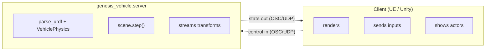
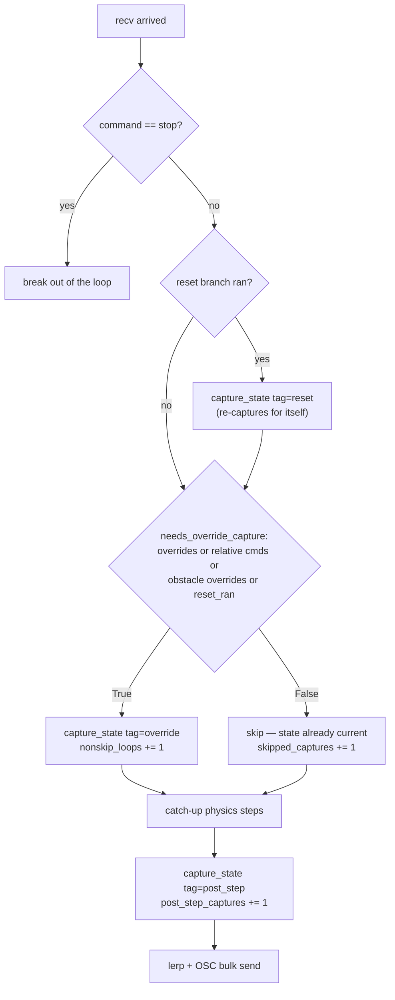

# Physics Server (`genesis_vehicle.server`)

An OSC/UDP server that runs the `genesis_vehicle` physics pipeline as a
standalone process and streams vehicle state to an external client (Unreal
Engine, Unity, a custom viewer, …). The client owns rendering and control
input; Genesis owns the physics truth.

> **Do you even need the server?** If your client is Python, you almost
> certainly don't — `import genesis_vehicle` and drive `VehiclePhysics` /
> `MultiVehiclePhysics` directly (simpler, faster, no UDP hop). The server
> exists for **language-agnostic, out-of-process clients** (C++ / C# /
> Blueprint). See [`batching.md`](batching.md) for the in-process APIs.

---

## 1. Purpose


```mermaid
flowchart LR
    subgraph Client["Client (UE / Unity)"]
        C1["renders"]
        C2["sends inputs"]
        C3["shows actors"]
    end
    subgraph Server["genesis_vehicle.server"]
        S1["parse_urdf + VehiclePhysics"]
        S2["scene.step()"]
        S3["streams transforms"]
    end
    Client -->|"control in (OSC/UDP)"| Server
    Server -->|"state out (OSC/UDP)"| Client
```

The server is **client-agnostic**: any process that speaks the OSC schema
in §4 can drive it. The bundled `genesis_unreal_plugin/` is one such
client (Unreal). UE-specific bits are confined to the wire format (cm /
left-handed coordinate conversion in `osc_manager.py`); the physics core
has no engine dependency.

---

## 2. Running

```bash
# L2 mode (per-entity) — the default: interacting / heterogeneous vehicles, one world
python -m genesis_vehicle.server

# multi-env (L3) mode: many IDENTICAL, NON-interacting vehicles
python -m genesis_vehicle.server --multi-env

# both modes default to the CPU backend; --gpu opts into GPU
# (pays off in --multi-env mode at ~300+ envs — measured crossover, see 2.1)
python -m genesis_vehicle.server --multi-env --gpu

# common flags
python -m genesis_vehicle.server --headless          # no Genesis viewer window
python -m genesis_vehicle.server --recv_port 7001 --send_port 7002 --send_port_obs 7004
# dt: the client-sent dt wins; the server fallback default is 0.025 (40 Hz,
# v1.0.17). To force 40 Hz regardless of what the client sends:
python -m genesis_vehicle.server --override_dt 0.025
# Rationale: verified physics-identical to 0.02 on bumpy terrain
# (cruise/z-oscillation/yaw within noise; measured at the pre-v1.1.25 default
# substeps=2), while the per-step budget grows 20 → 25 ms (+25 %) and total
# CPU drops ~20 % (40 loops/s instead of 50).
python -m genesis_vehicle.server --override_dt 0.01  # 100 Hz physics (finer)
python -m genesis_vehicle.server --no-floor --vis_mode visual -v

# internal substeps (v1.1.25; default 4, both modes): internal step = dt/substeps.
# It refines the CHASSIS rigid-body/contact integration, NOT the ray-wheel
# suspension, and it CHANGES THE TRAJECTORY - it is not a free perf knob.
# Read 2.3 before touching it.
python -m genesis_vehicle.server --substeps 1        # coarser chassis contact integration
python -m genesis_vehicle.server --substeps 10       # extra-fine internal step

# viewer follow camera (v1.1.25): track one target with the viewer's own
# follow_entity (jitter-free, smoothed; world-fixed offset) instead of the
# one-shot bird's-eye framing. 'side' views from -Y (wheel watching),
# 'chase' from behind (-X). Ignored when --headless.
python -m genesis_vehicle.server --follow-cam side --follow-target 0

# pacing: ADAPTIVE catch-up is the default (v1.0.20). The server monitors
# steps/loop: sustained overload (window avg ≥ 1.5) drops the cap to 1 —
# steady, burst-free slow motion; once step-loops run comfortably under the
# dt budget again (a full window of consecutive < 0.9×dt loops) it returns
# to cap=max(5, 0.1/dt) so backlog catch-up / real-time recovery resumes
# (plus a 100-loop startup grace so the build/JIT transient can't trigger it).
# Switches log as [Pacing] [AdaptiveCatchup]; every [STATS] line shows the
# current mode as [cap=N:burst|smooth|fixed:N].
# Pass N to PIN the cap and disable the adaptive pacer:
python -m genesis_vehicle.server --max-catchup-steps 1   # always-smooth (old fixed behavior)

# serving (L2 only, v1.6.6): the post-override capture_state is SKIPPED when
# no override / relative command / obstacle override arrived and no reset ran.
# Per-window counters print as a separate [SERVE] line. Full story in 2.5.
python -m genesis_vehicle.server --legacy-override-capture  # rollback: always capture
python -m genesis_vehicle.server --serve-timers             # + cap_override_us (GROSS cost, not a saving)

# pacing diagnostics: dump the trigger context on every adaptive switch
# (window steps/loop history, loop_dur avg/p95, dt budget, est speed ratio).
# Off by default; the server benchmark (§2.1) always enables it.
python -m genesis_vehicle.server --pacing-profile
```

**Diagnostics** printed by both modes:
- startup `[MODE] === L2 (per-entity) === / === L3 (multi-env) ===` banner
  (so perf reports are unambiguous about which path ran);
- startup `[PROFILE]` — one-shot per-step section breakdown
  (`raycast/proxy | SDK compute | genesis solver | 기타`), measured over 5
  warmup steps after 2 unprofiled JIT-warm steps;
- runtime `[STATS] [L2|L3 n_envs=N] Loop Avg | Physics Avg
  (X steps/loop, Y ms/step)` every 50 loops. `Physics Avg` is the SUM of the
  loop's catch-up steps — read the per-step value from the parenthesis;
  `steps/loop` pinned at the cap (default 5.0) means the server cannot hold
  real-time (permanent slow-motion), ~1.0 means it can. **`Physics Avg` /
  `ms/step` cover `vs.step()` and nothing else** — state capture, interpolation
  and the OSC send are inside the loop but outside that timer, so they show up
  only in `Loop Avg`. Compare `Loop Avg`, not `ms/step`, against the real-time
  budget; the exact boundaries are in §2.4.
- runtime `[SERVE] [L2] recv_loops=… nonskip_loops=… skipped_captures=…
  post_step_captures=… post_step_captures_ref=…` on its OWN line at the same
  50-loop boundary — **L2 only**, v1.6.6. The serving-side counters; see §2.5.

## 2.1 Official server benchmark

`genesis_vehicle.server.benchmark` (v1.0.20) drives the REAL server
end-to-end over the OSC wire with a built-in mock UE client — the official
per-mode speed test:

```bash
python -m genesis_vehicle.server.benchmark                  # full matrix:
#   {L2, L3} × {simple(plane), complex(88 convex hulls)} × {1,10,30,100,200,400 tanks}
python -m genesis_vehicle.server.benchmark --modes L3 --tanks 10,30
python -m genesis_vehicle.server.benchmark --terrain complex --gpu   # L3 GPU opt-in
python -m genesis_vehicle.server.benchmark --urdf /path/to/tank.urdf
```

Per configuration it launches the server subprocess (`--headless
--road-raycast-only`, CPU default, dt = 0.025), performs the full OSC
handshake (`/Genesis/Init/Physics` → `/Genesis/Vehicle/Init` (SkidSteer
mapping → `tank_skid_belt`) → K `/Init/Target`s → 88 `/Init/Obstacle`s
(complex) → `/Init/Done`), streams `/Genesis/Vehicle/Control` driving inputs
at ~30 Hz (`--input-hz`, default 30.0 — the rate every table below was
measured at), averages the server's `[STATS]` lines (first dropped as warm-up),
then sends `stop` (`MockUEClient.stop`, `server/benchmark.py:172`). The summary
table reports ms/step, steps/loop, Loop Avg, the **pacing mode** (final
adaptive-catchup state, with switch count — the benchmark always runs the
server with `--pacing-profile`) and a real-time verdict (steps/loop ≤ 1.05 AND
Loop Avg ≤ 25 ms). Since v1.6.6 it also reports **`serving`** (Loop Avg −
Physics Avg), the OBSERVED **`kinds`** count and the per-arm sample size **`n`**
— see §2.5 for those three and for `--kinds` / `--input-hz` /
`--legacy-override-capture` / `--serve-timers`. The reference tables below
predate those columns; the quantities they DO report are unaffected (`--kinds`
defaults to 1, which is the historical single shared kind bit-for-bit, and
`--input-hz` defaults to the historical rate). Every adaptive-catchup
trigger context is echoed per config as a `[pacing]` line (window steps/loop
history, loop_dur avg/p95, budget, est speed). The tank URDF defaults to
the SDK's bundled `samples/urdf/tank_ray.urdf` (`--urdf` to override).

Official reference results (v1.0.20, CPU, dt = 0.025, rco on, WSL2 laptop —
re-run on your hardware for absolute numbers):

| mode | terrain | tanks | ms/step | steps/loop | Loop Avg | pacing | realtime |
|---|---|---|---|---|---|---|---|
| L2 | simple | 1 | 10.9 | 0.4 | 5.9 | burst | O |
| L2 | simple | 10 | 12.7 | 0.5 | 9.0 | burst | O |
| L2 | simple | 30 | 15.7 | 0.6 | 14.5 | burst | O |
| L2 | simple | 100 | 31.1 | 1.0 | 57.8 | smooth (1sw) | X |
| L2 | complex(88) | 1 | 10.5 | 0.4 | 5.8 | burst | O |
| L2 | complex(88) | 10 | 13.0 | 0.5 | 9.2 | burst | O |
| L2 | complex(88) | 30 | 16.7 | 0.7 | 16.2 | burst | O |
| L2 | complex(88) | 100 | 35.8 | 1.0 | 64.1 | smooth (1sw) | X |
| L3 | simple | 1 | 10.3 | 0.4 | 5.9 | burst | O |
| L3 | simple | 10 | 11.4 | 0.5 | 8.3 | burst | O |
| L3 | simple | 30 | 12.1 | 0.5 | 10.6 | burst | O |
| L3 | simple | 100 | 17.4 | 1.0 | 40.5 | smooth (1sw) | X |
| L3 | complex(88) | 1 | 11.0 | 0.4 | 6.0 | burst | O |
| L3 | complex(88) | 10 | 12.2 | 0.5 | 8.7 | burst | O |
| L3 | complex(88) | 30 | 13.5 | 0.5 | 11.6 | burst | O |
| L3 | complex(88) | 100 | 24.5 | 1.0 | 51.4 | smooth (1sw) | X |

GPU backend (`--gpu` — accepted by BOTH server modes; since v1.1.6 the
benchmark forwards it to L2 as well, which is how the L2 anti-scaling below
was measured), same matrix:

| mode | terrain | tanks | ms/step | steps/loop | Loop Avg | pacing | realtime |
|---|---|---|---|---|---|---|---|
| L3-GPU | simple | 1 | 13.8 | 0.4 | 8.2 | burst | O |
| L3-GPU | simple | 10 | 15.8 | 0.6 | 14.4 | burst | O |
| L3-GPU | simple | 30 | 14.5 | 0.8 | 19.2 | burst | O |
| L3-GPU | simple | 100 | 15.6 | 1.9 | 57.5 | smooth (1sw) | X |
| L3-GPU | complex(88) | 1 | 19.6 | 2.2 | 60.0 | smooth (1sw) | X |
| L3-GPU | complex(88) | 10 | 18.4 | 1.6 | 40.3 | smooth (1sw) | X |
| L3-GPU | complex(88) | 30 | 19.3 | 2.4 | 67.0 | smooth (1sw) | X |
| L3-GPU | complex(88) | 100 | 21.5 | 2.5 | 91.1 | smooth (1sw) | X |

GPU reading: the physics step barely grows with n_envs (13.8 → 15.6 ms from
1 → 100 tanks — launch-bound, exactly as designed) and reaches CPU parity /
crossover around 100 tanks. The GPU loses on the **serving** side — measured
in steady state (100-simple, smooth cap=1 windows only; the table averages
above mix in pre-switch burst windows, inflating Loop Avg):

| backend | physics ms/step | serving ms/loop | Loop |
|---|---|---|---|
| CPU | 16.2 | 20.3 | 36.5 |
| GPU | 18.2 | 28.5 | 46.7 |

The gap is NOT data volume (tens of KB/loop — µs over PCIe). Every
hypothesis was implemented and measured (v1.1.1–v1.1.3):

1. *"per-read sync count"* — capture now downloads everything with ONE
   on-device concat + `.cpu()` (`_to_host_batched`): Loop unchanged.
2. *"capture-side GPU compute"* — the closed-form wheel poses are now
   computed **on the CPU** from one raw-state download
   (`wheel_visual_transforms_host`; "GPU mode = physics-only on GPU,
   serving math on CPU"): Loop unchanged.
3. *"post-step sync tail"* — the L3 loop's `synchronize()` moved inside the
   physics timing (a measurement fix: ~2 ms of GPU execution tail was being
   booked as serving).

Final steady-state decomposition (100-simple, smooth cap=1 windows): CPU
physics 16.2 / serving ~20.3; GPU physics **21.7** / serving ~25.6. So the
dominant term is **GPU physics itself** (launch-bound — still +5.5 ms over
CPU physics at n_envs=100); the residual serving delta (~5 ms) is per-step
HtoD input uploads + capture getter kernels, within run noise (±3 ms). The
serving-on-CPU architecture is now in place, so at the hundreds-of-envs
scale where GPU physics starts winning, serving will not be the bottleneck.
On complex terrain the extra solver kernel launches additionally cost
~+5 ms/step even at 1 tank.

**GPU crossover (measured, v1.1.6 — simple terrain, ms/step):**

| tanks | L2 CPU | L2 GPU | L3 CPU | L3 GPU |
|---|---|---|---|---|
| 30 | 15.7 | 109.5 | 12.1 | 14.5 |
| 100 | 31.1 | **684.0** | 17.4 | 15.6 |
| 200 | 73.2 | (impractical) | 27.4 | 31.5 |
| 400 | — | — | 46.2 | **27.8** |

- **L3 crosses over between 200 and 400 envs**: CPU grows ~linearly
  (17 → 27 → 46 ms) while GPU stays launch-bound-flat (~16–31 ms), so at
  400 envs GPU wins 1.66×. The long-standing "hundreds of envs" guidance
  now has a measured location (~250–300).
- **L2 has NO practical GPU crossover — it anti-scales**: 30 tanks 7×
  slower than CPU, 100 tanks 22× slower (684 ms/step; the GPU build alone
  took >14 minutes). Growing K grows ONE env's system — every per-vehicle
  sensor read and solver stage pays GPU launch/sync latency with no
  env-axis batch width to amortize it. Need interaction at scale → stay on
  CPU; need hundreds of vehicles without interaction → L3 (+`--gpu`
  beyond ~300).

Verdict: **CPU remains the server recommendation for L2 at every size and
for L3 up to ~200–300 envs**; the GPU backend pays off for L3 at ~300+
envs (and for RL/MPPI-style batching driven directly through the SDK).

Reading (CPU): both modes are real-time up to 30 tanks on simple AND complex
terrain. At 100 tanks the adaptive pacer detects the sustained overload and
switches to smooth (steps/loop pinned at 1.0, burst-free slow motion) — L2's
limit is the physics itself (31–36 ms/step, 2 300 links in one env), while
L3's physics still fits the budget (17–25 ms/step) and the loop overrun is
serving overhead (capture + OSC encode for 100 targets), the next
optimization target for 100-vehicle fleets.

## 2.2 Collision-stress benchmark (ring convergence)

The official benchmark spawns tanks on a 15 m grid, so they never touch —
it measures the contact-free cost. `genesis_vehicle.server.benchmark_collision`
(v1.1.1) measures the other regime: K tanks on a circle (radius auto-scaled
from K, `--radius` to override), each facing the center, driven at identical
constant throttle until they all pile up in the middle. L2 only (vehicles
must interact), plane terrain, CPU:

```bash
python -m genesis_vehicle.server.benchmark_collision              # 10, 30 tanks
python -m genesis_vehicle.server.benchmark_collision --tanks 30 --duration 40
python -m genesis_vehicle.server.benchmark_collision --radius 25 --throttle 1.0
```

Unlike `benchmark.py` it also LISTENS on the send port: chassis positions
and yaw are read back from `/Genesis/Vehicle/TargetBulk`, and steering is a
small P-controller aiming every tank at the origin — after the first impact
the tanks stay pressed together (sustained K-way contact) instead of
ricocheting out of the ring. It reports both "speed drops": the physical
one (mean tank speed v_peak → v_end; the collision instant is the first
drop below 50 % of peak) and the simulation one (mean ms/step before vs
after the pile-up, plus the post/pre slowdown factor), with a 0.5 s
timeline of mean ring radius / mean speed / ms/step per config.

Reference results (v1.1.1, CPU, dt = 0.025, throttle 0.8, same WSL2 laptop
as §2.1):

| tanks | R (m) | v_peak → v_end (m/s) | collision t | ms/step pre → post | slowdown |
|---|---|---|---|---|---|
| 10 | 20.0 | 6.29 → 0.02 | 9.5 s | 12.9 → 13.8 | 1.07× |
| 30 | 38.2 | 8.51 → 1.15 | 12.0 s | 14.0 → 19.5 | 1.39× |

Reading: the pile-up is real but affordable. At 30 tanks the sustained
30-way contact scrum costs ~+39 % per step vs the approach phase (peaking
at ~24 ms/step in the densest jam) — still inside the 25 ms real-time
budget that the contact-free grid holds at 15.7 ms/step (§2.1).

**Dependencies** (server only — NOT required by the SDK core):
`pythonosc`, `psutil`, `trimesh` (obstacle-mesh preprocessing). Install
into the same venv as `genesis-world` + `torch`.

**Platform**: Windows and Linux. Windows-only bits (PyInstaller
`ctypes.CDLL` patch, `HIGH_PRIORITY_CLASS`) are platform-guarded.

---

## 2.3 What `--substeps` actually changes (correction, v1.6.3)

| abbr | meaning |
|---|---|
| dt | one server/physics step duration (s) — `--override_dt`, client-sent otherwise |
| substep | one genesis internal integration step; internal step = `dt / substeps` |
| wrench | the force + torque pair the SDK applies to the chassis link each step |

**The old justification was wrong.** Through v1.6.2 the `--substeps` help text
and this document said "a stiff suspension spring needs a small internal step
or it rings" and told you to lower it "only to reproduce coarse-step
instability". That is false for the ray-wheel path. The SDK's suspension spring
and damper never pass through genesis substep integration at all:
`_pipeline.compute_wheel_step` computes the wrench once per `vs.step()`, it is
applied once through `_gs_compat.apply_links_wrench`, and genesis holds it
CONSTANT for every substep — `clear_external_force()` sits OUTSIDE the substep
loop (`genesis/engine/simulator.py:349-363`, installed genesis-world 1.4.0).
So the SDK spring/damper always integrate at `dt`, whatever `--substeps` says.

What `substeps` does refine is the **chassis rigid-body / contact integration**
inside genesis: chassis-vs-world contacts, the constraint solve, and above all
**contact transients** — the peak normal force of a drop or a kerb strike.

Measured (CPU/WSL2, genesis-world 1.4.0, one `car_4w_rwd_ackermann`, plane,
`dt` 0.02, 600 open-loop steps; scratchpad harness `m_substeps_fidelity.py`,
re-run independently by a reviewer — not shipped in the repo):

| substeps | settled ride height z (m) | peak contact normal force, 0.5 m drop (N) |
|---|---|---|
| 1 | 0.11145 | 39,094 |
| 2 | 0.11143 | 53,481 |
| 4 | 0.111422 | 60,561 |
| 8 | 0.111422 | 63,302 |

Ride height spans 0.03 mm across the whole range and z peak-to-peak is 1.4e-4
at every setting — the suspension is unmoved, exactly as the mechanism above
predicts. The drop force is not: it grows 1.6× from substeps 1 to 8.

**Lowering `substeps` is NOT trajectory-neutral, so do not treat it as a free
performance knob.** Same harness, 12 s of driving: substeps 2 ends at
`(30.267, -19.900)`, substeps 4 at `(30.365, -19.707)` — **0.217 m apart, yaw
0.26° apart**, and convergence is NOT monotone (8 is further from 2 than 4 is).
Any recorded scenario, regression baseline or replay is only valid at the
`substeps` it was captured with.

There was also no measurable speed to buy here at `n_envs=1`: one fresh process
per measurement, forward and reverse order, 300 timed steps after 60 warm-up
(CPU/WSL2, genesis-world 1.4.0, dual_scene, plane, same car, `dt` 0.02) gave
median `vs.step()` of 10.08/10.49 ms (substeps 1), 10.43/11.25 (2),
10.92/12.62 (4), 11.44/11.82 (8) — the between-setting differences sit inside
the run-to-run spread of a single setting, so this machine cannot resolve them.
The v1.6.2 help text's "cost is usually negligible at n_envs=1" was never
backed by a measurement and has been dropped rather than restated.

### `dt` and `substeps` are fixed at build — there is no runtime path (v1.6.5)

`--override_dt` (and the `dt` UE sends in the init handshake) reaches the
simulation only by being passed to `VehicleScene(dt=...)` **before**
`build()`. After that, nothing can change it: the engine snapshots
`dt`/`substeps` in `Simulator.__init__` on both genesis 1.3.3 and 1.4.0, and
`Simulator.dt` is read-only. Assigning `sim_options.dt` post-build is inert —
see [`physics-contracts.md`](physics-contracts.md) §7.14 for the measurement.

Through v1.6.4 the L2 path did exactly that assignment and then printed
`[OK] [Determinism] … 설정되었습니다`; the claim was false on 1.3.3 and the
assignment raised `AttributeError` on 1.4.0, killing the L2 server on the
first client connection. It now prints the engine's `effective_dt` /
`substeps` and says they are fixed at build. The L2 startup write was not the
only one: the `/Reset` handler assigned `vs.sim_options.gravity` and
`vs.sim_options.dt` too, so it was a SECOND `AttributeError` site on 1.4.0 —
unreachable in practice only because the startup write killed the process
first. Its `dt` restore is deleted and its gravity restore now goes through
`VehicleScene.set_gravity`.

L3's near-identical line never performed a write and was already accurate — but
note the fix is **L2-only** in the other direction too: `l3_runtime.py` prints
the `dt` it was HANDED (`sim_dt = ue_dt`) and no substeps, where L2 now prints
what the engine reports. True today, since the L3 scene is built with exactly
that `dt`; an asymmetry to tidy, tracked in the v1.6.5 CHANGELOG §8.

Gravity is the one exception: `VehicleScene.set_gravity()` IS live post-build,
and the `/Reset` handler uses it to restore the initial value. Note that
`/Genesis/Config/Physics`, which UE may use to push `gravity`/`dt`/`friction`
at runtime, is received and stored but **never consumed** — a separate ticket.

---

## 2.4 What the `[STATS]` line measures — and what it leaves out

The `[STATS]` line is **not** a full per-step cost. Only `vs.step()` is inside
the timer; everything else the server does per loop is outside it.

| quantity | includes | excludes |
|---|---|---|
| `Physics Avg` | the SUM over this loop's catch-up steps of `vs.step()` only — raycast + SDK wheel math + genesis solve | state capture, interpolation, OSC send, the OSC receive/parse at the top of the loop, the follow-cam update |
| `ms/step` | `Physics Avg / steps-per-loop` — same scope, per step | same as above |
| `Loop Avg` | the WHOLE loop body: receive/parse, every catch-up step, every `capture_state`, interpolation, both OSC bulk sends, the pacer | nothing inside the loop |

Boundaries, so you can check them in the source:

| path | timer opens | timer closes | outside but in-loop |
|---|---|---|---|
| L2 (`server/physics_server.py`) | `:1212` `physics_start` | `:1214` `physics_end` (`+=` at `:1216`) | post-override `capture_state` `:1158` (gated since v1.6.6, §2.5), post-step `capture_state` `:1226`, GPU sync `:1292`, `lerp_state` `:1298`, OSC sends `:1305` / `:1315`; loop span `:910` → `:1389` |
| L3 (`server/l3_runtime.py`) | `:677` `physics_start` | `:692` (`torch.cuda.synchronize()` at `:689-691` is INSIDE) | `st.capture` `:694`, `lerp_state` `:714`, OSC sends `:715-720`; loop span `:499` → `:722` |

**These L2 line numbers were WRONG before v1.6.6 and are corrected above.** The
table cited the loop span as `:814 → :1188` and the post-step `capture_state` as
`:1095`; at v1.6.5 the file already had `:830 → :1247` and `:1119` (everything
but the loop start was off by a uniform 24 lines, the loop start by 16), so the
citations were stale before this release moved them again. Re-derive them with
`grep -n` rather than trusting them after any edit to `physics_server.py`; the
L3 row was re-checked against the current file and is accurate.

Two consequences worth knowing:

- **State capture is the big excluded cost, and it grows with the fleet.**
  None of it is inside the reported `ms/step`, so a server that reports a
  comfortable `ms/step` can still miss real-time.

  > **Two `capture_state` cost figures used to be quoted here (one at 3 vehicle
  > kinds, one at 12) and are WITHDRAWN as of v1.6.6 — values removed, not
  > restated.** They came from an unshipped scratchpad harness (`bench_l2.py`)
  > under its own conditions, nothing in the tree reproduces them, and they are
  > on the serving work's retired-figures register. The qualitative claim — the
  > cost is excluded from `ms/step` and grows with the fleet — stands on the
  > code path (the table above) and is now measurable from the shipped
  > benchmark's `serving` column (§2.1, §2.5). No replacement number is
  > published; see §2.5.

- **On GPU the two paths differ.** L3 synchronizes inside the timer, L2
  synchronizes after the whole catch-up loop, so an L2 GPU `Physics Avg`
  under-reports by whatever kernel tail lands after `:1214`. CPU runs are
  unaffected.

**So: compare `Loop Avg` against the `dt` budget** (the real-time verdict in
§2.1 uses `Loop Avg` ≤ 25 ms at `dt` = 0.025 for exactly this reason). Use
`ms/step` only to attribute cost *within* the physics step. The `[PROFILE]`
line's `raycast/proxy | SDK compute | genesis solver | 기타` breakdown is also a
decomposition of `vs.step()` alone, on the same scope.

---

## 2.5 Serving-side counters — the `[SERVE]` line (v1.6.6)

**L2 only.** `server/l3_runtime.py` prints no `[SERVE]` line, has no capture
skip gate and takes none of the flags below.

§2.4 says state capture is the big cost outside the physics timer. This
section is how you count it. Since v1.6.6 the L2 loop skips one of its
`capture_state` calls when nothing has moved the solver, and prints five
per-window counters so both the skip and the remaining captures are
machine-checkable rather than assumed.

### The skip gate

Per receiving loop the L2 server used to capture the whole world twice: once
after the override block and once after the physics step. The first of those
is now conditional.


```mermaid
flowchart TD
    R[recv arrived] --> C{command == stop?}
    C -->|yes| X[break out of the loop]
    C -->|no| RST{reset branch ran?}
    RST -->|yes| CAPR["capture_state tag=reset<br/>(re-captures for itself)"]
    RST -->|no| G
    CAPR --> G{"needs_override_capture:<br/>overrides or relative cmds or<br/>obstacle overrides or reset_ran"}
    G -->|True| CAPO["capture_state tag=override<br/>nonskip_loops += 1"]
    G -->|False| SKIP["skip — state already current<br/>skipped_captures += 1"]
    CAPO --> STEP[catch-up physics steps]
    SKIP --> STEP
    STEP --> CAPS["capture_state tag=post_step<br/>post_step_captures += 1"]
    CAPS --> SEND[lerp + OSC bulk send]
```

The gate is the pure, module-level predicate
`needs_override_capture(safe_overrides, safe_relative_cmds,
safe_obstacle_overrides, reset_ran)` in `server/physics_server.py`; it guards
the one call at `server/physics_server.py:1158` and nothing else.

**What makes the skip safe, stated with its scope:** on the span from the reset
branch to that capture, exactly four inputs reach the solver — the three popped
override dicts, which drive `set_pos` / `set_quat` / `set_dofs_velocity`, and
the reset branch, which re-places every entity. `recv['target_forces']` is
deliberately NOT one of them: it goes through `control_dofs_force`, which
records a command consumed by the NEXT `scene.step()` and moves nothing now.
When none of the four fired, the capture would return the state the loop
already holds. That enumeration is the whole argument; it is not a general
claim that "nothing else can move the solver anywhere in the loop".

The `reset_ran` term is currently **redundant** — the reset branch
(`server/physics_server.py:1033`) re-captures for itself and assigns both
`prev_state` and `curr_state`. It is kept deliberately: without it the gate's
correctness would depend on that re-capture continuing to exist, and optimising
the re-capture away later would turn the gate into a one-loop stale-state
broadcast.

Rollback: `--legacy-override-capture` restores the pre-v1.6.6 unconditional
call. Its startup banner carries no `[SERVE]` token, so a parser can still
count windows by that token alone.

### The line

Printed at the same 50-loop boundary as `[STATS]` and reset there, so each line
describes exactly the preceding window. It is a SEPARATE line on purpose: the
`[STATS]` string is frozen — `server/benchmark.py` and
`server/benchmark_collision.py` each hold their own regex copy of it — so new
information goes on a new line rather than into that string.

```
 [SERVE] [L2] recv_loops=<int> nonskip_loops=<int> skipped_captures=<int> post_step_captures=<int> post_step_captures_ref=<int>
 [SERVE] [L2] ... post_step_captures_ref=<int> cap_override_us=<float>      # only with --serve-timers
```

| counter | counts, over the window | identity |
|---|---|---|
| `recv_loops` | loops that REACHED the skip decision — `recv` truthy and the loop did not break out first | — |
| `nonskip_loops` | of those, the ones that captured | `skipped_captures + nonskip_loops == recv_loops` |
| `skipped_captures` | of those, the ones the gate skipped | same |
| `post_step_captures` | post-step `capture_state` calls actually executed | — |
| `post_step_captures_ref` | `sum(min(catchup_steps, 2))` — the post-step captures the interpolation actually consumes (`prev` and `curr`) | the reference a future catch-up capture-skip must match; it is BELOW `post_step_captures` whenever a burst runs more than 2 steps |
| `cap_override_us` | `--serve-timers` only — see below | — |

`recv_loops` is counted at the skip decision, **not** at `if recv:`. A loop that
receives `stop` breaks out before the decision; counting it earlier would break
the identity by exactly that loop.

### `--serve-timers` — and why `cap_override_us` is not a saving

`--serve-timers` wraps the post-override `capture_state` call and reports the
per-window total in microseconds. **It is the GROSS cost of the calls that ran.
It is not the loop saving from skipping them.**

    saving = gross - displacement

where the displacement is the work that moves onto the remaining captures (warm
caches, freshly read buffers). The timer wraps only the call, so it cannot
observe the displacement term in either arm. It answers "what did this call
cost", never "how much faster did the loop get". When comparing two arms,
enable it in BOTH — otherwise the arms differ by a flag.

Off by default; when on it adds two `time.perf_counter()` calls per
non-skipped loop.

### Benchmark side (`server.benchmark`, §2.1)

| flag / column | meaning |
|---|---|
| `--kinds N` | split the K targets into N batched vehicle KINDS by varying ONLY the per-target `/Init/Target` friction (`2.0 + 1e-3*(tid % N)`); `build_cfg`'s cache key is `(abspath(urdf), friction, mapping)`. `N=1` is the historical constant `2.0`, bit-for-bit. Obstacle and global friction are untouched |
| `--input-hz` | `/Genesis/Vehicle/Control` streaming rate; default `30.0` is exactly the historical hardcoded rate, which is what §2.1's table was measured at. `benchmark_collision.py` has its own 30 Hz streamer and does NOT take this flag |
| `--legacy-override-capture`, `--serve-timers` | forwarded to the server, for A/B arms |
| `serving` column | `Loop Avg − Physics Avg` — the non-physics part of the loop (capture, interpolation, OSC encode/send, pacing); the §2.4 decomposition, per arm |
| `kinds` column | the OBSERVED kind count: `  Target ID: ` lines minus `reusing shared cfg` lines. Before v1.6.6 the reader discarded both unless `-v` was passed, so the count could only be assumed |
| `n` column | `[STATS]` windows averaged (first dropped), per arm |

Three rules that decide whether two arms may be compared at all:

1. **An `n` mismatch is a rejection reason.** A timeout that shortens one arm
   silently changes what its averages mean.
2. **A `serve_windows != n` flag (`!!` on the progress line) is a rejection
   reason, same standing.** The reader thread sets `stats_done` while handling
   a `[STATS]` line and the matching `[SERVE]` line is the NEXT line on the
   same stream, so the snapshot can lose the last window; the `[SERVE]` sums
   scale with the window count, so a short arm is not comparable. A bounded 2 s
   grace wait is applied first, and a server with no `[SERVE]` stream at all
   still exits cleanly rather than hanging.
3. **`--kinds N>1` is not a pure batching knob, so compare arms at the SAME
   `--kinds`.** The friction it varies is also the chassis material friction
   (`server/vehicle_builder.py:614`) and the `mu_long` / `mu_lat` fallback when
   the URDF declares neither (`server/vehicle_builder.py:455`, `:461`), so a
   `--kinds 3` arm differs from `--kinds 1` by up to 0.1% in friction and its
   trajectories diverge.

**The kind count is L2-only.** `server/l3_runtime.py:367` calls
`print_resolved_table("L3-shared", ...)` exactly once for the whole fleet, so
even a 100-vehicle L3 run reports `k_observed=1, reuse_lines=0, kinds=1`. That
is a correct kind count and NOT a target count; the table prints `1*` and the
record carries `kinds_observable=False`.

### No serving speed figure is published

v1.6.6 ships the counters and the A/B arm, and **no number**. The quoting
threshold for this work is n ≥ 10 per arm, the planned measurement step
specifies n ≥ 6, and no n ≥ 10 re-measurement is scheduled; the measurement
steps themselves have not been run (they were blocked on the engine-API crash
fixed in v1.6.5). Earlier figures that circulated for this work are retired and
are not repeated in any form. If you need a number for your hardware, run both
arms yourself with `--serve-timers` on BOTH, honour the three rules above, and
remember that `cap_override_us` is a gross cost, not a saving.

---

## 3. Mode selection

The two server modes are the SDK's L2 / L3 batching axes (see
[`batching.md`](batching.md)); "per-entity" is the historical name of the
L2 mode, kept for the CLI and logs.

| Sample goal | Mode | Batching axis | Backend | Vehicles interact? | Solver |
|---|---|---|---|---|---|
| Interacting traffic, heterogeneous, see collisions | **default (L2)** | **L2** (K vehicles × 1 env) | CPU | ✅ (one world) | batched per vehicle *kind* — identical targets share ONE pipeline (1.0.8) |
| Many identical cars spread out, no mutual collision, max count | **`--multi-env`** | **L3** (1 vehicle × n_envs) | CPU (`--gpu` at ~300+ envs — measured, see §2.1) | ❌ (parallel envs) | 1 × `VehiclePhysics(n_envs=N)` |
| Interacting traffic × N parallel scenarios (RL / MPPI) | *(not in server)* | **L2 × L3** | CPU (GPU at large K×N) | ✅ within env | `MultiVehiclePhysics(n_envs=N)` — drive from Python, see [`samples/l2l3_minimal.py`](../samples/l2l3_minimal.py) |

**Why is CPU the default in BOTH modes?** GPU kernel-launch overhead is a
fixed per-step cost that needs a lot of parallel work to amortize. At
`n_envs=1` (L2) CPU wins outright (measured: 10 vehicles → CPU
47 ms vs GPU 160 ms per step). Even batched (`--multi-env`), the GPU step
is a flat ≈ 19 ms/step (30/50/100 vehicles alike) while the CPU step is
8.4 ms at 30 tanks — so CPU stays ahead until the measured crossover at
~250–300 envs (v1.1.6: L3×400 GPU 27.8 vs CPU 46.2 ms/step — 1.66×), where
the GPU's flat cost finally undercuts the CPU's growing one. Pass `--gpu`
for fleets of that scale. L2 has NO GPU crossover at any size — it
anti-scales (see the crossover table in §2.1). The deciding factor is per-step compute
weight, not vehicle count — for a collision-heavy real map, check the
server's startup `실측된 1스텝 평균` log line and compare. See
[`backends.md`](backends.md) for the consolidated CPU-vs-GPU guide and
[`batching.md`](batching.md) for the full L1/L2/L3 story.

`--multi-env` requirements: all targets share ONE URDF; each target maps
to its own env (`target_id` sorted → env index); dynamic obstacles are
per-env copies (state reported from env 0); `target_forces` and
impulse/torque relative commands are not supported (logged at runtime).

**Raycast scene**: since v1.0.12 BOTH modes default to the SDK's
`dual_scene` raycast (matching `VehicleScene`'s own default) — statics get
a kinematic mirror in a separate raycast scene (static BVH, wheels ride
the exact mesh surface), and dynamic obstacles get a per-step-synced
mirror so wheels can still drive onto moving ramps/platforms.
`--road-raycast-only` composes on top: it additionally drops the
main-scene road collider (no CoACD / chassis-vs-road narrow-phase). The
pre-v1.0.12 L2 behavior — one scene, rays hit the rigid colliders
themselves — remains available as `--single-scene` (L2 mode only;
incompatible with `--road-raycast-only`, ignored by `--multi-env`).

> **`--single-scene` cannot carry a real road mesh (documented v1.6.3 — this
> limitation shipped undocumented).** In `single_scene` the wheel rays only hit
> RIGID COLLISION geometry, so a CARLA-style town mesh has no working route in:
>
> - as a rigid collider with `convexify=False`, any mesh over 1000 faces is
>   refused outright by the mesh guard
>   (`vehicle_scene.py:158-217`, limit `_MAX_NONCONVEX_COLLISION_FACES` at
>   `:97`): `[genesis_vehicle:mesh-guard] add_static('road_mesh'): refusing to
>   build a 5120-face non-convex mesh as a rigid collision/raycast body with
>   convexify=False (limit 1000)…` (verified on a 5,120-face mesh, SDK 1.6.2);
> - the documented workaround, a kinematic raycast surface, is
>   `dual_scene`-ONLY and raises at `vehicle_scene.py:817-833`:
>   `add_static('road_mesh'): collision=False requires
>   raycast_mode='dual_scene'; single_scene cannot host a no-collision
>   wheel-raycast surface.` `add_raycast_surface()` routes to the same call and
>   raises the same error;
> - `--road-raycast-only`, which is how the server loads a road as a raycast
>   surface, is rejected with `--single-scene` at arg-parse time
>   (`server/physics_server.py:436-439`).
>
> What is left is `convexify=True`: the road builds, but CoACD replaces the
> surface with convex hulls and the wheels ride the convex bulge (no kerb
> lips, no dips), and its BVH re-fits every step. **For any client driving on
> a real road mesh, `--single-scene` is not an option — use the default
> `dual_scene` (optionally with `--road-raycast-only`).**

---

## 4. OSC schema reference

### 4.1 Ports & transport

| Role | Default | Direction |
|---|---|---|
| `recv_port` | 7001 | client → server (all inbound, one unified receiver) |
| `send_port` (`send_port_cpp`) | 7002 | server → client (state, pacing) |
| `send_port_obs` | 7004 | server → client (observation tensors) |

Transport is plain OSC over UDP. The subject name (default `Genesis`)
prefixes some addresses (`/{subject}/…`).

### 4.2 Coordinate convention

Genesis is **right-handed, meters**, quaternion `(w, x, y, z)`. UE is
**left-handed, centimeters**, quaternion `(x, y, z, w)`. Outbound state is
converted in `osc_manager.send_target_states_bulk`:

```
ue_pos  = ( x·100,  −y·100,  z·100 )         # m → cm, Y flipped
ue_quat = ( −qx, qy, −qz, qw )               # (w,x,y,z) → (Qx,Qy,Qz,Qw), mirrored
```

Inbound init poses are expected **already in Genesis coordinates** (the UE
bridge converts on its side before sending).

### 4.3 Handshake (startup)

| Step | Address | Args | Dir |
|---|---|---|---|
| 1 | `/Genesis/RequestInit` | — | server → client (polled ~1 Hz until init arrives) |
| 2 | `/Genesis/Init/Physics` | `gravityZ:f, dt:f, friction:f` | client → server |
| 3 | `/Genesis/Vehicle/Init` | `urdfPath:s, mappingJSON:s` | client → server (vehicle only) |
| 4 | `/Init/Target` (or `/{subject}/…`) | `[id:i,] type:i, Px,Py,Pz, Qx,Qy,Qz,Qw, Sx,Sy,Sz, mass:f, friction:f, restitution:f` (14 or 15 args) | client → server |
| 5 | `/Init/Obstacle` | obstacle descriptor (type, pose, scale, mesh path, collision tag) | client → server |
| 6 | `/Init/Done` | — | client → server (ends `wait_for_initialization`) |
| 7 | `/Genesis/Init/Pacing` | `dt:f` | server → client (confirms physics period) |

The `urdfPath` of step 3 goes through `prepare_vehicle_urdf()` (since
v1.1.24 — both server modes), which writes a ray-wheel-ready temp copy next
to the original and feeds that single path to the morph, the config and the
wheel-ray pattern. A URDF authored for a normal rigid-body sim usually
violates one of the three ray-wheel contracts; the most visible one is a
suspension joint origin that sits below the wheel centre, which makes the
vehicle **float** in UE by exactly that offset (before v1.1.24 the server
skipped the prep and did exactly this — a 14-wheel tank hovered 0.433 m). The
original file is never modified, and a compliant URDF is used as-is. See
[physics-contracts.md §7.9](physics-contracts.md#79-urdf-contracts-for-ray-wheels-auto-corrected-since-v1122)
for the contracts and what gets corrected. If a vehicle still floats or
sinks in the client, check the server's startup log for the `urdf prep` line
and for a `WARNING` about links missing an `<inertial>`.

After build, the server also emits topology once:
`/Genesis/Vehicle/JointList`, `/Genesis/Vehicle/LinkList`,
`/Genesis/Vehicle/WheelNamesList` (arrays of strings).

### 4.4 Runtime — client → server

| Address | Payload | Meaning |
|---|---|---|
| `/Genesis/Vehicle/Control` | `frameId:i, [id:i, steer:f, throttle:f, brake:f, aux1:f, aux2:f] × K` | per-vehicle inputs (6 fields/vehicle). `steer/throttle/brake` in `[-1,1]`/`[0,1]` |
| `/Genesis/Control` | command string (`stop`, `reset`) | lifecycle |
| `/Genesis/State/SimTime` | `t:f` | SIM time (s) of the TargetBulk that follows (interpolation-fractional). Lets clients finite-difference velocity in the sim's own time base — immune to server slow motion and lerped sends |
| `/Genesis/Debug/Spheres` | `r,g,b,a, radius, (x,y,z) x N` | debug overlay: one sphere marker per point (waypoints/goals); receiving any overlay also reframes the server viewer to cover it |
| `/Genesis/Debug/Polyline` | `r,g,b,a, radius, (x,y,z) x N` | debug overlay: draws the polyline in the server viewer (Genesis metres; e.g. a trajectory client's planned path — see sample #14) |
| `/Genesis/Vehicle/TargetControl/Transform` | `id:i, Px,Py,Pz, Qx,Qy,Qz,Qw` | teleport (pos+quat) |
| `…/TargetControl/Position` · `…/Rotation` | per-component teleport |
| `…/TargetControl/AddLocalOffset` · `AddWorldOffset` | `id:i, dx,dy,dz` | relative move |
| `…/TargetControl/AddLocalRotation` · `AddWorldRotation` | `id:i, qw,qx,qy,qz` | relative rotate |
| `…/TargetControl/AddWorldForce` · `AddWorldImpulse` · `AddWorldTorque` | `id:i, x,y,z` | per-vehicle external wrench (L2 mode only) |
| `/Genesis/Obstacle/Transform` | `id:i, Px,Py,Pz, Qx,Qy,Qz,Qw` | drive a dynamic obstacle from the client |

### 4.5 Runtime — server → client

| Address | Payload | Meaning |
|---|---|---|
| `/Genesis/Vehicle/TargetBulk` | per vehicle: `id:i, Px,Py,Pz, Qx,Qy,Qz,Qw, numWheels:i, (wPx,wPy,wPz, wQx,wQy,wQz,wQw, spinAngle:f) × numWheels`; trailing `-1` sentinel | all vehicle + wheel transforms, one packet/step |

> **Wheel pose source (v0.7.7+):** the server fills the per-wheel `wPx..wQw`
> from `VehiclePhysics.wheel_visual_transforms("world")` — a closed-form pose
> that already includes steer + suspension + spin and works regardless of
> WheelJointInternalSync (the server runs headless, so WheelJointInternalSync is off). The trailing
> `spinAngle` is therefore sent as `0` (spin is baked into the wheel quat — the
> client uses the quat directly and must NOT re-apply spin). Earlier versions
> read `entity.get_link(wheel)`, which returned a frozen rest pose with
> WheelJointInternalSync off (no suspension travel / no steer). See
> [`api-reference.md`](api-reference.md#76-wheel-visual-pose-for-external-renderers-wheel_visual_transforms-v077).
| `/Genesis/Dynamic/StateBulk` | chunked `id, Px,Py,Pz, Qx,Qy,Qz,Qw` | dynamic obstacle transforms |
| `/Genesis/Init/TimeDilation` | `ratio:f` | tells the client to slow playback when the loop can't hit real-time (`ratio = dt / loop_avg`) |
| `/Genesis/Step/Ack` | `frameId:i` | lockstep acknowledgement |
| `/Genesis/State/Observation` (port 7004) | float array | optional RL observation tensor |

### 4.6 Vehicle mapping JSON (`/Genesis/Vehicle/Init` arg 2)

Serialized from UE's `FGenesisVehicleMapping`. Recognized keys (camelCase
and PascalCase both accepted):

| Key | Type | Meaning |
|---|---|---|
| `driveType` | int | 0 Ackermann (needs 4 wheels), 1 Truck (needs 6), 2 SkidSteer (**any wheel count**, v1.1.26 — loads `tank_skid_belt` for every tracked vehicle), 3 Manual. A non-matching count falls through to the `drivingJoints`/`steeringJoints` mapping path |
| `drivingJoints` / `steeringJoints` | `[{jointName}]` | which joints propel / steer (Manual path) |
| `drivetrainStrategy` | int | 0 AWD, 1 RWD, 2 FWD, 3 PerSide |
| `couplingStrategy` | int | 0 Independent, 1 SameSideBelt |
| `maxTorque` / `maxBrake` | float | drive / brake torque (N·m) |
| `steerScale` *(= `maxSteerRad`)* | float | max steer angle (rad) at \|steer\|=1. **UE serializes `SteerScale`; the server also accepts `maxSteerRad`.** Should stay within the URDF steer joint `<limit>` |
| `brakeBiasFrontRatio` | float | front brake fraction (rest to rear) |
| `topSpeed` | float | **top speed in m/s** (v1.2.4) — radius-independent; the server converts it to the drive omega cap via the mean wheel radius. Preferred over `omegaMaxDrive`. e.g. `18.6` ≈ 67 km/h |
| `omegaMaxDrive` | float | drive omega cap in **rad/s** (the raw cap; `topSpeed` wins if both are sent) |
| `dragArea` | float | aero drag Cd·A in m² (v1.2.4); 0 = off. Top speed then comes from drag + the omega cap together |
| `airDensity` | float | air density kg/m³ (v1.2.4, default 1.225) |
| `wheelOverrides` | `[{wheelName, radius, mass, stiffness, bumpStiffness, muLong, pbX, …}]` | per-wheel physical / Pacejka overrides. `wheelName` matches exact/position/substring against ANY name in the wheel's URDF joint chain (wheel link, spin, suspension, steer joint); `"*"` / `"all"` = every wheel (v1.1.26). An entry that matches nothing is skipped **with a warning** naming the URDF's wheel links. `bumpStiffness` (v1.2.6) = bump-stop rate beyond `restStroke`, 0 = off — keep `(k_susp+k_bump)·dt²/m_share` under ~0.7 or the suspension chatters |

> **Choosing `wheelName` for a tracked / numbered vehicle:** position matching
> (`FL`, `FR`, `RL`, `RR`, `front_left`, …) only fires on wheels whose URDF
> names encode a position. A hull whose wheels are numbered — `L_wheel_01` …
> `R_wheel_07` — has no front/rear token, so `"FL"` matches **nothing** and the
> override is dropped (with a warning). Use `"*"` for all wheels, or a side
> substring like `"L_wheel"` / `"R_wheel"` to address one track. This is a
> common cause of "my suspension / friction override had no effect."

### You no longer need to send suspension values (v1.2.1)

`stiffness` / `compressionDamping` / `extensionDamping` were the values a client
had to compute by hand, because standard URDF has nowhere to put a spring rate.
The SDK now derives them from the URDF's own **sprung mass** and wheel count, so
a client that sends nothing gets a spring matched to the vehicle it is driving.
The full chain:

```
wheelOverrides  >  URDF <dynamics stiffness=...>  >  mass-derived
```

Send them only to deliberately depart from the mass-matched value — an override
replaces a spring sized for that hull with a hand-picked one. Vehicles that were
already sending them keep working unchanged.

> **Steering note:** `steerScale` is the **center (bicycle) angle**; with
> Ackermann the inner wheel turns *more*. If a client expects "max angle =
> exact wheel angle," account for the Ackermann inner/outer spread. Keep
> `steerScale` ≤ the URDF steer joint limit or the physics angle will
> exceed what the visual joint can show.

> **Silent-failure guards (v1.1.26):** a mapping whose `drivingJoints` match
> no wheel spin joint used to build a DEAD drivetrain (all-zero drive
> weights — the vehicle creeps at cm/s); it now falls back to all-wheel
> drive with a warning. Likewise an unmatched `wheelOverrides` entry used to
> be skipped silently (the plant then quietly diverges from any sweep table
> measured for it); it now warns. If a vehicle barely moves or rides on
> obviously wrong suspension, check the server startup log for these
> `[WARN]` lines and compare the resolved wheel-settings table it prints.

---

## 5. Limitations

- **`--multi-env`**: same-URDF only; no inter-vehicle collision (separate
  envs); dynamic obstacles per-env (env-0 state sent); no per-vehicle
  forces/impulses; no lockstep.
- **L2 × L3 through the server** is not wired (by design) — drive
  `MultiVehiclePhysics(n_envs=N)` from Python instead.
- **UDP datagram size**: ~16 KB at 100 vehicles. Fine on localhost; over a
  real network this can exceed MTU and fragment (one lost fragment drops
  the whole packet). Split per-vehicle if you hit this.

---

## 6. Relationship to `genesis_unreal_plugin/`

The canonical, version-controlled implementation lives **here, in the
SDK** (`genesis_vehicle/server/`). The repository-external
`genesis_unreal_plugin/` folder is a thin launcher that delegates to this
package (run `python -m genesis_vehicle.server` or its shim). Earlier the
plugin kept its own full copy of the server, which led to a silently
dropped performance patch on a hand-off overwrite — do not reintroduce a
fork there; edit the SDK copy.
