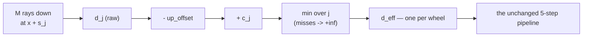

# Tire models & ground-contact mechanisms

Two **independent** axes are often confused because of project history. This
doc separates them, gives the standard names, and states the recommended
combination.

## Glossary

| Term | Meaning |
|---|---|
| Pacejka (파세카) | Magic-formula empirical tire model |
| Coulomb (쿨롱) | Simple μ·N friction law |
| slip curve | tire-force vs slip curve (rise → peak → saturation) |
| contact patch | the tire's footprint on the ground |
| N | road normal force |
| μ | friction coefficient |
| M | `contact_samples` — rays per wheel in a swept-envelope fan; 1 = point contact |
| `c_j` | sample `j`'s swept-circle height penalty, `r - sqrt(r^2 - s_j^2)` |
| `r` / `h` | wheel radius / obstacle (step) height, metres |

---

## The two axes are orthogonal

|  | **collider-vs-collider contact** | **ray-hit (analytic force)** |
|---|---|---|
| friction / tire | engine built-in Coulomb contact friction | `CoulombIsotropic` **or** `PacejkaAnisotropic` |
| cost | per-step cylinder-vs-ground collision test | one ray + analytic formula |

- **Axis A — ground detection**: collider contact ↔ ray-hit ↔ shapecast ↔ contact-patch
- **Axis B — tire friction model**: Coulomb ↔ Pacejka

This SDK **fixes Axis A to ray-hit** and lets you pick Axis B (Coulomb or
Pacejka) on top. The wheel has no collision geometry for tire forces; a
downward ray measures ground distance and the SDK applies suspension +
tire forces analytically (as one chassis wrench — see
`_gs_compat.apply_links_wrench`).

> **History note.** The old "Coulomb = always test cylinder-vs-ground
> collision" memory refers to Axis A being *collider contact*, where
> friction came from the engine's built-in Coulomb contact solver — heavy
> and jittery. The migration replaced that with ray-hit + an analytic tire
> model (Pacejka), and kept an analytic `CoulombIsotropic` as a baseline.
> Today's `CoulombIsotropic` is **ray-hit-based**, NOT the old collider
> approach — it consumes the same `N` (from ray-hit suspension compression)
> and slip (from ray-hit wheel kinematics) as Pacejka; only the final
> friction formula is simpler. There is no collider-contact tire path in
> this SDK.

---

## Axis B — which tire model? → **Pacejka** (effectively better on every axis)

| Criterion | Pacejka | Coulomb |
|---|---|---|
| Realism | **Industry standard** — slip-curve peak & saturation, separate long/lat, friction-circle (combined slip) | Crude — μN always opposes slip, no peak/saturation, single isotropic μ, unrealistic combined slip |
| Compute cost | slightly heavier (sin/atan ×6 + friction-circle) | slightly lighter |
| **Effective wall-clock** | **practically identical** — tire is a tiny fraction of step cost (dominated by `scene.step()` + state I/O) | identical |
| Numerical stability | smooth saturation → stable | discontinuity at zero slip → **low-speed chatter** risk |

Coulomb's only edge (marginally lighter) is negligible in the full
pipeline, and its low-speed stability is *worse*. So Coulomb is not a
performance win in practice. **Use Pacejka** (all bundled presets do);
reach for `CoulombIsotropic` only as a comparison baseline, for debugging,
or when you explicitly want simple predictable friction.

Note: `CoulombIsotropic` uses a single μ (`wheel_meta.mu_long`) — `mu_lat`
is ignored. If you need distinct longitudinal/lateral friction, use
Pacejka.

Swap is config-level:

```python
from genesis_vehicle import car_4w_rwd_ackermann, CoulombIsotropic
cfg = car_4w_rwd_ackermann(URDF)
cfg.tire = CoulombIsotropic()        # default: PacejkaAnisotropic()
```

Both run on the same shared `_pipeline.compute_wheel_step`, so the choice
applies identically to `VehiclePhysics` and `MultiVehiclePhysics`.

---

## Axis A — ground-detection mechanisms (standard names)

This SDK ships the first two — the first is the default. The remaining two are
listed for context / future work.

| Mechanism | Standard name | Notes |
|---|---|---|
| **Single downward ray** (`wheel_contact="point"`, the DEFAULT) | **Raycast wheel / ray-cast suspension** (a.k.a. single-point raycast contact) | Lightest, most stable. Used by Unity *Wheel Collider*, UE *Chaos Vehicles*. Limitation: a zero-radius probe reads ground height as a STEP FUNCTION — see below. |
| **Multiple rays / shape sweep** (`wheel_contact="swept_envelope"`, OPT-IN since v1.6.0) | **Shapecast (sweep) wheel / spherecast suspension** | Approximates the contact patch → the wheel starts climbing an edge before it, instead of teleporting onto it. M raycasts per wheel where there was 1. |
| Real collision shape | **Rigid contact wheel / collider-based wheel** | Wheel is a cylinder collider; engine contact solver resolves penetration + Coulomb friction. General (multi-point, edges) but heavy, jittery, hard to tune (the *old* approach). |
| Discretized footprint | **Contact-patch / brush model** (e.g. FTire, brush) | Splits the patch into elements for high fidelity. Very expensive; real vehicle-dynamics / R&D use. |

The SDK's term for this is **"ray-cast wheel + Pacejka tire"** — the 5-step
ray-wheel pipeline (raycast → suspension N → slip → tire force → wheel ω +
chassis force).

---

## Recommended combination

**Pacejka + raycast wheel** is the standard sweet spot for realism,
performance, and stability — and is what the presets ship. If you need
better behaviour over curbs / rough terrain, upgrade *Axis A* to the swept
envelope below while keeping Pacejka on *Axis B*; the two axes really are
independent, so that does not require touching the tire model.

> **Corrected in v1.6.0.** This section used to describe the shapecast upgrade
> as future work ("if you later need..."). The SDK now ships one — the swept
> envelope, opt-in — and the next section describes it.

---

## Axis A upgrade — the swept envelope (`wheel_contact="swept_envelope"`, v1.6.0)

### The defect it addresses

A single downward ray is a **zero-radius probe**. It reads ground height as a
step function: the wheel is at road level on one step and inside the kerb on the
next, so the whole obstacle height arrives as suspension compression in one
`dt`. The damper term then sees a rate no tire can produce and dominates the
spring. Measured on the reference car (`r=0.358`) crossing a 0.130 m lip at
3.3 m/s with `dt=0.025`: `dcompression = 0.130 m` in ONE step, raw rate
`5.200 m/s`, peak wheel `N` `85,120 N`.

A real tire is a circle, and a circle touches a step *before* its centre reaches
it — about `sqrt(2*r*h)` before, for a step of height `h`.

### The model

M rays per wheel, spread along **body +X** over `[-r*fan_span, +r*fan_span]`
using each wheel's OWN radius, each penalised by how far above the wheel's
lowest point its tire surface sits, and reduced by a minimum:

```
s_j   = (2j/(M-1) - 1) * r * fan_span        j = 0 .. M-1   (M odd)
c_j   = r - sqrt(r^2 - s_j^2)                c(0) = 0, c(±r) = r
d_eff = min_j (d_j + c_j)                    a MISSING sample -> +inf
```

`c_j` is a **discrete approximation of the swept-circle lower envelope** — the
lowest surface the wheel's circle sweeps as it translates. It errs in the safe
direction: M samples of the continuum can only see a contact LATE, never invent
one.



Because the centre sample has `c_0 = 0` **exactly**, `d_eff <= d_center` always:
the envelope can only RAISE the ground it reports, never lower it. A sinking
regression is structurally impossible, not merely untested. That is why M must
be ODD — an even fan has no centre sample and loses the guarantee (and reads
even flat ground biased: `-0.020017 m` at M=4 for `r=0.35`).

The M axis is eliminated inside `read_distances`, so the pipeline, the visual
mirrors and every public read still see `(n_envs, n_wheels)`.

### What it buys, and what M is not

Same wheel, same lip, same constants — only the contact model changes:

| | point (M=1) | M=9 | M=15 | M=31 | M=101 |
|---|---|---|---|---|---|
| compression in one step | `0.1300 m` | `0.0732` | `0.0658` | `0.0594` | `0.0616` |
| peak wheel `N` | `85,120 N` | `49,978` | `44,670` | `41,745` | `43,455` |
| ratio vs point | — | **1.703** | 1.906 | **2.039** | 1.959 |

**M is a discretisation count, not an accuracy dial.** The peak does not
converge monotonically — M=101 sits *below* M=31 — because which sample wins
the minimum changes with M. Convergence needs M around 101; across M ∈ [9, 31]
the peak still swings by roughly ±20%. Pick M for cost, read the result as "no
longer a step function" rather than as a converged force, and **do not compare
two runs at different M**.

The real limitation of the model is that the rays are **vertical** and therefore
blind to terrain slope — not the size of `c_j`. An intermediate `s_j` winning
the minimum with a smaller penalty than the outermost sample is the model
working.

### Choosing M and `fan_span`

- **M=9** (the default) is the smallest count that does useful work at the
  default span.
- **M=3 at `fan_span=1.0` is exactly the point contact**: its only off-centre
  samples sit at `|s| = r`, where `c = r`, so for any obstacle shorter than the
  wheel radius they can never win the minimum. It is legal and useful at
  `fan_span < 1` — at `0.6` the same three rays land where they can see the lip
  (`52,416 N` against the point contact's `85,120 N`).
- **Even M raises.** So does a wheel with no radius, naming both escapes.

### Using it

```python
veh = vs.add_vehicle(urdf, car_4w_rwd_ackermann,
                     wheel_contact="swept_envelope",   # default "point"
                     contact_samples=9)                # M, odd
```

Also on `scene_helpers.make_wheel_raycaster` / `scene_helpers.add_vehicle` —
but those size the fan from URDF geometry and cannot see a
`WheelConfig(radius=...)` override; `VehicleScene.add_vehicle` resolves the
config and matches radii by wheel name, so use it when the two differ.

Both raycast modes support the fan. In `single_scene` the high-cast offset is
capped against EVERY fan ray, not the wheel centre — an outer sample can sit
under a low overhang the centre clears (`physics-contracts.md` §7.11).

`DifferentiablePlant` does **not** model the envelope: it freezes `distances`
over its horizon, so a `swept_envelope` vehicle's kerb crossing is still
predicted as a point contact (`path-following.md`).

### See also
- [`batching.md`](batching.md) — how the pipeline (incl. `resolved.tire(...)`) is vectorized.
- [`physics-contracts.md`](physics-contracts.md) — friction-circle clamp, N clamp, sign conventions, §7.11 swept-envelope contract.
- `tire_models/pacejka.py`, `tire_models/coulomb.py` — the two implementations.
