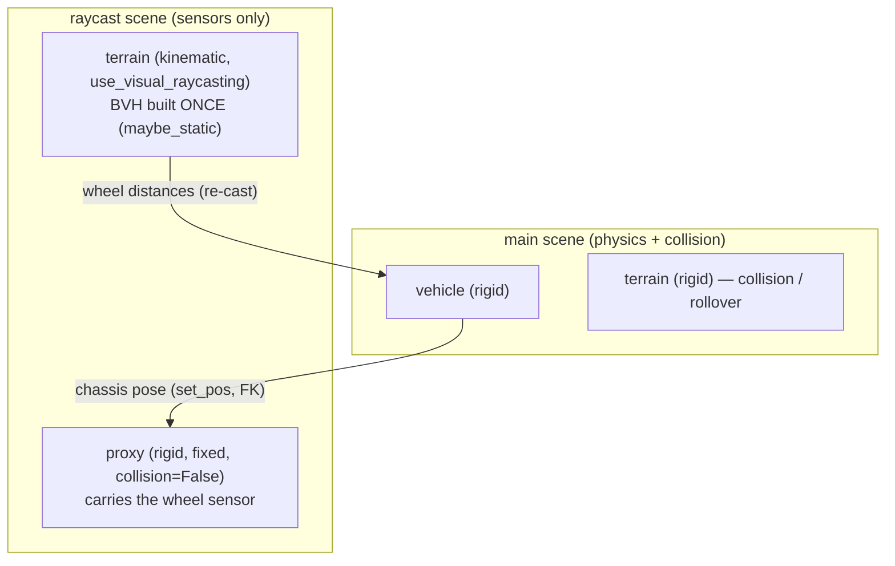

# Two-scene raycast & the `VehicleScene` API

| abbr | meaning |
|---|---|
| BVH | Bounding Volume Hierarchy (ray/collision acceleration tree) |
| FK | Forward Kinematics (link world transforms from joint/base state) |
| `maybe_static` | a raycast BVH whose solver has no physics-movable link → built once, never re-fit |
| re-cast | shooting the rays through an existing BVH (cheap, ~flat in face count) |
| rebuild | re-fitting the BVH from all faces (radix sort + bounds) — scales with face count |
| proxy | a pose-carrier entity in the raycast scene that the wheel sensor is attached to |

`VehicleScene` is the unified, high-level entry point of the SDK. It owns the
Genesis scene(s), the registered vehicles and static bodies, and the per-step
loop, so you never call `gs.init` / `scene.build` / `scene.step` / `sensor.read`
directly. It also hosts the two-scene raycast optimization.

**Modes.** `raycast_mode="dual_scene"` (default) is the ray-wheel-dedicated
optimization described below; `raycast_mode="single_scene"` is the classic
one-scene path. The legacy names `"raywheel"` / `"inline"` and `"split"` /
`"single"` are accepted as aliases for `"dual_scene"` / `"single_scene"`. In the
tables below, "single" = `single_scene`, "split" = `dual_scene`.

## The problem it solves

The wheel raycaster casts rays down from each wheel to measure the ground
distance `d` that drives suspension. Genesis builds one collision-face BVH per
rigid solver and **re-fits it every step whenever any link in that solver is
physics-movable**. A driving vehicle is movable, so the BVH — which also
contains the terrain's faces — is rebuilt every step. That rebuild cost scales
with terrain face count:

| terrain faces | single-scene raycast cost (CPU) |
|---|---|
| 3 k   | ~4 ms (rebuild) |
| 51 k  | ~17 ms |
| 205 k | ~44 ms |

The **re-cast** (actually shooting the rays) is cheap and ~flat (~2.5 ms,
independent of face count). The expensive part is the **rebuild**.

## The mechanism (`raycast_mode="dual_scene"`, the default)

Put the terrain in a **separate raycast scene** as a *kinematic* body (raycast
target, no physics) so its BVH is `maybe_static` → **built once, never re-fit**.
Keep the terrain as a *rigid* body in the **main scene** for collision/rollover.



Per `vs.step()` in dual_scene mode:

1. Mirror each vehicle's chassis base pose onto its raycast-scene **proxy**
   (`proxy.set_pos` runs FK).
2. `raycast_scene.step()` — refreshes the ray origins and re-casts against the
   **static** terrain BVH. No rebuild.
3. Read the wheel distances and feed them to the main-scene physics via
   `VehiclePhysics.step(distances=...)`.
4. `main_scene.step()` advances the real vehicle physics / collision.

### Why the proxy must be rigid, fixed, collision-free

The proxy carries the wheel sensor and must move with the chassis, but it must
**not** invalidate the static terrain BVH. Three properties matter:

- **`collision=False`** → it contributes no collision faces, so it is never a
  raycast target (no self-hit) and its presence adds nothing to rebuild.
- **rigid (not kinematic)** → it lives in the rigid solver, **separate** from the
  kinematic terrain. Teleporting it via `set_pos` fires a `GEOMETRY` change on
  the *rigid* solver only; the kinematic terrain's BVH subscriber never sees it,
  so the terrain BVH stays `maybe_static`. A *kinematic* proxy shares the
  terrain's solver and its `set_pos` would flag the terrain BVH for rebuild
  every step (measured ~6x slower — no win).
- **fixed base** → no dynamics; `set_pos` simply teleports it each step.

### Why a full `scene.step()` (not just `set_pos` + `read`)

`sensor.read()` returns a **cache** filled by the last `scene.step()`; it does
**not** re-cast. So `set_pos` followed by `read()` returns the stale (previous)
distances — this is the artifact that made an early "no-step" benchmark look
fast (a *stationary* proxy's cache happened to be correct). Refreshing the cast
requires the SensorManager to run, which happens inside `scene.step()`. Because
the raycast scene is otherwise static, that step is cheap (no real physics; the
dominant cost is the unavoidable re-cast). A lower-level `cast-only` path
(`sim._sensor_manager.step()`) exists and is ~2% cheaper but uses an internal
API; the public `scene.step()` is used for robustness.

### The raycast scene is never viewed or rendered

It is **sensors-only**. It is created with `show_viewer=False` **always** —
independent of `VehicleScene`'s `show_viewer` / `viewer_options`, which configure
the **main** scene's native viewer — no camera is ever added to it, and
`VehicleScene` steps it with `update_visualizer=False`. So its `step()` does no
viewer/render work; only the SensorManager re-cast runs. (Genesis already no-ops a
viewer-less scene's visualizer update during a normal advancing step, so
`update_visualizer=False` is explicit intent / belt-and-suspenders rather than a
measurable speedup — see the 0.9.13/0.9.14 CHANGELOG.) Only the **main** scene can
have a viewer.

## Performance (honest, CPU)

`raycast_mode` changes only the *raycast* cost. The vehicle physics is shared.

| terrain faces | raycast: single (rebuild) | raycast: split (re-cast) | raycast ratio | **full step** single | **full step** split | **full-step ratio** |
|---|---|---|---|---|---|---|
| 3 k   | ~4 ms  | ~2.5 ms | 1.7x  | ~7 ms  | ~7.7 ms | **0.94x** (split slower) |
| 13 k  | ~7 ms  | ~2.5 ms | 2.9x  | ~11 ms | ~7.5 ms | 1.47x |
| 51 k  | ~17 ms | ~2.5 ms | 4.7x  | ~20 ms | ~7.1 ms | 2.79x |
| 205 k | ~44 ms | ~2.5 ms | 17.7x | ~49 ms | ~8.9 ms | **5.49x** |

- The **raycast cost** drops ~2–18x and the gap grows with face count.
- The **full-step** speedup is smaller because the shared vehicle physics
  (~6 ms here) does not change; it dominates once the rebuild is gone.
- On **small/flat terrain split is slightly slower** (two scenes + ~2x terrain
  memory). It is still the **default** (`dual_scene`) because complex terrain is
  the common case and the win grows with `n_envs`; switch to `single_scene` only
  for a flat ground at `n_envs=1`.

### Performance on GPU (n_envs=1) — much smaller gap

The CPU numbers above do **not** carry over to GPU: the BVH rebuild parallelizes,
so single-scene barely grows with face count, and split's fixed two-scene /
kernel-launch overhead dominates at `n_envs=1`:

| terrain faces | single (GPU) | split (GPU) | full-step ratio |
|---|---|---|---|
| 13 k  | 21.1 ms | 21.5 ms | **0.98x** (split slower) |
| 51 k  | 25.6 ms | 23.3 ms | 1.10x |
| 205 k | 30.5 ms | 23.3 ms | 1.31x |

So on GPU split is **break-even to ~1.3x** for heavy terrain and slightly slower
for small/medium **at `n_envs=1`**. But it earns its keep elsewhere — and the
biggest case is L3 batching.

### Performance on GPU across L3 batch size (`n_envs`) — the real win

The static terrain BVH is built **once and shared across envs**, so split's
per-step cost is nearly **flat** in `n_envs`, while single re-fits per env and
scales ~linearly. The speedup therefore grows strongly with batch size
(GPU, 51 k-face terrain):

| n_envs | single ms | split ms | ratio | single env-steps/s | split env-steps/s |
|---|---|---|---|---|---|
| 1   | 24.4  | 23.6 | 1.03x | 41   | 42   |
| 16  | 32.5  | 28.8 | 1.13x | 493  | 555  |
| 64  | 47.7  | 30.3 | 1.57x | 1343 | 2111 |
| 256 | 101.6 | 29.9 | **3.40x** | 2521 | **8576** |

Split scales near-linearly (42 → 8576 env-steps/s ≈ 204x for 256x envs); single
scales sublinearly (41 → 2521 ≈ 61x) because each env adds rebuild cost.
**For batched RL / MPPI / Real2Sim rollouts (high `n_envs`), `dual_scene` (the
default) is clearly the right mode.** Only a flat-ground, `n_envs=1` interactive
sim is marginally better on `single_scene`.

Caveat: split replicates the terrain BVH per env, so at very high `n_envs` it
hits a memory ceiling (≈512 envs for a 51 k-face terrain here). Genesis #2914
("share static raycast BVH across envs") lifts that ceiling once merged.

Split also helps independent of speed via (a) very-high-poly terrain on GPU and
(b) **accuracy** on non-convex mesh terrain (see below).

## API

```python
from genesis_vehicle import VehicleScene, car_4w_rwd_ackermann
import genesis as gs

VehicleScene.init_backend("cpu")   # physics backend (default cpu; "gpu" only for large-n_envs L3)
vs = VehicleScene(raycast_mode="dual_scene", dt=1/48, substeps=10)  # dual_scene is the default

# Static body: rigid in main (collision) + kinematic in raycast (static BVH).
# Provide collision_morph for a coarse/convex collider while raycasting a
# detailed surface (recommended for high-poly / non-convex meshes — a rigid
# mesh is auto-convexified for collision, so a rigid-mesh raycast would hit the
# convex bulge, not the true surface; the kinematic raycast stays exact).
vs.add_static(morph=gs.morphs.Terrain(...))

car = vs.add_vehicle(URDF, car_4w_rwd_ackermann, pos=(0, 0, 1.0))
vs.build()

for t in range(N):
    car.set_inputs(throttle=0.6, steer=0.0)
    vs.step()
    pos = car.get_pos()
```

`raycast_mode="single_scene"` uses one scene with the classic per-vehicle wheel
raycaster and reproduces the prior SDK behavior; prefer it for a flat ground at
`n_envs=1`.

Runnable demo: `python -m genesis_vehicle.samples.two_scene_terrain --compare`.

## Scope & follow-ups

Supported:

- **One or more vehicles (L2)** — each gets its own proxy + sensor in the
  raycast scene and they still collide in the main scene (verified: dual_scene
  matches single_scene pose-for-pose with two cars).
- **L3 (`n_envs >= 1`) batching** — one proxy per env; the static terrain BVH is
  shared across envs.
- **Static terrain/mesh raycast targets** — `add_static` (always a wheel-raycast
  target; use `wheel_raycast_morph` for a detailed raycast surface vs a coarse
  `collision_morph`).
- **Dynamic raycast targets** — `add_dynamic(morph, physics=…, wheel_raycast=True)`
  adds a moving body the wheels must *sense* (ramp, curb, moving platform). A
  dynamic body is collide-only by default (`wheel_raycast=False`); set
  `wheel_raycast=True` only for a surface the wheels drive onto, and prefer a
  primitive Box/Sphere/Cylinder collider (a non-primitive mesh logs a warning,
  since its mirror BVH re-fits every step). In dual_scene mode it gets a rigid
  mirror in the raycast scene's *rigid* solver — a separate BVH context from the
  kinematic terrain — re-synced each step, so only that small body's BVH re-fits
  while the heavy terrain stays static. Verified: the wheel distance tracks the
  body (and matches single_scene) as it is moved via `handle.set_pose(...)`.

Follow-up:

- **Server unification**: DONE as of 1.0.12 — both OSC server modes default to
  `dual_scene` (statics get kinematic mirrors, dynamic obstacles get
  `wheel_raycast` mirrors via `env_builder`); `--road-raycast-only` composes on
  top by additionally dropping the main-scene road collider
  (`add_raycast_surface`). The legacy one-scene behavior remains as the
  per-entity `--single-scene` flag — see `server.md` §3.

The upstream-correct fix (no second scene) is Genesis splitting the rigid
collision/raycast BVH into static + dynamic subsets so the static terrain is not
re-fit while the vehicle moves — see Genesis issue **#2878** (open).
